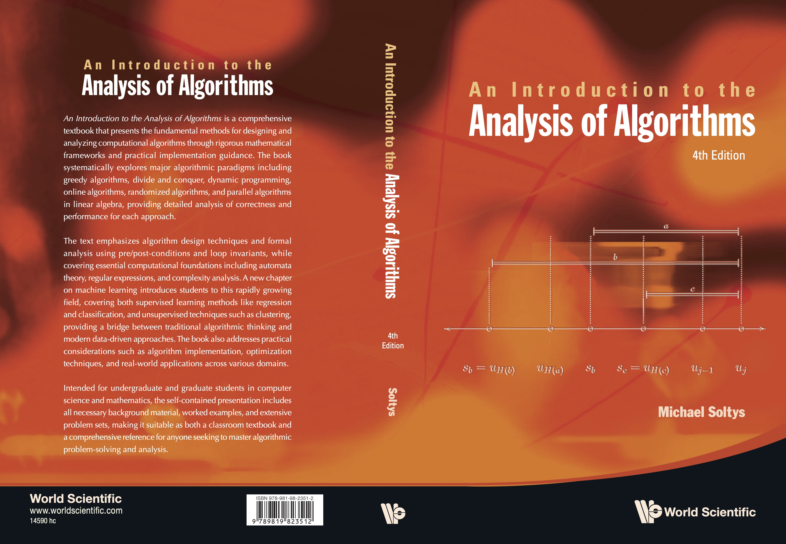

# Introduction to the Analysis of Algorithms - Companion Site

## Book Information

This companion site supports "Introduction to the Analysis of Algorithms" by Michael Soltys. The materials provide practical implementations and detailed solutions to complement the theoretical foundations presented in the textbook.

https://doi.org/10.1142/14590

**Note**: All numbering references (problems, exercises, algorithms) correspond to the **4th edition** of the book.

This repository contains the companion materials organized into three main directories:

## Directory Structure

### 📂 Algorithms/
Algorithm implementations referenced in the textbook, organized by chapter and section:
- **Chapter 1**: Preliminaries (Division, Euclidean GCD, Palindrome check, Ulam sequences, Gale-Shapley matching, Extended Euclidean algorithm, Powers of 2)
- **Chapter 2**: Greedy algorithms (Kruskal's MST, component merging, job scheduling, make change, Huffman coding)
- **Chapter 3**: Divide & conquer (merge operations, mergesort, recursive binary multiplication, Savitch's theorem)
- **Chapter 4**: Dynamic programming (longest subsequence, Floyd-Warshall, knapsack variants, activity selection)
- **Chapter 5**: Online algorithms
- **Chapter 6**: Randomized algorithms (pattern matching, Rabin-Miller primality)
- **Chapter 7**: Parallel algorithms in linear algebra (Gaussian elimination, lattice reduction)
- **Chapter 8**: Machine learning
- **Chapter 9**: Computational foundations
- **Chapter 10**: Mathematical foundations
- **Additional algorithms**: Bellman-Ford, Berkowitz, Csanky, Dijkstra, PageRank, Quicksort, Merkle-Hellman

Each algorithm directory typically contains:
- `README.txt` - Problem description and references
- Implementation files (`.py`, `.go` with tests)
- `label.txt` - Chapter/section labels
- Sample input/output files where applicable

### 📂 Slides/
LaTeX presentation slides for each chapter of the book:
- Individual chapter files (`chp0.tex` through `chp10.tex`)
- **Chapter 9** is divided into focused sections:
  - `chp9.1-2.tex` - Sections 9.1-9.2: Alphabets, strings and languages
  - `chp9.3.tex` - Section 9.3: Regular Languages  
  - `chp9.4.tex` - Context-Free Languages
  - `chp9.5.tex` - Turing Machines
  - `chp9appendix.tex` - Lambda-calculus and recursive functions (appendix)
- Compiled PDF versions of each chapter/section
- `figures/` subdirectory with diagrams, photos, and illustrations
- Common styling and title templates

### 📂 Solutions/
Worked solutions to selected textbook problems, organized by problem number:
- Multiple solution approaches for many problems
- Jupyter notebooks for detailed explanations
- Python implementations with test data
- README files explaining the solution approach
- Input/output examples and test cases

Each solution directory contains:
- `Solution-X/` subdirectories for alternative approaches
- `README.txt` files with solution explanations
- Implementation code with sample data
- `label.txt` files for cross-referencing

## Languages and Tools Used
- **Python**: Primary implementation language for most algorithms
- **Go**: Selected algorithms with unit tests
- **LaTeX**: Slides and mathematical notation
- **Jupyter**: Interactive notebooks for complex solutions

## Getting Started
1. Browse the `Algorithms/` directory to find implementations of specific algorithms
2. Check `Solutions/` for worked examples of textbook problems  
3. View `Slides/` for presentation materials covering theoretical concepts

