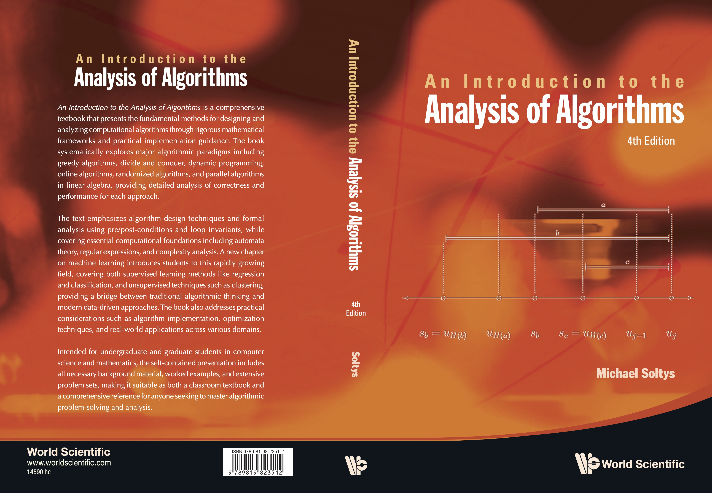

# Introduction to the Analysis of Algorithms - Companion Site

## Book Information

This companion site supports "Introduction to the Analysis of Algorithms" by Michael Soltys. The materials provide practical implementations and detailed solutions to complement the theoretical foundations presented in the textbook.

https://doi.org/10.1142/14590

**Note**: All numbering references (problems, exercises, algorithms) correspond to the **4th edition** of the book.

This repository contains the companion materials organized into three main directories:

## Directory Structure

### Algorithms/
Algorithm implementations referenced in the textbook. Each file is named `A<N>_<Name>.<ext>` where `<N>` is the algorithm number in the book. Every file has a header comment with the algorithm number, page, LaTeX label, and a brief description.

**Naming convention:**
- `A<N>_<Name>.py` — Python implementation
- `A<N>_<Name>.go` — Go implementation
- `A<N>_<Name>_test.go` — Go unit tests
- `input_A<N>_<Name>.txt` — sample input file

**Current implementations:**

| File | Algorithm | Page |
|------|-----------|:----:|
| `A1_Division.go` | Division | 4 |
| `A2_Euclid.go`, `A2_Euclid.py` | Euclid's Algorithm | 6 |
| `A3_Palindromes.go` | Palindromes | 7 |
| `A4_Whatis1.py` | What Is It? (1) | 9 |
| `A6_Ulam.go` | Ulam's Algorithm | 10 |
| `A7_Gale-Shapley.py` | Gale-Shapley Stable Marriage | 16 |
| `A9_Powers2.py` | Powers of 2 | 24 |
| `A24_Dispersed-Knapsack.py` | Dispersed Knapsack | 83 |
| `A25_Consecutive-Subsequence.py` | Consecutive Subsequence | 89 |
| `A27_Perfect-Matching.py` | Perfect Matching | 125 |
| `A28_Pattern-Matching.py` | Pattern Matching | 129 |
| `A29_Rabin-Miller.py` | Rabin-Miller Primality Test | 131 |
| `A33_Gauss-Lattice-Reduction.py` | Gauss Lattice Reduction (2D) | 163 |

### Slides/
Slidev presentations for each section of the book (`slides_X.X.md`). See [Slides/README-SLIDEV.md](Slides/README-SLIDEV.md) for conventions.

### Solutions/
Worked solutions to selected textbook problems, organized by problem number.

## Languages and Tools Used
- **Python**: Primary implementation language for most algorithms
- **Go**: Selected algorithms with unit tests
- **Slidev**: Markdown-based presentation slides (replaces legacy LaTeX Beamer)

## Getting Started
1. Browse the `Algorithms/` directory to find implementations of specific algorithms
2. Check `Solutions/` for worked examples of textbook problems
3. View `Slides/` for presentation materials covering theoretical concepts

## Acknowledgements

The algorithm implementations and solutions in this companion repository were contributed by:

- **Ryan McIntyre** ([ryanmcintyre](https://github.com/ryanmcintyre)) — proof-read the 3rd edition manuscript and wrote the Python implementations during the summer of 2017
- **Rishikesh Patil** — proof-read the 4th edition during the summer of 2024
- **Skyler Atchison** — improved the manuscript by pointing out typos, omissions, errors and gaps
- **Greg Herman** — improved the manuscript by pointing out typos, omissions, errors and gaps
- **Christopher Kuske** — improved the manuscript by pointing out typos, omissions, errors and gaps
