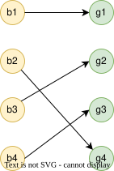
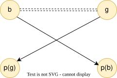

<style>
.slidev-layout.cover {
  background: white !important;
  color: black !important;
}
.slidev-layout.cover h1 {
  color: black !important;
}
</style>

# Stable Marriage Problem

Section 1.2.2 — Match $n$ boys with $n$ girls so no two would rather elope; a Nobel-winning idea, still matching residents to hospitals today.

<div style="position: absolute; bottom: 20px; right: 30px; font-size: 0.55em; color: navy;">All references are to the 4th edition of <em>An Introduction to the Analysis of Algorithms</em> (World Scientific, 2025)</div>

<!--
The 1962 paper is seven pages in the American Mathematical Monthly, titled "College Admissions and the Stability of Marriage." Gale and Shapley wrote it as something a bright undergraduate could read, and as an example that mathematics is more than "the relationship and symbolism of numbers and magnitudes." It is still one of the Monthly's most cited papers.

Gale died in 2008. The Nobel is not awarded posthumously, so in 2012 the prize went to Shapley and to Alvin Roth, who had spent the intervening decades turning the paper into working markets. Roth had nominated the two of them together.
-->

---

# Motivation

<div style="color: #9ca3af; font-style: italic; font-size: 0.9em; margin-bottom: 0.8em;">

Where this problem actually shows up — interns, colleges, schools, even kidney exchanges.

</div>

Real-world matching problems:


- Matching **interns** with **hospitals**
- Matching **students** with **colleges**
- The **admission process problem**
- Matching **TAs** with **Slots** at the Learning Resource Center


**Goal:** Find a matching that optimizes overall satisfaction of all parties.


This elegant algorithm has been used since the 1960s!

<!--
The intern market unraveled before anyone had a theorem. By the early 1940s hospitals were making offers in the junior year of medical school, then inquiring of sophomores, because whoever waited lost the good candidates. Uniform appointment dates did not help: the reply window shrank from ten days to eight to twelve hours, then to exploding telegrams at 12:01 AM. Roth wrote the history of this in JAMA in 2003.

The National Intern Matching Program, later the NRMP, started in 1952, a decade before Gale and Shapley wrote anything down. A medical-student rewrite of the first computer program, the "Boston Pool" algorithm, is what survived. Roth showed in 1984 that it was deferred acceptance, with hospitals proposing.
-->

---

# Problem Definition

<div style="color: #9ca3af; font-style: italic; font-size: 0.9em; margin-bottom: 0.8em;">

Two equal-sized groups, each member with a *strict ranking* of every member of the other group.

</div>

<div class="grid grid-cols-2 gap-6 items-start">
<div style="text-align: left;">

An instance of the **stable marriage problem** of size $n$:


- Set of **boys**: $B = \{b_1, b_2, \ldots, b_n\}$
- Set of **girls**: $G = \{g_1, g_2, \ldots, g_n\}$
- Each boy $b_i$ has a **ranking** $<_i$ of all girls
  - $g <_i g'$ means $b_i$ prefers $g$ over $g'$
- Each girl $g_j$ has a **ranking** $<^j$ of all boys
  - $b <^j b'$ means $g_j$ prefers $b$ over $b'$

</div>
<div class="flex gap-4 items-start justify-end">
<div style="background: #ecfdf5; border: 1px solid #a7f3d0; border-radius: 8px; padding: 0.35em 0.5em; font-size: 0.55em; line-height: 1.3; text-align: left; display: inline-block; width: max-content; flex: 0 0 auto;">
<div class="grid grid-cols-2 gap-x-3">
<div>

**Boys**<br>
$b_1$: $g_2,g_4,g_3,g_1$<br>
$b_2$: $g_4,g_1,g_2,g_3$<br>
$b_3$: $g_2,g_1,g_3,g_4$<br>
$b_4$: $g_3,g_4,g_1,g_2$

</div>
<div>

**Girls**<br>
$g_1$: $b_1,b_3,b_4,b_2$<br>
$g_2$: $b_3,b_1,b_4,b_2$<br>
$g_3$: $b_3,b_4,b_1,b_2$<br>
$g_4$: $b_2,b_1,b_3,b_4$

</div>
</div>
</div>
<div>



</div>
</div>
</div>

<!--
Marriage is the clean n-on-n case they used to prove the idea. The original paper is really about college admissions, the same algorithm with quotas, which is why some students go unmatched and some seats go unfilled. The book follows the marriage presentation, which is why the slides say boys and girls. Strict rankings are a modeling choice: real applicants have ties, and handling ties is a later, messier literature.

In the n=4 instance on the right, nobody's first choice is mutual.
-->

---

# Blocking Pairs

<div style="color: #9ca3af; font-style: italic; font-size: 0.9em; margin-bottom: 0.8em;">

A *bijection* first — then the pairs who'd rather elope — then stability.

</div>

A **matching** (or **marriage**) $M$ is a bijective correspondence between $B$ and $G$. If $b$ and $g$ are matched in $M$, they are **partners**: $p_M(b) = g$ and $p_M(g) = b$.

<div class="grid grid-cols-2 gap-6 items-start">
<div style="text-align: left;">

A matching $M$ is **unstable** if there exists a **blocking pair**.

A pair $(b, g)$ is a **blocking pair** if:

1. $b$ and $g$ are **not** partners in $M$
2. $b$ prefers $g$ to his current partner $p_M(b)$
3. $g$ prefers $b$ to her current partner $p_M(g)$

$M$ is **stable** if it has **no blocking pairs**. A stable matching always exists (Gale-Shapley).

</div>
<div>



</div>
</div>

<!--
A matching here is a perfect matching of a complete bipartite graph. Stability is an extra constraint on which perfect matching you pick. Knuth devoted a whole monograph to this one problem, Marriages Stables, in 1976, which is a hint that the clean existence proof hides a lot of structure.

Stability is not the same as everyone being happy, and it is not the same as maximizing the sum of ranks. A matching can be stable while one person gets their last choice, as the walkthrough will show. The test is only: would any unmatched pair both walk away. One person preferring someone else is ordinary disappointment, not instability.
-->

---

# Gale-Shapley Algorithm

<div style="color: #9ca3af; font-style: italic; font-size: 0.9em; margin-bottom: 0.8em;">

The pseudocode — three cases per proposal, an outer loop over stages, and we're done in $O(n^3)$.

</div>

<span style="font-size: 0.6em; color: navy;">Alg 7, Pg 16, alg:gale-shapley</span> <a href="https://github.com/michaelsoltys/IAA/blob/main/Algorithms/A7_Gale-Shapley.py" style="font-size: 0.6em; color: teal;">[Python implementation]</a>

```text
Stage 1: b₁ chooses his top g, M₁ ← {(b₁, g)}

For s = 1 to |B| - 1 (Stage s+1):
    M ← Mₛ
    b* ← bₛ₊₁
    For b* proposes to all g's in order of preference:
        If g was not engaged:
            Mₛ₊₁ ← M ∪ {(b*, g)}
            end current stage
        Else if g was engaged to b but g prefers b*:
            M ← (M - {(b, g)}) ∪ {(b*, g)}
            b* ← b
            repeat from line 6
    Mₛ₊₁ ← M

Return M_{|B|}
```

<!--
Seven pages, one idea, and this is all of it. The O(n^3) bound is the book's, counting a line of pseudocode as a step. With a bit of care you can implement it in O(n^2), which is also the worst-case number of proposals. For the NRMP that difference does not matter; tens of thousands of applicants finish in seconds either way.
-->

---

# Example: Preferences

<div style="color: #9ca3af; font-style: italic; font-size: 0.9em; margin-bottom: 0.8em;">

A small instance with $n=4$ to trace by hand — note nobody's first choice is mutual.

</div>

<div style="background: #ecfdf5; border: 1px solid #a7f3d0; border-radius: 10px; padding: 0.8em 1em;">
<div class="grid grid-cols-2 gap-4">
<div>

**Boys' preferences:**
| Boy | Ranking |
|-----|---------|
| $b_1$ | $g_2, g_4, g_3, g_1$ |
| $b_2$ | $g_4, g_1, g_2, g_3$ |
| $b_3$ | $g_2, g_1, g_3, g_4$ |
| $b_4$ | $g_3, g_4, g_1, g_2$ |

</div>
<div>

**Girls' preferences:**
| Girl | Ranking |
|------|---------|
| $g_1$ | $b_1, b_3, b_4, b_2$ |
| $g_2$ | $b_3, b_1, b_4, b_2$ |
| $g_3$ | $b_3, b_4, b_1, b_2$ |
| $g_4$ | $b_2, b_1, b_3, b_4$ |

</div>
</div>
</div>

<!--
Giving everyone their first choice is impossible: b1 and b3 both want g2.
-->

---

# Example: Stage 1

<div style="color: #9ca3af; font-style: italic; font-size: 0.9em; margin-bottom: 0.6em;">

The first boy walks in, picks his favorite — easy, no competition yet.

</div>

<div class="flex gap-8 items-start">
<div style="text-align: left; flex: 1; min-width: 0;">

$b_1$ chooses his top choice: $g_2$

$$M_1 = \{(b_1, g_2)\}$$

</div>
<div style="flex: 0 0 auto; display: flex; flex-direction: column; gap: 0.45em;">
<div style="background: #ecfdf5; border: 1px solid #a7f3d0; border-radius: 8px; padding: 0.35em 0.5em; font-size: 0.55em; line-height: 1.3; text-align: left; display: inline-block; width: max-content; flex: 0 0 auto;">
<div class="grid grid-cols-2 gap-x-3">
<div>

**Boys**<br>
$b_1$: $g_2,g_4,g_3,g_1$<br>
$b_2$: $g_4,g_1,g_2,g_3$<br>
$b_3$: $g_2,g_1,g_3,g_4$<br>
$b_4$: $g_3,g_4,g_1,g_2$

</div>
<div>

**Girls**<br>
$g_1$: $b_1,b_3,b_4,b_2$<br>
$g_2$: $b_3,b_1,b_4,b_2$<br>
$g_3$: $b_3,b_4,b_1,b_2$<br>
$g_4$: $b_2,b_1,b_3,b_4$

</div>
</div>
</div>
<div style="background: #eff6ff; border: 1px solid #93c5fd; border-radius: 8px; padding: 0.35em 0.5em; font-size: 0.55em; line-height: 1.35; text-align: left;">

**Matching at end of stage 0**

$M_0 = \emptyset$

</div>
</div>
</div>

<!--
This is the only stage with no one to disappoint. g2's ranking has b3 first and b1 second, so this engagement is already on borrowed time.
-->

---

# Example: Stage 2

<div style="color: #9ca3af; font-style: italic; font-size: 0.9em; margin-bottom: 0.6em;">

$b_2$ proposes to a *different* girl — clean acceptance, no displacement yet.

</div>

<div class="flex gap-8 items-start">
<div style="text-align: left; flex: 1; min-width: 0;">

$b^* = b_2$ proposes to $g_4$ (his top choice)

$g_4$ is not engaged → accepts!

$$M_2 = \{(b_1, g_2), (b_2, g_4)\}$$

</div>
<div style="flex: 0 0 auto; display: flex; flex-direction: column; gap: 0.45em;">
<div style="background: #ecfdf5; border: 1px solid #a7f3d0; border-radius: 8px; padding: 0.35em 0.5em; font-size: 0.55em; line-height: 1.3; text-align: left; display: inline-block; width: max-content; flex: 0 0 auto;">
<div class="grid grid-cols-2 gap-x-3">
<div>

**Boys**<br>
$b_1$: $g_2,g_4,g_3,g_1$<br>
$b_2$: $g_4,g_1,g_2,g_3$<br>
$b_3$: $g_2,g_1,g_3,g_4$<br>
$b_4$: $g_3,g_4,g_1,g_2$

</div>
<div>

**Girls**<br>
$g_1$: $b_1,b_3,b_4,b_2$<br>
$g_2$: $b_3,b_1,b_4,b_2$<br>
$g_3$: $b_3,b_4,b_1,b_2$<br>
$g_4$: $b_2,b_1,b_3,b_4$

</div>
</div>
</div>
<div style="background: #eff6ff; border: 1px solid #93c5fd; border-radius: 8px; padding: 0.35em 0.5em; font-size: 0.55em; line-height: 1.35; text-align: left;">

**Matching at end of stage 1**

$M_1 = \{(b_1, g_2)\}$

</div>
</div>
</div>

<!--
Clean because b2's first choice was still free. Two boys, both with their first choice. It will not last.
-->

---

# Example: Stage 3

<div style="color: #9ca3af; font-style: italic; font-size: 0.9em; margin-bottom: 0.6em;">

First conflict — $b_3$ wants $g_2$ who's engaged to $b_1$, and $g_2$ trades up.

</div>

<div class="flex gap-8 items-start">
<div style="text-align: left; flex: 1; min-width: 0;">

$b^* = b_3$ proposes to $g_2$ (his top choice)

- $g_2$ is engaged to $b_1$
- $g_2$'s ranking: $b_3, b_1, b_4, b_2$ → she prefers $b_3$!
- $g_2$ breaks off with $b_1$, accepts $b_3$
- Now $b^* = b_1$ must find a new partner

</div>
<div style="flex: 0 0 auto; display: flex; flex-direction: column; gap: 0.45em;">
<div style="background: #ecfdf5; border: 1px solid #a7f3d0; border-radius: 8px; padding: 0.35em 0.5em; font-size: 0.55em; line-height: 1.3; text-align: left; display: inline-block; width: max-content; flex: 0 0 auto;">
<div class="grid grid-cols-2 gap-x-3">
<div>

**Boys**<br>
$b_1$: $g_2,g_4,g_3,g_1$<br>
$b_2$: $g_4,g_1,g_2,g_3$<br>
$b_3$: $g_2,g_1,g_3,g_4$<br>
$b_4$: $g_3,g_4,g_1,g_2$

</div>
<div>

**Girls**<br>
$g_1$: $b_1,b_3,b_4,b_2$<br>
$g_2$: $b_3,b_1,b_4,b_2$<br>
$g_3$: $b_3,b_4,b_1,b_2$<br>
$g_4$: $b_2,b_1,b_3,b_4$

</div>
</div>
</div>
<div style="background: #eff6ff; border: 1px solid #93c5fd; border-radius: 8px; padding: 0.35em 0.5em; font-size: 0.55em; line-height: 1.35; text-align: left;">

**Matching at end of stage 2**

$M_2 = \{(b_1, g_2),\ (b_2, g_4)\}$

</div>
</div>
</div>

<!--
First trade-up. g2 prefers b3 to b1, so the engagement from stage 1 is revoked. Deferred acceptance means that "yes" was always "yes for now." The dumped boy does not leave the algorithm; he becomes the proposer.
-->

---

# Example: Stage 3 (continued)

<div style="color: #9ca3af; font-style: italic; font-size: 0.9em; margin-bottom: 0.6em;">

The displaced $b_1$ proposes to his 2nd choice — gets rejected — moves on to his 3rd.

</div>

<div class="flex gap-8 items-start">
<div style="text-align: left; flex: 1; min-width: 0;">

$b^* = b_1$ proposes to $g_4$ (his 2nd choice)

- $g_4$ is engaged to $b_2$
- $g_4$'s ranking: $b_2, b_1, b_3, b_4$ → she prefers $b_2$
- $g_4$ rejects $b_1$

$b^* = b_1$ proposes to $g_3$ (his 3rd choice)

- $g_3$ is not engaged → accepts!

$$M_3 = \{(b_1, g_3), (b_2, g_4), (b_3, g_2)\}$$

</div>
<div style="flex: 0 0 auto; display: flex; flex-direction: column; gap: 0.45em;">
<div style="background: #ecfdf5; border: 1px solid #a7f3d0; border-radius: 8px; padding: 0.35em 0.5em; font-size: 0.55em; line-height: 1.3; text-align: left; display: inline-block; width: max-content; flex: 0 0 auto;">
<div class="grid grid-cols-2 gap-x-3">
<div>

**Boys**<br>
$b_1$: $g_2,g_4,g_3,g_1$<br>
$b_2$: $g_4,g_1,g_2,g_3$<br>
$b_3$: $g_2,g_1,g_3,g_4$<br>
$b_4$: $g_3,g_4,g_1,g_2$

</div>
<div>

**Girls**<br>
$g_1$: $b_1,b_3,b_4,b_2$<br>
$g_2$: $b_3,b_1,b_4,b_2$<br>
$g_3$: $b_3,b_4,b_1,b_2$<br>
$g_4$: $b_2,b_1,b_3,b_4$

</div>
</div>
</div>
<div style="background: #eff6ff; border: 1px solid #93c5fd; border-radius: 8px; padding: 0.35em 0.5em; font-size: 0.55em; line-height: 1.35; text-align: left;">

**Matching at end of stage 2**

$\{(b_3, g_2),\ (b_2, g_4)\}$ — $b_1$ free

</div>
</div>
</div>

<!--
b1 is learning the theorem in real time: his partner only gets worse. g4 already prefers her current partner, so she rejects him, which is case 3. g3 is free, which is case 1. Two of the three cases on one slide.
-->

---

# Example: Stage 4

<div style="color: #9ca3af; font-style: italic; font-size: 0.9em; margin-bottom: 0.6em;">

$b_4$ enters and bumps $b_1$ — *again* — sending poor $b_1$ back to the drawing board.

</div>

<div class="flex gap-8 items-start">
<div style="text-align: left; flex: 1; min-width: 0;">

$b^* = b_4$ proposes to $g_3$ (his top choice)

- $g_3$ is engaged to $b_1$
- $g_3$'s ranking: $b_3, b_4, b_1, b_2$ → she prefers $b_4$!
- $g_3$ breaks off with $b_1$, accepts $b_4$
- Now $b^* = b_1$ must find a new partner

</div>
<div style="flex: 0 0 auto; display: flex; flex-direction: column; gap: 0.45em;">
<div style="background: #ecfdf5; border: 1px solid #a7f3d0; border-radius: 8px; padding: 0.35em 0.5em; font-size: 0.55em; line-height: 1.3; text-align: left; display: inline-block; width: max-content; flex: 0 0 auto;">
<div class="grid grid-cols-2 gap-x-3">
<div>

**Boys**<br>
$b_1$: $g_2,g_4,g_3,g_1$<br>
$b_2$: $g_4,g_1,g_2,g_3$<br>
$b_3$: $g_2,g_1,g_3,g_4$<br>
$b_4$: $g_3,g_4,g_1,g_2$

</div>
<div>

**Girls**<br>
$g_1$: $b_1,b_3,b_4,b_2$<br>
$g_2$: $b_3,b_1,b_4,b_2$<br>
$g_3$: $b_3,b_4,b_1,b_2$<br>
$g_4$: $b_2,b_1,b_3,b_4$

</div>
</div>
</div>
<div style="background: #eff6ff; border: 1px solid #93c5fd; border-radius: 8px; padding: 0.35em 0.5em; font-size: 0.55em; line-height: 1.35; text-align: left;">

**Matching at end of stage 3**

$M_3 = \{(b_1, g_3),\ (b_2, g_4),\ (b_3, g_2)\}$

</div>
</div>
</div>

<!--
b1 dumped again. The algorithm is not being cruel to b1 in particular. The proposing side as a whole is being optimized, which can still leave one proposer with their last feasible partner. That is coming.
-->

---

# Example: Stage 4 (continued)

<div style="color: #9ca3af; font-style: italic; font-size: 0.9em; margin-bottom: 0.6em;">

$b_1$ ends up with his *last* choice — a stable matching, but a humbling one for him.

</div>

<div class="flex gap-8 items-start">
<div style="text-align: left; flex: 1; min-width: 0;">

$b^* = b_1$ proposes to $g_1$ (his 4th choice)

$g_1$ is not engaged → accepts!

$$M_4 = \{(b_1, g_1), (b_2, g_4), (b_3, g_2), (b_4, g_3)\}$$

</div>
<div style="flex: 0 0 auto; display: flex; flex-direction: column; gap: 0.45em;">
<div style="background: #ecfdf5; border: 1px solid #a7f3d0; border-radius: 8px; padding: 0.35em 0.5em; font-size: 0.55em; line-height: 1.3; text-align: left; display: inline-block; width: max-content; flex: 0 0 auto;">
<div class="grid grid-cols-2 gap-x-3">
<div>

**Boys**<br>
$b_1$: $g_2,g_4,g_3,g_1$<br>
$b_2$: $g_4,g_1,g_2,g_3$<br>
$b_3$: $g_2,g_1,g_3,g_4$<br>
$b_4$: $g_3,g_4,g_1,g_2$

</div>
<div>

**Girls**<br>
$g_1$: $b_1,b_3,b_4,b_2$<br>
$g_2$: $b_3,b_1,b_4,b_2$<br>
$g_3$: $b_3,b_4,b_1,b_2$<br>
$g_4$: $b_2,b_1,b_3,b_4$

</div>
</div>
</div>
<div style="background: #eff6ff; border: 1px solid #93c5fd; border-radius: 8px; padding: 0.35em 0.5em; font-size: 0.55em; line-height: 1.35; text-align: left;">

**Matching at end of stage 3**

$\{(b_2, g_4),\ (b_3, g_2),\ (b_4, g_3)\}$ — $b_1$ free

</div>
</div>
</div>

<!--
Last choice, last girl who is still free. By the invariant, exactly one new girl becomes engaged each stage, so someone had to be left for him. It happens to be his least favorite.
-->

---

# Example: Final matching

<div style="color: #9ca3af; font-style: italic; font-size: 0.9em; margin-bottom: 0.6em;">

Everyone is paired. This matching is stable — no blocking pair.

</div>

<div class="flex gap-8 items-start">
<div style="text-align: left; flex: 1; min-width: 0;">

$$M_4 = \{(b_1, g_1),\ (b_2, g_4),\ (b_3, g_2),\ (b_4, g_3)\}$$

- $b_1$ — $g_1$ (his 4th choice)
- $b_2$ — $g_4$ (his 1st)
- $b_3$ — $g_2$ (his 1st)
- $b_4$ — $g_3$ (his 1st)

</div>
<div style="flex: 0 0 auto; display: flex; flex-direction: column; gap: 0.45em;">
<div style="background: #ecfdf5; border: 1px solid #a7f3d0; border-radius: 8px; padding: 0.35em 0.5em; font-size: 0.55em; line-height: 1.3; text-align: left; display: inline-block; width: max-content; flex: 0 0 auto;">
<div class="grid grid-cols-2 gap-x-3">
<div>

**Boys**<br>
$b_1$: $g_2,g_4,g_3,g_1$<br>
$b_2$: $g_4,g_1,g_2,g_3$<br>
$b_3$: $g_2,g_1,g_3,g_4$<br>
$b_4$: $g_3,g_4,g_1,g_2$

</div>
<div>

**Girls**<br>
$g_1$: $b_1,b_3,b_4,b_2$<br>
$g_2$: $b_3,b_1,b_4,b_2$<br>
$g_3$: $b_3,b_4,b_1,b_2$<br>
$g_4$: $b_2,b_1,b_3,b_4$

</div>
</div>
</div>
<div style="background: #eff6ff; border: 1px solid #93c5fd; border-radius: 8px; padding: 0.35em 0.5em; font-size: 0.55em; line-height: 1.35; text-align: left;">

**Matching at end of stage 4**

$M_4 = \{(b_1, g_1),\ (b_2, g_4),\ (b_3, g_2),\ (b_4, g_3)\}$

</div>
</div>
</div>

<!--
Three of four boys got their first choice; b1 got his last. That is still boy-optimal: there is no stable matching in which b1 does better. The people who might want to jump are the ones who did not get their first choice, and those first choices are already happier than they would be with the jumper.

A matching can look unfair and still be stable. Stability is the absence of a mutually preferred defection, not a happiness-maximizing assignment.
-->

---

# Why Does It Terminate?

<div style="color: #9ca3af; font-style: italic; font-size: 0.9em; margin-bottom: 0.8em;">

Bookmarks only move forward — at most $n^2$ proposals before everyone's paired up.

</div>

**Key Insight:** Each boy proposes to each girl **at most once**.


- Each boy keeps a "bookmark" on his preference list
- The bookmark only moves **forward** (never backward)
- After stage $s$, only $s$ girls are engaged
- Bookmarks must eventually reach a girl who accepts

<!--
If a boy proposed twice to the same girl, the bookmark would have to move backward. It never does. The circular-chase worry, that case 2 might loop forever as boys keep bumping each other, is the one the book is answering here. Advancing bookmarks kill the cycle.
-->

---

# Complexity Analysis

<div style="color: #9ca3af; font-style: italic; font-size: 0.9em; margin-bottom: 0.8em;">

$n$ stages, each $O(n^2)$, gives $O(n^3)$ — well within reach for matching tens of thousands of residents.

</div>


- There are $n$ stages
- At stage $s+1$, at most $(s+1)^2$ steps (bookmarks advance)
- Each stage takes $O(n^2)$ steps


**Total complexity:** $O(n^3)$


(A "step" = one line of the algorithm: assignment, test, or update)

<!--
n around 40,000 is a rounding error for O(n^3) on a laptop. The NRMP's actual work is the extras Roth and Peranson added in 1998: couples who need two jobs in the same city, and programs with several slots. That is why the production matcher is not the ten-line algorithm on the earlier slide.
-->

---

# Optimality Properties

<div style="color: #9ca3af; font-style: italic; font-size: 0.9em; margin-bottom: 0.8em;">

There can be many stable matchings — which one is *best*, and best for whom?

</div>

**Definitions:**


- A pair $(b, g)$ is **feasible** if there exists a stable matching where $b, g$ are partners
- **Boy-optimal:** every boy is paired with his highest-ranked feasible partner
- **Boy-pessimal:** every boy is paired with his lowest-ranked feasible partner
- Similarly for **girl-optimal/pessimal**

<!--
There can be exponentially many stable matchings. They form a lattice: you can join and meet them. A consequence Roth proved, the rural hospital theorem, is that any hospital that fails to fill its seats in one stable matching fails to fill them in every stable matching. Switching from hospital-optimal to applicant-optimal does not staff the rural hospitals. That was a disappointment to people who hoped a different algorithm would.
-->

---

# Optimality Result

<div style="color: #9ca3af; font-style: italic; font-size: 0.9em; margin-bottom: 0.8em;">

The proposers win, the receivers lose — *who* proposes determines whose side gets the best deal.

</div>

**Theorem:** The Gale-Shapley algorithm (with boys proposing) produces a **boy-optimal** and **girl-pessimal** stable matching. <span style="font-size: 0.6em; color: navy;">Thm 1.24, Pg 19, thm:saaty</span>


**Consequence:** The order in which boys propose doesn't matter for the final result!


**To get girl-optimal:** Let the girls propose instead.

<!--
Who proposes is whose side gets the best stable matching. NRMP ran hospital-proposing for decades, then in 1998 Roth and Peranson flipped it so applicants propose. It is a dominant strategy for the proposing side to tell the truth; the receiving side can sometimes gain by lying. That is the real reason the 1998 flip mattered, not just the labels "boy-optimal" and "girl-pessimal."
-->

---

# Key Problems

<div style="color: #9ca3af; font-style: italic; font-size: 0.9em; margin-bottom: 0.8em;">

The exercises that prove the invariants and the optimality theorem — plus a coding assignment.

</div>


1. **Problem 1.19:** Show that exactly one new girl becomes engaged at each stage, and engaged girls' partners only improve <span style="font-size: 0.6em; color: navy;">Prb 1.19, Pg 16, exr:girls2</span>

2. **Problem 1.20:** Show that at stage $n$, $M_n$ is a stable marriage <span style="font-size: 0.6em; color: navy;">Prb 1.20, Pg 17, exr:girls1</span>

3. **Problem 1.21:** Show the algorithm produces boy-optimal, girl-pessimal matching <span style="font-size: 0.6em; color: navy;">Prb 1.21, Pg 17, exr:girls3</span>

4. **Problem 1.22:** Implement the Gale-Shapley algorithm <span style="font-size: 0.6em; color: navy;">Prb 1.22, Pg 17, exr:girls4</span>

5. **Problem 1.23:** Show that each $b$ need propose at most once to each $g$ <span style="font-size: 0.6em; color: navy;">Prb 1.23, Pg 17, exr:gale-shapley</span> <a href="https://github.com/michaelsoltys/IAA/blob/main/Problems/P1.23_Gale-Shapley_1.py" style="font-size: 0.6em; color: teal;">[Python solution]</a>

<!--
1.19 through 1.21 are the proof of the algorithm. 1.23 is the bookmark lemma that gives termination. 1.22 is the coding one. 1.20 is the one that makes the algorithm worth having: the output is stable.
-->

---

# Applications

<div style="color: #9ca3af; font-style: italic; font-size: 0.9em; margin-bottom: 0.8em;">

A 1962 paper, still placing thousands of doctors and students every year — and saving lives via kidney chains.

</div>


- **Medical residency matching** (NRMP in the US)
- **College admissions**
- **School choice programs**
- **Kidney exchange programs**
- **Job market matching**


The algorithm is still used today to match thousands of medical residents to hospitals every year!

<!--
NYC high-school choice and Boston both moved off immediate-acceptance after Roth, Pathak, Abdulkadiroğlu, and Sönmez showed that mechanism was unstable and manipulable.

Kidney exchange is the version that is not a simple bipartite marriage: a donor-patient pair that is blood-type incompatible can swap with another pair, and a single altruistic donor can start a chain. Rees, Roth, Sandholm and others reported a 10-transplant chain in the New England Journal of Medicine in 2009. The algorithm on these slides is the ancestor, not the production code.

Match Day is still the third Friday of March. Students open an envelope. The computer that filled it is this idea, plus fifty years of patches.
-->
