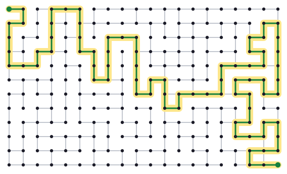
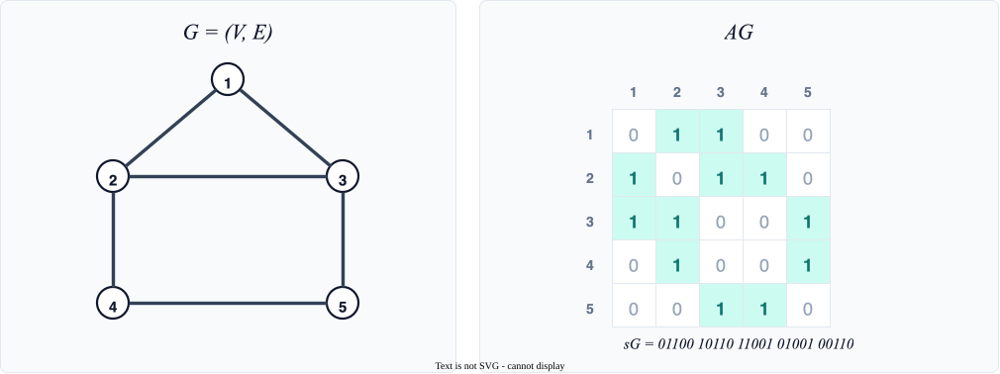
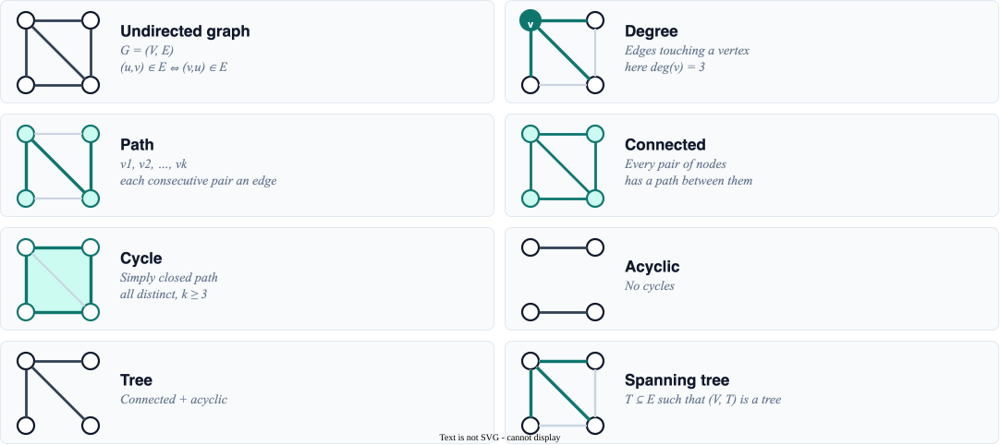
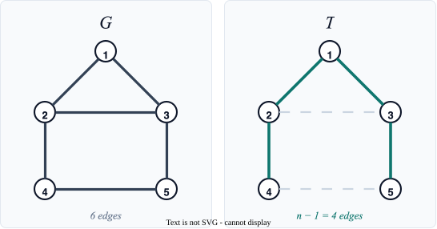
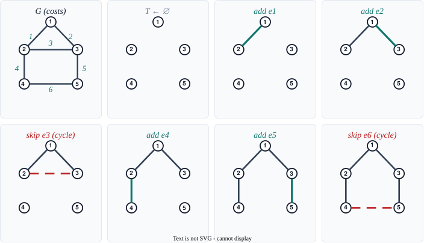
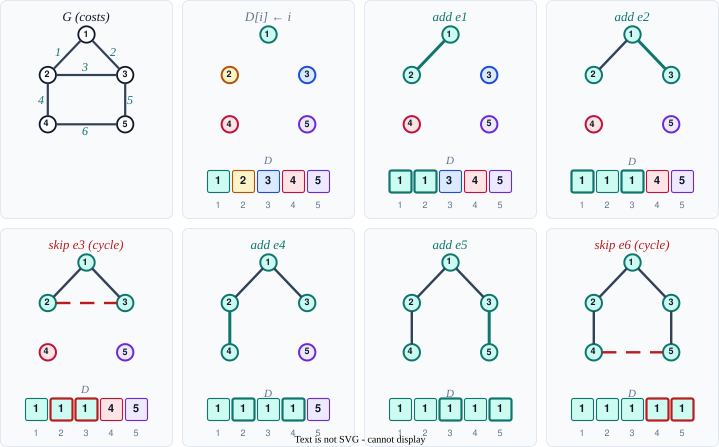
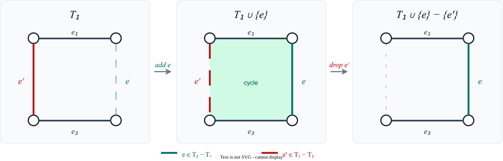

<style>
.slidev-layout.cover {
  background: white !important;
  color: black !important;
}
.slidev-layout.cover h1 {
  color: black !important;
}
</style>

# Minimum Cost Spanning Trees

Section 2.1 — Connect every node in a weighted graph using the cheapest possible set of edges; greedy works, and the proof is gorgeous.

<div style="position: absolute; bottom: 20px; right: 30px; font-size: 0.55em; color: navy;">All references are to the 4th edition of <em>An Introduction to the Analysis of Algorithms</em> (World Scientific, 2025)</div>

<!--
The first published MST algorithm is Otakar Borůvka's, from 1926. He was solving an engineering problem: how to wire the electricity grid of southern Moravia as cheaply as possible. His method grows a forest by, at each step, adding the cheapest edge out of every component at once. Kruskal (1956) and Prim (1957) came three decades later; Jarník had already found Prim's algorithm in 1930. Three independent discoveries of the same greedy idea, the earliest of them written for a power company.
-->

---

# Finding a Path

<div style="color: #9ca3af; font-style: italic; font-size: 0.9em; margin-bottom: 0.8em;">

A large graph. One path from the top-left corner to the bottom-right, in green.

</div>



<!--
By eye, even *a* path through this is a slog. Breadth-first search finds one in linear time; that is not the hard problem. Distances with real weights still move, as the next slide records. Then the lecture asks a different question: connect every node, and do it as cheaply as possible. The figure is a 12 by 20 grid with neighbour edges only, generated by IAA/util/gen_grid_path.py.
-->

---

# Reachability, Then Distances

<div style="color: #9ca3af; font-style: italic; font-size: 0.85em; margin-bottom: 0.5em;">

Unweighted: BFS is linear. Weighted shortest paths sat at Dijkstra for decades, then broke.

</div>

<div style="font-size: 0.78em; text-align: left;">

| Year | Result | Bound |
|------|--------|-------|
| 1959 | BFS (Moore); Dijkstra | unweighted $O(m+n)$; later $O(m + n\log n)$ with Fibonacci heaps |
| 1999 | Thorup, undirected *integers* | $O(m+n)$ in the RAM model |
| 2023 | Duan–Mao–Shu–Yin, undirected *reals* | $O\bigl(m\sqrt{\log n\,\log\log n}\bigr)$, first break of Dijkstra |
| 2025 | Duan–Mao–Mao–Shu–Yin, *directed* | $O(m\log^{2/3}n)$ |
| **2026** | **Kadria–Roditty, undirected reals** | $O\bigl(m\sqrt{\log n}\,(\log\log n\cdot\log\log\log n)^{1/4}\bigr)$ |

</div>

<div style="font-size: 0.72em; text-align: left; margin-top: 0.4em;">

Latest: first improvement since FOCS 2023, by a factor $(\log\log n / \log\log\log n)^{1/4}$, via a nearest-sample distance tool. <a href="https://arxiv.org/abs/2609.15247" style="color: teal;">arXiv:2609.15247</a>

</div>

<!--
The maze on the previous slide is unweighted reachability: BFS, linear time, settled. Distances with real weights are not. Dijkstra with Fibonacci heaps (Fredman–Tarjan 1984) was O(m + n log n) for forty years. Thorup got linear time for undirected integer weights in the RAM model, but the comparison-addition model (only compare and add weights) stayed stuck. Duan, Mao, Shu, and Yin (FOCS 2023) were the first to beat Dijkstra on undirected real weights, randomized. The same group then broke the directed sorting barrier (STOC 2025) and matched the undirected bound for directed graphs (ICALP 2026). Kadria and Roditty, 14 September 2026, shave a (log log n / log log log n)^{1/4} factor off the FOCS 2023 bound; the new piece is a tool that, for every vertex, returns the distance to the nearest vertex in a random sample. This lecture then asks a different question: connect every node, as cheaply as possible.
-->

---

# Graph Representation

<div style="color: #9ca3af; font-style: italic; font-size: 0.9em; margin-bottom: 0.5em;">

A $1$ where there is an edge. Concatenate the rows and you have the input string $s_G \in \{0,1\}^{n^2}$.

</div>

$$A_G[i,j] = \begin{cases} 1 & \text{if } (i,j) \in E \\ 0 & \text{otherwise} \end{cases}$$



<!--
The matrix is symmetric because the graph is undirected, and the diagonal is zero because there are no loops. Looking up edge (i,j) is a single bit test at position (i-1)n + j in s_G. The 240-node maze on the previous slide is the same object, just too big to read by eye.
-->

---

# Graph Definitions

<div style="color: #9ca3af; font-style: italic; font-size: 0.9em; margin-bottom: 0.4em;">

The vocabulary — paths, cycles, connected, tree, spanning tree — that we'll use for every graph algorithm.

</div>



<!--
The four vertices sit in the same places in every panel. Acyclic is a forest, two components, so it is not a tree; the spanning-tree panel is the tree from the panel next to it, drawn as a subset of the original edge set. If G has a cycle it has more than one spanning tree, and every spanning tree has n-1 edges — that is the next slide.
-->


---

# Trees Have $n-1$ Edges

<div style="color: #9ca3af; font-style: italic; font-size: 0.9em; margin-bottom: 0.8em;">

A first induction proof using leaves — the structural fact we'll quote constantly.

</div>

**Lemma:** Every tree with $n$ nodes has exactly $n-1$ edges. <span style="font-size: 0.6em; color: navy;">Lem 2.1, Pg 34, lem:trees</span>


**Proof sketch:**


1. **Claim:** Every tree has a leaf (node with degree 1)
   - If no leaf exists, every node has $\geq 2$ edges
   - Start anywhere, keep walking → must form a cycle (contradiction!)

2. **By induction on $n$:**
   - Base case: $n = 1$ trivially has 0 edges ✓
   - Inductive step: Remove a leaf and its edge from tree $T$
   - Get tree $T'$ with $n$ nodes, which has $n-1$ edges by IH
   - So $T$ has $(n-1) + 1 = n$ edges when we add back the leaf

<!--
Cayley's formula says the complete graph $K_n$ has exactly $n^{n-2}$ distinct spanning trees. For $n=10$ that is already a hundred million; brute-force search over spanning trees is hopeless. The lemma cuts the search space down to "choose $n-1$ edges and stay acyclic," which is still exponential, but it is why a greedy scan of the sorted edge list can even be in the running.
-->

---

# Minimum Cost Spanning Tree

<div style="color: #9ca3af; font-style: italic; font-size: 0.9em; margin-bottom: 0.5em;">

Pick $n-1$ edges that connect everything *and* minimize total cost — the classic network-design problem.

</div>

<div style="display: grid; grid-template-columns: 1.15fr 1fr; gap: 1.4rem; align-items: center; text-align: left;">

<div>

**Setup:**
- Graph $G = (V, E)$ with cost $c: E \rightarrow \mathbb{R}^+$
- Total cost: $c(T) = \sum_{e \in T} c(e)$

**Definition:** $T$ is a **Minimum Cost Spanning Tree (MCST)** if:
1. $T$ is a spanning tree for $G$
2. For any other spanning tree $T'$: $c(T) \leq c(T')$

**Goal:** Find a MCST for $G$

</div>



</div>

<!--
The house is the graph from the representation slide. T keeps the two roof edges and the two walls, and drops the ceiling and the floor: four edges, five vertices, no cycle. It is a spanning tree, not yet a *minimum-cost* one; costs come in on the next slide.
-->


---

# Kruskal's Algorithm

<div style="color: #9ca3af; font-style: italic; font-size: 0.9em; margin-bottom: 0.5em;">

Sort edges cheap-to-expensive and add each one *unless it would close a cycle*.

</div>

<div style="display: grid; grid-template-columns: 0.85fr 1.25fr; gap: 1.2rem; align-items: center; text-align: left;">

<div>

<span style="font-size: 0.6em; color: navy;">Alg 10, Pg 35, alg:kruskal</span>

Kruskal's Algorithm:
```text
Sort: c(e₁) ≤ … ≤ c(eₘ)
T ← ∅
for i = 1 to m:
   if T ∪ {eᵢ} has no cycle:
      T ← T ∪ {eᵢ}
return T
```
In words, order edges by cost, starting with cheapest; keep adding edges unless adding an edge creates a cycle.

</div>



</div>

<!--
Joseph Kruskal published this in 1956 in the Proceedings of the AMS, while at Princeton and later Bell Labs. His brother Martin Kruskal is the Kruskal of Kruskal–Szekeres (general relativity) and of soliton theory; two brothers, two fields, the same surname on a lemma. Costs on the hat are 1 through 6 in the order Kruskal considers them. After the two roof edges, e3 is the ceiling and closes the triangle, so it is rejected in the middle of the run; the two walls go in, then the floor is rejected because 4 is already joined to 5 through the roof. Same spanning tree as the previous slide. Distinct costs, so this MCST is unique.
-->

---

# Cycle Detection with Connected Components

<div style="color: #9ca3af; font-style: italic; font-size: 0.9em; margin-bottom: 0.5em;">

Same $D$ value means same component. A cycle is just $D[r] = D[s]$.

</div>

<div style="display: grid; grid-template-columns: 0.85fr 1.25fr; gap: 1.2rem; align-items: center; text-align: left;">

<div>

- $D[i] = j$ means vertex $i$ is in component $V_j$
- Init: $D[i] \leftarrow i$
- $e_i = (r,s)$ forms cycle iff $D[r] = D[s]$

**Merge** (when adding $(r,s)$): 

<span style="font-size: 0.6em; color: navy;">Alg 11, Pg 35, alg:component</span>

```text
k ← D[r]
l ← D[s]
for j = 1 to n:
    if D[j] = l:
        D[j] ← k
```

</div>



</div>

<!--
Same run as the previous slide. After e1 and e2 the roof is one component, D[2]=D[3]=1, so e3 is a cycle and D does not change. Merge always absorbs the second endpoint's label into the first, which is why everything ends up the color of vertex 1. The ringed cells are the two endpoints just compared.
-->

---

# Why Does Kruskal's Algorithm Work?

<div style="color: #9ca3af; font-style: italic; font-size: 0.9em; margin-bottom: 0.8em;">

Acyclic is automatic; *connected* needs an invariant — the unconsidered edges always plug the gaps.

</div>

We need to show the output $T$ is:
1. **Acyclic** - obvious, we never add an edge that creates a cycle
2. **Connected** - less obvious!


**Loop Invariant for Connectivity:**

> The edge set $T \cup \{e_{i+1}, \ldots, e_m\}$ connects all nodes in $V$


If we reject $e_i$ because it forms a cycle, then $T$ already has a path connecting the endpoints of $e_i$, so connectivity is preserved.

<!--
Optimality is the promising invariant plus the Exchange Lemma on the next slide. The full write-up (promising, both cases, the swap, a witness-MCST trace) is TailEnds/slides_2.1-tailends.md.
-->

---

# Exchange Lemma

<div style="color: #9ca3af; font-style: italic; font-size: 0.9em; margin-bottom: 0.5em;">

Adding $e$ to $T_1$ creates a cycle; some edge $e'$ on that cycle lies in $T_1 - T_2$.

</div>

**Lemma:** Let $G$ be connected, $T_1$ and $T_2$ be spanning trees. For every $e \in T_2 - T_1$ there is an $e' \in T_1 - T_2$ such that $T_1 \cup \{e\} - \{e'\}$ is a spanning tree. <span style="font-size: 0.6em; color: navy;">Lem 2.11, Pg 39, lem:exch</span>



<!--
T1 union {e} has a unique cycle. That cycle cannot live entirely inside T2, because T2 is acyclic, so some edge e' of the cycle is missing from T2 and therefore sits in T1 - T2. Delete it. Whitney's 1935 definition of a matroid is this same exchange property, abstracted away from graphs; graphic matroids are the special case sitting on this slide. The rest of the promising proof is TailEnds/slides_2.1-tailends.md.
-->

---

# Complexity Analysis

<div style="color: #9ca3af; font-style: italic; font-size: 0.9em; margin-bottom: 0.8em;">

Sorting dominates with the simple components array; better data structures buy us $O(m \log n)$.

</div>


1. **Sorting edges:** $O(m \log m)$ or $O(m^2)$ with insertion sort
2. **Main loop:** $m$ iterations
3. **Cycle check:** $O(1)$ using component array
4. **Merge components:** $O(n)$ per merge, at most $n-1$ merges

**Total:** $O(m \log m + mn)$ or with better data structures: $O(m \log n)$

<!--
The $O(n)$ merge on this slide is the naive component array. Replace $D[\,]$ by Union-Find with union-by-rank and path compression and each merge drops to essentially constant time: Tarjan showed the amortized cost is the inverse Ackermann function $\alpha(n)$, which is at most 4 for any $n$ that fits in the universe. Sorting the edges then dominates, and Kruskal is $O(m \log n)$.
-->

---

# Key Problems

<div style="color: #9ca3af; font-style: italic; font-size: 0.9em; margin-bottom: 0.8em;">

Trace, prove, implement — five problems that lock in every part of the lecture.

</div>


1. **Problem 2.4:** Prove that every tree with $n$ nodes has $n-1$ edges <span style="font-size: 0.6em; color: navy;">Prb 2.4, Pg 34, exr:cycles</span>

2. **Problem 2.5:** Trace Kruskal's algorithm on a given graph <span style="font-size: 0.6em; color: navy;">Prb 2.5, Pg 35, exr:kruskal-run</span>

3. **Problem 2.12:** If $e_1$ has strictly smallest cost, show every MCST includes $e_1$ <span style="font-size: 0.6em; color: navy;">Prb 2.12, Pg 39, exr:exch_lem</span>

4. **Problem 2.13:** Show that the smallest edge is in every MCST <span style="font-size: 0.6em; color: navy;">Prb 2.13, Pg 39, exr:kruskal_smallest_edge</span>

5. **Problem 2.15:** Implement Kruskal's algorithm <span style="font-size: 0.6em; color: navy;">Prb 2.15, Pg 39, exr:kruskal_program</span> <a href="https://github.com/michaelsoltys/IAA/blob/main/Problems/P2.15_Kruskal-Program.py" style="font-size: 0.6em; color: teal;">[Python solution]</a>
