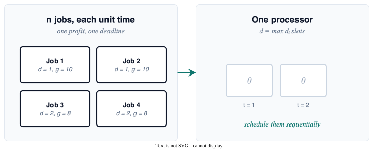
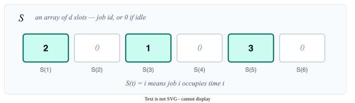
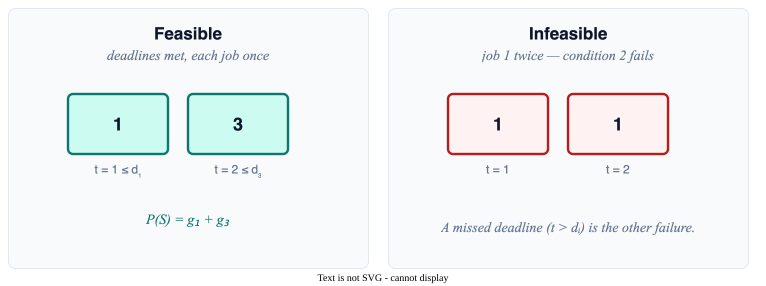
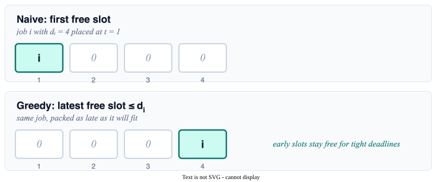
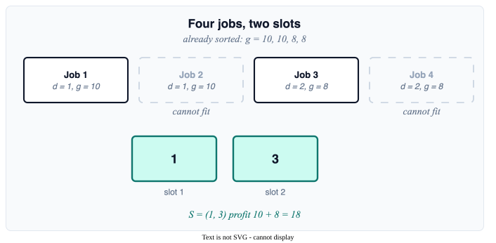
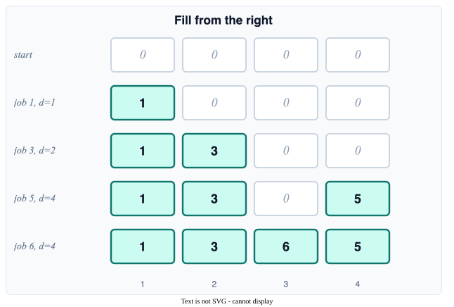
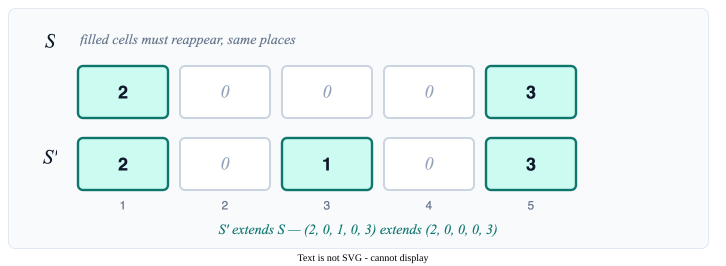
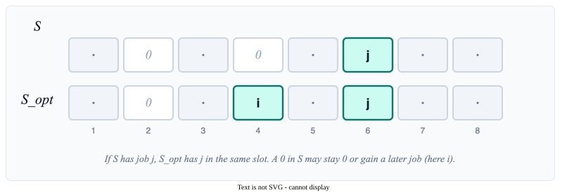
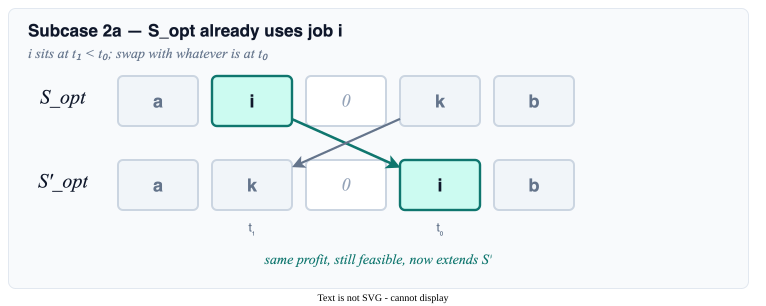
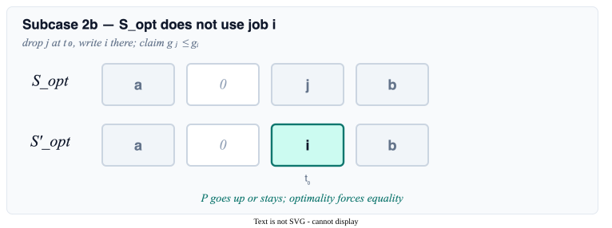

<style>
.slidev-layout.cover {
  background: white !important;
  color: black !important;
}
.slidev-layout.cover h1 {
  color: black !important;
}
</style>

# Jobs with Deadlines and Profits

Section 2.2 — Schedule unit-time jobs to maximize profit, by *procrastinating* — pack the high-value jobs as late as possible.

<div style="position: absolute; bottom: 20px; right: 30px; font-size: 0.55em; color: navy;">All references are to the 4th edition of <em>An Introduction to the Analysis of Algorithms</em> (World Scientific, 2025)</div>

<!--
James R. Jackson's 1955 UCLA report, *Scheduling a production line to minimize maximum tardiness*, is the sequencing paper still taught. Same year, Richard Bellman at RAND surveyed the field and wrote of "the deplorable state of the art." Jackson's rule is earliest due date, one sort; this lecture sorts by profit and packs each job as late as it will fit. The book's index has an entry for procrastination.
-->

---

# Problem Setup

<div style="color: #9ca3af; font-style: italic; font-size: 0.9em; margin-bottom: 0.8em;">

One processor, $n$ jobs, each with a deadline and a payoff — what's the most money we can make?

</div>


<div style="display: grid; grid-template-columns: 0.9fr 1.2fr; gap: 1.2rem; align-items: center; text-align: left;">

<div>

- **$n$ jobs**, each takes **unit time**
- **One processor** to schedule them sequentially
- Each job $i$ has profit $g_i$ and deadline $d_i$
- Miss the deadline → **no profit**

**Goal:** maximize total profit

</div>



</div>

<!--
Unit durations turn the processor into an array of slots. Give the jobs arbitrary lengths and the same objective is a knapsack: one shared capacity and you are packing items. The later section on durations is careful to say greedy does not "seem" to work, with a footnote to Borodin, Nielsen, and Rackoff 2003 on how hard it is even to define the greedy paradigm.
-->


---

# What is a Schedule?

<div style="color: #9ca3af; font-style: italic; font-size: 0.9em; margin-bottom: 0.8em;">

An array of $d$ slots — each holds a job ID or zero, with $d$ being the latest deadline among all jobs.

</div>

A **schedule** $S$ is an array $S(1), S(2), \ldots, S(d)$ where $d = \max_i d_i$:

- $S(t) = i$ means job $i$ occupies time $t$
- $S(t) = 0$ means the slot is idle
- each slot holds at most one job



<!--
Henry Gantt drew these charts around 1917 for US munitions and shipbuilding. The array S is a one-row Gantt chart. Its length is the latest deadline, not the number of jobs; extra jobs simply fail to find a free slot.
-->


---

# Feasible Schedules

<div style="color: #9ca3af; font-style: italic; font-size: 0.9em; margin-bottom: 0.8em;">

Two rules — meet every deadline, no job twice — and we measure success by total profit.

</div>

A schedule $S$ is **feasible** if it satisfies two conditions:

**Condition 1:** $S(t) = i > 0 \Rightarrow t \leq d_i$ (meet the deadline)

**Condition 2:** each job appears in at most one slot

**Total profit:** $P(S) = \sum_{t=1}^{d} g_{S(t)}$ where $g_0 = 0$



<!--
Profit here is all or nothing: miss the deadline and g_i is gone, with no extra charge for how late. Moore's 1968 algorithm, the version he credited to T. E. Hodgson, minimizes the *count* of late jobs instead, by scanning in due-date order and dropping the longest job whenever the schedule overflows. Unweighted, one greedy pass; weighted, NP-hard. The algorithm on these slides only ever writes a feasible S, so the proof stays inside the feasible set.
-->


---

# The Greedy Algorithm

<div style="color: #9ca3af; font-style: italic; font-size: 0.9em; margin-bottom: 0.8em;">

Take jobs in *decreasing profit order* and schedule each as *late as it'll fit* — procrastination, optimized.

</div>

<span style="font-size: 0.6em; color: navy;">Alg 12, Pg 42, alg:jobs</span>

<div style="display: grid; grid-template-columns: 0.95fr 1.15fr; gap: 1.1rem; align-items: center; text-align: left;">

<div>

Job scheduling algorithm:
```text
Sort: g₁ ≥ g₂ ≥ … ≥ gₙ
d ← max_i dᵢ
S(t) ← 0 for all t
for i = 1 to n:
    latest free t ≤ dᵢ
    S(t) ← i
return S
```

Process by decreasing profit; pack each job as **late as it will fit**.

</div>



</div>

<!--
The book calls this a scientific confirmation of procrastination: early slots stay free for jobs whose deadlines are tight. Jackson sequenced by due date; here the order is profit and the placement is the latest feasible slot. The naive scan for that slot is O(n d). A parent array parent[t] = latest free slot at or before t, with path compression, brings the placements to nearly linear after the sort.
-->


---

# Example

<div style="color: #9ca3af; font-style: italic; font-size: 0.9em; margin-bottom: 0.8em;">

Four jobs, two slots — we get the *two highest payouts* and skip the cheaper duplicates.

</div>

Jobs: $(d_1, g_1) = (1, 10)$, $(d_2, g_2) = (1, 10)$, $(d_3, g_3) = (2, 8)$, $(d_4, g_4) = (2, 8)$. Latest deadline $d = 2$.



<!--
Two jobs of profit 10 compete for slot 1; the second is dropped, not postponed. Slot 2 then takes the first profit-8 job. Total 18, the same number you would get by taking both 8s. Problem 2.20 asks when the optimum is unique; tied profits are the usual source of several optima.
-->

---

# Detailed Example

<div style="color: #9ca3af; font-style: italic; font-size: 0.9em; margin-bottom: 0.5em;">

Eight jobs, four slots, already sorted by profit — watch them fill from the right.

</div>

<div style="display: grid; grid-template-columns: 0.95fr 1.15fr; gap: 1.1rem; align-items: center; text-align: left;">

<div style="font-size: 0.88em;">

| Job | $d_i$ | $g_i$ |
|-----|-------|-------|
| 1 | 1 | 10 |
| 2 | 1 | 10 |
| 3 | 2 | 8 |
| 4 | 2 | 8 |
| 5 | 4 | 6 |
| 6 | 4 | 6 |
| 7 | 4 | 6 |
| 8 | 4 | 6 |

$d = 4$, four slots. Jobs 2, 4, 7, 8 find no free slot.

**Final profit:** $10 + 8 + 6 + 6 = 30$

</div>



</div>

<!--
Lawler, in 1973, sequenced jobs last-to-first, always taking, among those still available, the one with the latest deadline. Filling slots from the right is that idea with no precedence constraints. Job 5, deadline 4, takes slot 4, the latest free slot, and only then does job 6 take slot 3. Jobs 2, 4, 7, 8 are late. Total profit 30; the eight profits sum to 60, so half the money is on the floor.
-->


---

# Why Does This Work?

<div style="color: #9ca3af; font-style: italic; font-size: 0.9em; margin-bottom: 0.8em;">

Same trick as Kruskal — *promising* is the loop invariant, just with schedules instead of edge sets.

</div>

**Theorem:** The greedy solution to job scheduling is optimal. <span style="font-size: 0.6em; color: navy;">Thm 2.18, Pg 42, thm:theorem1</span>


**Proof approach:** Same as Kruskal's algorithm!

Show that "$S$ is promising" is a loop invariant.

<!--
Edmonds proved in 1971 that greedy is optimal for every weight function on a hereditary set system if and only if that system is a matroid. Kruskal is the graphic matroid: independent sets are forests. This problem is the scheduling matroid: a set of unit-time jobs is independent when they can all meet their deadlines. CLRS §16.5 is that theorem. That is why the promising argument copies Kruskal's.
-->


---

# Promising Schedules

<div style="color: #9ca3af; font-style: italic; font-size: 0.9em; margin-bottom: 0.8em;">

"Extends" is the schedule version of "is a subset of" — and *promising* means extendable to an optimum.

</div>

**Definition:** $S'$ **extends** $S$ if every filled slot of $S$ reappears, in the same place, in $S'$.



**Definition:** $S$ is **promising** if it can be extended to an optimal schedule using jobs not yet considered.

<!--
Extends is the schedule analogue of "is a subset of." Zeros may be filled later; a written job is frozen. In matroid language S is a partial independent set, and promising means it sits inside some maximum-weight basis.
-->


---

# The Loop Invariant

<div style="color: #9ca3af; font-style: italic; font-size: 0.9em; margin-bottom: 0.8em;">

The empty schedule is trivially promising — we just need to maintain that property through each job.

</div>

**Lemma:** "$S$ is promising" is an invariant for the for-loop in the job scheduling algorithm. <span style="font-size: 0.6em; color: navy;">Lem 2.19, Pg 42, lem:lemma1</span>


**Basis case:** After 0 iterations, $S = (0, 0, \ldots, 0)$
- Can extend to any optimal schedule using all jobs
- So $S$ is promising ✓

<!--
The empty set is independent in every matroid, so the basis of the invariant is free. After zero iterations the witness can be any optimal schedule.
-->


---

# Induction Step Setup

<div style="color: #9ca3af; font-style: italic; font-size: 0.9em; margin-bottom: 0.8em;">

Pick any optimal $S_{\text{opt}}$ that extends $S$ — we'll modify it to extend $S'$ without losing profit.

</div>

Suppose $S$ is promising, and let $S_{\text{opt}}$ be some optimal schedule extending $S$. Let $S'$ be $S$ after considering job $i$.

**Goal:** an optimal $S'_{\text{opt}}$ that extends $S'$.



<!--
A written job is a promise S_opt must honour. Idle slots are the only places the witness is allowed to differ. That is the book's figure for this argument (label fig:jobs). The rest of the proof is one exchange, in two cases.
-->


---

# Case 1: Job Cannot Be Scheduled

<div style="color: #9ca3af; font-style: italic; font-size: 0.9em; margin-bottom: 0.8em;">

If we couldn't fit job $i$, neither could $S_{\text{opt}}$ — so the witness needs no surgery.

</div>

Job $i$ cannot be scheduled (no free slot before deadline).


Then $S' = S$.


Let $S'_{\text{opt}} = S_{\text{opt}}$.


**Subtle point:** $S$ was extendable using jobs $\{i, i+1, \ldots, n\}$, but now we can't use job $i$.

But that's OK! If $S_{\text{opt}}$ used job $i$, there would have been a free slot in $S$ for it (contradiction).

<!--
If adding i would make the on-time set infeasible, no maximum-weight completion of S can contain i. The witness needs no edit. Problem 2.22 is this case.
-->


---

# Case 2: Job is Scheduled

<div style="color: #9ca3af; font-style: italic; font-size: 0.9em; margin-bottom: 0.8em;">

We placed job $i$ at $t_0$ — now split on whether the witness $S_{\text{opt}}$ also uses job $i$.

</div>

Job $i$ is scheduled at time $t_0$ (latest possible free slot).

So $S'(t_0) = i$ where $S(t_0) = 0$.


**Two subcases:**
- (a) Job $i$ is in $S_{\text{opt}}$ at some time $t_1$
- (b) Job $i$ is not in $S_{\text{opt}}$

<!--
t_0 is the latest hole that still meets d_i. The witness either already uses i, somewhere at or before t_0, or it does not. Those are the two subcases.
-->


---

# Subcase 2a: Job $i$ in $S_{\text{opt}}$

<div style="color: #9ca3af; font-style: italic; font-size: 0.9em; margin-bottom: 0.8em;">

If $S_{\text{opt}}$ scheduled job $i$ earlier, swap it with whatever's at $t_0$ — same profit, still feasible.

</div>

Job $i$ is scheduled in $S_{\text{opt}}$ at time $t_1$.

**If $t_1 = t_0$:** $S'_{\text{opt}} = S_{\text{opt}}$

**If $t_1 < t_0$:** swap those two slots — same profit, still feasible, now extends $S'$

**If $t_1 > t_0$:** impossible ($t_0$ was the latest free slot in $S$)



<!--
The swap is the Exchange Lemma of this section. Feasibility of the swap is one of the "why"s in Problem 2.24: i still meets its deadline because t0 ≤ d_i, and k moves earlier so it cannot miss its deadline. Jackson's original proof that earliest due date minimizes maximum lateness is the same adjacent transposition: swap any inversion of due dates and L_max does not increase.
-->


---

# Subcase 2b: Job $i$ Not in $S_{\text{opt}}$

<div style="color: #9ca3af; font-style: italic; font-size: 0.9em; margin-bottom: 0.8em;">

Drop whatever $S_{\text{opt}}$ had at $t_0$, replace it with $i$ — and now we owe a proof of "no profit lost."

</div>

Job $i$ is not scheduled in $S_{\text{opt}}$. Write $i$ at $t_0$ instead.



**Claim:** if $S_{\text{opt}}(t_0) = j$, then $g_j \leq g_i$. Otherwise $j$ would already have been written into $S$ at $t_0$.

<!--
If S_opt left t_0 for a cheaper job, write i there instead. Profit cannot fall, because i was the most profitable remaining job that fitted. That is the weighted-matroid exchange: a heavier element displaces a lighter one at the same rank.
-->


---

# Proving the Claim

<div style="color: #9ca3af; font-style: italic; font-size: 0.9em; margin-bottom: 0.8em;">

If a higher-profit job $j$ were sitting at $t_0$, we'd have scheduled it ourselves earlier — contradiction.

</div>

Assume for contradiction: $g_j > g_i$ (so $j \neq 0$).


- Job $j$ was considered before job $i$ (higher profit)
- Since job $i$ was scheduled at $t_0$, and $S(t_0) = 0$...
- ...job $j$ must have been scheduled at some $t_2 \neq t_0$
- (We know $j$ was scheduled in $S$ since $t_0 \leq d_j$)
- So $S(t_2) = j$
- But $S_{\text{opt}}$ extends $S$, so $S_{\text{opt}}(t_2) = j$
- Yet we said $S_{\text{opt}}(t_0) = j$
- **Contradiction!** (job scheduled twice)

<!--
The contradiction is the greedy-choice property: a heavier job j would already have claimed t_0 when it was considered. So the occupant of t_0 in the witness is at most as valuable as i.
-->


---

# Completing the Proof

<div style="color: #9ca3af; font-style: italic; font-size: 0.9em; margin-bottom: 0.8em;">

The swap can only *increase* profit; combined with $S_{\text{opt}}$'s optimality, equality must hold.

</div>

Since $g_j \leq g_i$:


- $P(S'_{\text{opt}}) = P(S_{\text{opt}}) - g_j + g_i \geq P(S_{\text{opt}})$
- But $S_{\text{opt}}$ was optimal
- So $P(S'_{\text{opt}}) = P(S_{\text{opt}})$
- Therefore $S'_{\text{opt}}$ is also optimal and extends $S'$ ✓


This completes the induction step, proving the loop invariant.

After the algorithm terminates, $S$ is promising and all jobs considered → $S$ is optimal!

<!--
At termination every job has been considered, so a promising S is already a maximum-weight independent set. That is the theorem.
-->


---

# Key Problems

<div style="color: #9ca3af; font-style: italic; font-size: 0.9em; margin-bottom: 0.8em;">

Trace the algorithm, plug holes in the proof, and uniqueness questions about the optimum.

</div>


1. **Problem 2.17:** Trace the algorithm on a given input, showing how "promising" is maintained <span style="font-size: 0.6em; color: navy;">Prb 2.17, Pg 42, exr:job_scheduling</span> <a href="https://github.com/michaelsoltys/IAA/blob/main/Problems/P2.17_Job-Scheduling.py" style="font-size: 0.6em; color: teal;">[Python solution]</a>

2. **Problem 2.20:** Under what conditions is there a unique optimal schedule? <span style="font-size: 0.6em; color: navy;">Prb 2.20, Pg 42, prb:jobsexm</span>

3. **Problem 2.21:** Why does the loop invariant imply the theorem? <span style="font-size: 0.6em; color: navy;">Prb 2.21, Pg 43, exr:lemma1</span>

4. **Problem 2.22:** Discuss the subtle point in Case 1 of the proof <span style="font-size: 0.6em; color: navy;">Prb 2.22, Pg 43, prb:subtle</span>

5. **Problem 2.24:** Answer all the "why's" in the proof <span style="font-size: 0.6em; color: navy;">Prb 2.24, Pg 44, exr:whys</span>

<!--
Problem 2.24's "whys" are the feasibility of the swap: i still meets d_i at t_0, and k moving earlier cannot miss its deadline. A linear independence test for this matroid: for every t, at most t jobs in the set have deadline ≤ t.
-->


---

# What's Different from MCST?

<div style="color: #9ca3af; font-style: italic; font-size: 0.9em; margin-bottom: 0.8em;">

Same template, different swap — Kruskal uses Exchange Lemma, this one swaps slots in a schedule.

</div>


Both use "promising" as a loop invariant, but:

| MCST (Kruskal) | Job Scheduling |
|----------------|----------------|
| Add cheapest edge | Add most profitable job |
| Avoid cycles | Respect deadlines |
| Use Exchange Lemma | Use swap argument |
| Build up a tree | Fill schedule slots |

Same proof structure, different problem!

<!--
Kruskal's independent sets are forests; here they are sets of unit-time jobs that can all meet their deadlines. Same Edmonds theorem, two matroids. Give the jobs arbitrary durations and the feasible sets stop being a matroid, which is why the later section leaves greedy behind.
-->
