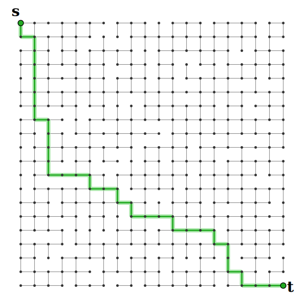
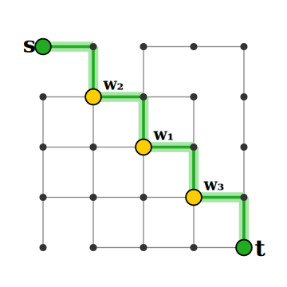

<style>
.slidev-layout.cover {
  background: white !important;
  color: black !important;
}
.slidev-layout.cover h1 {
  color: black !important;
}
</style>

# Savitch's Algorithm

Section 3.3 - Savitch's Algorithm

<!--
Walter Savitch published this in 1970, when he was 27, in a paper with the
unassuming title "Relationships between nondeterministic and deterministic
tape complexities." Buried in that paper was Savitch's Theorem:
NSPACE(s(n)) ⊆ DSPACE(s(n)²). It's still one of the cleanest results in
complexity theory — and we don't know if the squaring is necessary! That's
the famous open problem: is NL = L? If you solved it, you'd be on a
postage stamp.

Teaching hook: this is the rare algorithm where the *time* analysis is
embarrassing and the *space* analysis is the whole point. Most of the
course optimizes time; here we deliberately throw time away.
-->


<div style="position: absolute; bottom: 20px; right: 30px; font-size: 0.55em; color: navy;">All references are to the 4th edition of <em>An Introduction to the Analysis of Algorithms</em> (World Scientific, 2025)</div>

---

# The Problem: Graph Reachability

<div style="display: grid; grid-template-columns: 1fr 1fr; gap: 2rem; align-items: center;">
<div>

Given a directed graph $G$ and two nodes $s$ and $t$:

**Question:** Is there a path from $s$ to $t$?

<v-click>

We're not looking for the *shortest* path — just whether $t$ is **reachable** from $s$.

</v-click>

<v-click>

**Twist:** We want to minimize **space** (memory), not time!

</v-click>

</div>
<div style="text-align: center;">

</div>
</div>

---

# Why Care About Space?

The graph may be given **implicitly**, not explicitly.

<v-click>

**Example:** The World Wide Web
- $V$ = all web pages
- $(x, y) \in E$ if page $x$ has a hyperlink to page $y$
- The graph is **enormous** — we can't store it all in memory
- We query pages piecemeal

</v-click>

<!--
The web graph has roughly 50 billion indexed pages and on the order of a
trillion edges. Storing the adjacency list alone would take terabytes —
nobody runs BFS on it from a laptop. But Savitch's algorithm only needs
~log²(50 billion) ≈ 1300 bits of state. That's *less than this slide*.
The catch, of course, is that you'd wait until the heat death of the
universe for it to finish — but the *space* would fit on a Post-it.

Other "implicit graph" examples worth mentioning: chess positions (~10⁴³
nodes), Rubik's cube states (~4×10¹⁹), reachable states of a Turing machine
during a computation. Reachability in implicit graphs is *the* canonical
problem behind PSPACE-completeness.
-->


<v-click>

Savitch's algorithm solves reachability in space $O(\log^2 n)$ — remarkably small!

</v-click>

---

# The Key Idea

Define $\text{R}(G, u, v, i)$ = true iff there is a path from $u$ to $v$ of length $\leq 2^i$

<v-click>

**Recursive insight:** If a path exists from $u$ to $v$, it must have a **midpoint** $w$:

$$\text{R}(G, u, v, i) \iff (\exists w)[\text{R}(G, u, w, i-1) \wedge \text{R}(G, w, v, i-1)]$$

</v-click>

<v-click>

A path of length $\leq 2^i$ can be split into two paths of length $\leq 2^{i-1}$

</v-click>

<!--
This "guess the midpoint" trick is the same idea behind the Floyd–Warshall
algorithm and behind matrix exponentiation by repeated squaring. It's a
recurring theme: when you can't afford to remember the *whole* path,
remember just enough to recurse.

A nice analogy for students: imagine you're trying to prove two strangers
know each other through a chain of friends, but you can only hold one
person's name in your head at a time. You'd ask "is there *somebody* I
both of us know?" — that somebody is the midpoint. Then recurse on each
half, forgetting the midpoint as soon as you're done. That's literally
what Savitch's algorithm does on the call stack.
-->


---

# Savitch's Algorithm

<span style="font-size: 0.6em; color: navy;">Alg 19, Pg 68, alg:savitch</span>

```text
R(G, u, v, i):
  if i = 0:
    if u = v: return true
    elif (u, v) is an edge: return true
  else:
    for every vertex w:
      if R(G, u, w, i-1) and R(G, w, v, i-1):
        return true
  return false
```

<v-click>

**To solve reachability:** Call $\text{R}(G, s, t, \lceil \log_2 n \rceil)$

since any path in an $n$-node graph has length $\leq n \leq 2^{\lceil \log_2 n \rceil}$

</v-click>

---

# Example: Recursion Stack

<div style="display: grid; grid-template-columns: 1.1fr 1fr; gap: 1.5rem; align-items: center;">
<div>

5×5 grid; query $\text{R}(s, t, 3)$ — path of length $\leq 8$?

<v-clicks>

**Level 3:** guess midpoint $w_1$
$$\text{R}(s, w_1, 2) \;\wedge\; \text{R}(w_1, t, 2)$$

**Level 2 (left half):** guess $w_2$
$$\text{R}(s, w_2, 1) \;\wedge\; \text{R}(w_2, w_1, 1)$$

**Level 2 (right half):** guess $w_3$
$$\text{R}(w_1, w_3, 1) \;\wedge\; \text{R}(w_3, t, 1)$$

**Level 1 → 0:** each call splits once more, bottoming out at single edges ✓

</v-clicks>

<v-click>

Stack depth $= O(\log n)$; each frame stores one vertex.

</v-click>

</div>
<div style="text-align: center;">

</div>
</div>

---

# Space Analysis

**Why $O(\log^2 n)$ space?**

<v-clicks>

- The recursion depth is at most $i \leq \lceil \log_2 n \rceil$
- At each level, we store one vertex $w$ — takes $s = O(\log n)$ bits
- **Total space:** $i \cdot s = O(\log n) \cdot O(\log n) = O(\log^2 n)$

</v-clicks>

<v-click>

**The trick:** The two recursive calls $\text{R}(G, u, w, i-1)$ and $\text{R}(G, w, v, i-1)$ are made **sequentially**, not in parallel — so the same stack space is reused!

</v-click>

---

# Time Complexity

<v-click>

What's the **time** cost of this space savings?

</v-click>

<v-click>

At each level $i$, we try all $n$ possible midpoints $w$, and each leads to two recursive calls at level $i - 1$:

$$T(n, i) \leq n \cdot 2 \cdot T(n, i-1)$$

</v-click>

<v-click>

This gives exponential time — $O(n^{2 \log n})$ — a huge cost for tiny space!

**Savitch's algorithm trades time for space.**

</v-click>

<!--
Time–space trade-offs are a deep theme in CS. The classic motto from
complexity theory is "you can usually buy one with the other, but rarely
for free." Savitch is an extreme example: it gives up an *exponential*
amount of time to save a *quadratic* amount of space.

Real-world echo: cryptographic hash functions like scrypt and Argon2 are
*deliberately* designed to defeat time–space trade-offs — they want
attackers to be unable to use Savitch-style tricks. So this 1970 result
still shows up in 2020s password hashing standards.
-->


---

# Key Questions

<v-clicks>

1. **Problem 3.7:** Prove that Savitch's algorithm correctly computes $\text{R}(G, u, v, i)$ and uses at most $i \cdot s$ space. Conclude $O(\log^2 n)$ space. <span style="font-size: 0.6em; color: navy;">Prb 3.7, Pg 67, exr:savitch1</span>

2. **Problem 3.8:** What is the exact time complexity of Savitch's algorithm? <span style="font-size: 0.6em; color: navy;">Prb 3.8, Pg 67, prb:savitchtime</span>

3. **Problem 3.9:** Implement Savitch's algorithm so that at each step it outputs the contents of the recursion stack. <span style="font-size: 0.6em; color: navy;">Prb 3.9, Pg 67, exr:savitch-program</span> <a href="https://github.com/michaelsoltys/IAA/blob/main/Problems/P3.9_Savitch.py" style="font-size: 0.6em; color: teal;">[Python solution]</a>

</v-clicks>

---

# Bonus: Quicksort & Git Bisect

Two more divide and conquer ideas from Section 3.4:

<v-clicks>

**Quicksort** — pick a pivot, partition, recurse:
```haskell
qsort [] = []
qsort (x:xs) = qsort smaller ++ [x] ++ qsort larger
  where
    smaller = [a | a <- xs, a <= x]
    larger  = [b | b <- xs, b > x]
```

**Git bisect** — binary search through commit history to find which commit introduced a bug. A practical application of divide and conquer!

</v-clicks>

<!--
A bit of history on git bisect: Linus Torvalds wrote it into Git almost from the
beginning because he hated reading other people's bug reports — he would
rather automate the search than ask "what did you change?". The Mozilla and
Chromium projects routinely bisect across *thousands* of commits, and the
WebKit team has bisected regressions across more than 10,000 commits in a
single afternoon — that's only ~14 builds thanks to log₂.

Even better: git bisect run takes a *script* and does the whole thing for
you while you go get coffee. Tell the students: the next time they're stuck
on "which of my last 50 commits broke the tests?", they can let divide and
conquer answer in 6 steps. It's the most viscerally satisfying use of
log₂(n) most programmers ever encounter.

Historical aside: the technique predates Git. The Linux kernel folks were
doing "manual bisection" with tarballs in the 90s, and Donald Knuth himself
called binary search "an idea so simple that it took fifteen years for the
first bug-free version to appear in print" (TAOCP Vol 3). Knuth's point:
even *binary search* is hard to get right — off-by-one errors haunted
published versions until 1962.
-->


---

# Summary

<v-clicks>

- **Savitch's algorithm** solves graph reachability in $O(\log^2 n)$ space
- **Key idea:** A path of length $\leq 2^i$ has a midpoint splitting it into two paths of length $\leq 2^{i-1}$
- **Space trick:** Sequential (not parallel) recursive calls allow stack reuse
- **Trade-off:** Exponential time for logarithmic space
- **Motivation:** Implicitly represented graphs (e.g., the WWW)

</v-clicks>

---

# Chapter 3 Complete

Divide and Conquer key takeaways:
- **Mergesort:** $O(n \log n)$ sorting via split-merge
- **Karatsuba:** $O(n^{1.59})$ multiplication via reducing recursive calls
- **Savitch:** $O(\log^2 n)$ space via midpoint recursion
