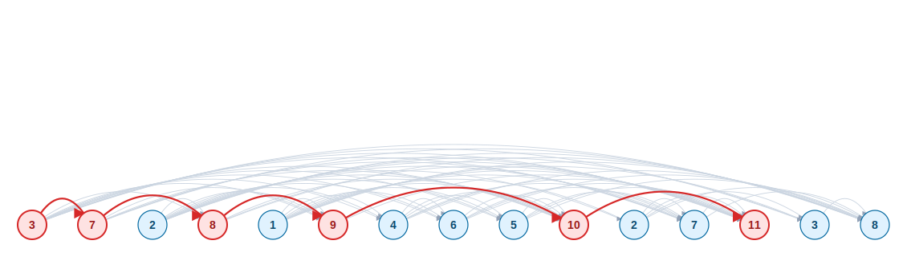
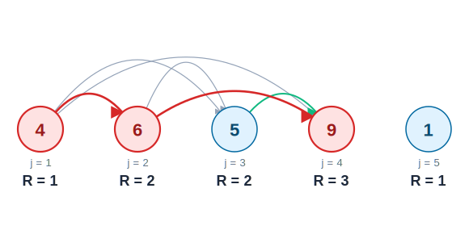

<style>
.slidev-layout.cover {
  background: white !important;
  color: black !important;
}
.slidev-layout.cover h1 {
  color: black !important;
}
</style>

# Longest Monotone Subsequence

Section 4.1 - LMS

<div style="position: absolute; bottom: 20px; right: 30px; font-size: 0.55em; color: navy;">All references are to the 4th edition of <em>An Introduction to the Analysis of Algorithms</em> (World Scientific, 2025)</div>

<!--
Stanisław Ulam posed the LIS question around 1961: for a random permutation of n numbers, how long do you expect the longest increasing subsequence to be? The answer took nearly four decades to pin down. Hammersley (1972) showed the expected length is asymptotically c·√n; Logan–Shepp and Vershik–Kerov proved c = 2 in the late 1970s; and Baik, Deift, and Johansson (1999) nailed down the full distribution — a Tracy–Widom law borrowed from random matrix theory. A textbook DP problem that opens a door into a very deep corner of probability.
-->

---

# Problem Definition

**Input:** $d, a_1, a_2, \ldots, a_d \in \mathbb{N}$

**Output:** $L =$ length of the longest monotone non-decreasing subsequence

<div style="background: #fefce8; border: 2px dotted #4B0082; border-radius: 12px; padding: 10px 20px; margin-top: 10px; font-size: 0.75em;">

<v-clicks>

**Where it shows up:**

- **Bioinformatics:** conserved motifs in DNA/protein sequences; longest chain of matching k-mers between genomes
- **Patience sorting / card games:** number of piles in the card game Patience equals the LIS length — also yields an $O(d \log d)$ algorithm
- **Version control & diff tools:** `diff`, `git`, file-merge reduce to LCS, which maps to LIS via index permutation
- **Box / envelope nesting (Russian dolls):** longest chain of items that fit strictly inside each other
- **Time series & finance:** longest monotone run in stock prices, sensor readings, or performance benchmarks
- **Packet reordering / network QoS:** measure how "out of order" a packet stream is
- **Airline / job scheduling:** longest chain of compatible flights or tasks

</v-clicks>

</div>

<!--
Ulam's 1961 question — how long is the LIS of a random permutation of n numbers? — took nearly forty years to pin down. Baik, Deift, and Johansson (1999) proved that after rescaling, the length follows the Tracy–Widom distribution from random matrix theory. A tidy DP problem with a surprisingly deep probabilistic shadow.
-->

---

# What is a Subsequence?

A subsequence **need not be consecutive**

For $a_{i_1}, a_{i_2}, \ldots, a_{i_k}$ to be a monotone subsequence:

<v-clicks>

- **Indices are increasing:** $1 \leq i_1 < i_2 < \ldots < i_k \leq d$

- **Values are non-decreasing:** $a_{i_1} \leq a_{i_2} \leq \ldots \leq a_{i_k}$

</v-clicks>

<!--
Erdős and Szekeres proved in 1935 that any sequence of more than (r−1)(s−1) distinct real numbers must contain either an increasing subsequence of length r or a decreasing one of length s. So in any sequence of 10 distinct numbers, a monotone subsequence of length 4 is unavoidable — try to construct one without, and you'll fail. The problem was originally posed by Esther Klein; George Szekeres (whom she was then dating, and later married) worked out the proof together with Erdős. Erdős nicknamed it the "Happy Ending theorem" for that reason.
-->

---

# Example

Consider the sequence: $\{4, 6, 5, 9, 1\}$

<v-clicks>

Some monotone subsequences:
- $\{4, 6, 9\}$ - length 3 ✓
- $\{4, 5, 9\}$ - length 3 ✓
- $\{4, 6\}$ - length 2
- $\{1\}$ - length 1

The **longest monotone subsequence (LMS)** has length **3**

</v-clicks>

<!--
Note that the LMS is not unique — {4, 6, 9} and {4, 5, 9} both qualify. The algorithm below returns only the length; reconstructing an actual witness subsequence is Problem 4.1, which requires a backtracking pass over R.
-->

---

# Extension DAG

For $w = \langle 3, 7, 2, 8, 1, 9, 4, 6, 5, 10, 2, 7, 11, 3, 8 \rangle$: node $i$ holds $w_i$; draw $i \to j$ when $i < j$ and $w_i \leq w_j$.
The **longest path** (red) gives the LMS: $3 \to 7 \to 8 \to 9 \to 10 \to 11$, length **6**.



<!--
The DAG view is the structural picture behind the DP: R(j) is literally 1 + the longest path ending at any predecessor of j. This also makes the recurrence's base case visible — any node with no usable incoming edge starts fresh at R=1.
-->

---

# Dynamic Programming Approach

## Step 1: Define Subproblems

Let $R(j) =$ length of the longest monotone subsequence **that ends at** $a_j$

<v-click>

The final answer is:

$$L = \max_{1 \leq j \leq d} R(j)$$

</v-click>

---

# Step 2: Find the Recurrence

**Base case:** $R(1) = 1$

**Recursive case** for $j > 1$:

$$
R(j) = \begin{cases}
1 & \text{if } a_i > a_j \text{ for all } 1 \leq i < j \\
1 + \max_{1 \leq i < j} \{R(i) \mid a_i \leq a_j\} & \text{otherwise}
\end{cases}
$$

<v-click>

**Idea:** Either $a_j$ starts a new subsequence, or it extends a previous one

</v-click>

---

# Recurrence in Action

Using $\langle 4, 6, 5, 9, 1 \rangle$, with $R(1){=}1$, $R(2){=}2$, $R(3){=}2$ already computed.

<div class="grid grid-cols-2 gap-6 mt-4">

<div style="background: #ecfdf5; border: 2px solid #10b981; border-radius: 10px; padding: 10px 18px; font-size: 0.85em;">

**Extending case — $R(4)$ for $a_4 = 9$**

Candidates $i < 4$ with $a_i \leq 9$:

| $i$ | $a_i$ | $a_i \leq 9$ | $R(i)$ |
|-----|-------|---------------|--------|
| 1 | 4 | ✓ | 1 |
| 2 | 6 | ✓ | 2 |
| 3 | 5 | ✓ | 2 |

$$R(4) = 1 + \max\{1, 2, 2\} = 3$$

</div>

<div style="background: #fef2f2; border: 2px solid #ef4444; border-radius: 10px; padding: 10px 18px; font-size: 0.85em;">

**Base case — $R(5)$ for $a_5 = 1$**

Candidates $i < 5$ with $a_i \leq 1$:

| $i$ | $a_i$ | $a_i \leq 1$ |
|-----|-------|---------------|
| 1 | 4 | ✗ |
| 2 | 6 | ✗ |
| 3 | 5 | ✗ |
| 4 | 9 | ✗ |

No valid predecessor &nbsp;&rarr;&nbsp; $R(5) = 1$

</div>

</div>

<!--
The two colored panels map to the two branches of the recurrence: green for the "extends a previous run" case, red for the "start fresh" base case. Students often miss that the base case kicks in not only at j=1 but whenever every earlier element is strictly greater than a_j.
-->

---

# Step 3: Write the Algorithm

<span style="font-size: 0.6em; color: navy;">Alg 21, Pg 76, alg:lms</span>

```text
LMS Algorithm:
  R(1) ← 1
  for j = 2 to d:
    max ← 0
    for i = 1 to j-1:
      if R(i) > max and aᵢ ≤ aⱼ:
        max ← R(i)
    R(j) ← max + 1
```

<v-click>

**Time complexity:** $O(d^2)$

**Space complexity:** $O(d)$

</v-click>

<!--
The O(d²) DP is the clean, textbook version, but the problem also admits an O(d log d) algorithm via patience sorting — literally modeled on the card game Patience (Klondike Solitaire). You deal cards one at a time onto the leftmost pile whose top card is larger; at the end, the number of piles equals the length of the LIS. Aldous and Diaconis popularized the connection in a widely-read 1999 Bulletin of the AMS survey. Binary search over the pile-tops is what gives the log factor.
-->

---

# Example Walkthrough

Building $R$ left to right for $\langle 4, 6, 5, 9, 1 \rangle$ — arrows show which predecessor each $R(j)$ extends.



<div class="grid grid-cols-5 gap-2 mt-2" style="font-size: 0.7em;">

<v-clicks>

<div style="background: #fef3c7; border-left: 4px solid #d97706; border-radius: 6px; padding: 6px 10px;">
<b>j=1, a₁=4</b><br/>Base case<br/><b style="color:#1e293b">R(1)=1</b>
</div>

<div style="background: #ecfdf5; border-left: 4px solid #10b981; border-radius: 6px; padding: 6px 10px;">
<b>j=2, a₂=6</b><br/>Extends a₁ (4≤6)<br/><b style="color:#1e293b">R(2)=1+1=2</b>
</div>

<div style="background: #ecfdf5; border-left: 4px solid #10b981; border-radius: 6px; padding: 6px 10px;">
<b>j=3, a₃=5</b><br/>Extends a₁ (4≤5)<br/><b style="color:#1e293b">R(3)=1+1=2</b>
</div>

<div style="background: #fee2e2; border-left: 4px solid #d62828; border-radius: 6px; padding: 6px 10px;">
<b>j=4, a₄=9</b><br/>Extends a₂ or a₃<br/><b style="color:#1e293b">R(4)=1+2=3 ★</b>
</div>

<div style="background: #fef3c7; border-left: 4px solid #d97706; border-radius: 6px; padding: 6px 10px;">
<b>j=5, a₅=1</b><br/>No aᵢ ≤ 1 before it<br/><b style="color:#1e293b">R(5)=1</b>
</div>

</v-clicks>

</div>
---

# Key Questions

<v-clicks>

1. **Problem 4.1:** Once we have computed array $R$, how can we build an actual subsequence of length $L$? <span style="font-size: 0.6em; color: navy;">Prb 4.1, Pg 76, exr:lmsbacktrack</span>

2. **Problem 4.2:** What are appropriate pre/post-conditions? How do we prove correctness with a loop invariant? <span style="font-size: 0.6em; color: navy;">Prb 4.2, Pg 76, exr:lmscorrectness</span>

3. **Problem 4.3:** What if consecutive elements can differ by at most $s$? <span style="font-size: 0.6em; color: navy;">Prb 4.3, Pg 76, exr:stepone</span>
   - Example: For $s=1$ and sequence $\{7, 6, 1, 4, 7, 8, 20\}$
   - Answer: $\{7, 6, 7, 8\}$ with length 4

</v-clicks>

---

# Summary

<v-clicks>

- **Problem:** Find longest non-decreasing subsequence
- **Approach:** Dynamic programming with subproblem $R(j)$
- **Recurrence:** Build from previous valid positions
- **Complexity:** $O(d^2)$ time, $O(d)$ space
- **Key insight:** Optimal substructure - LMS ending at $j$ extends LMS from earlier positions

</v-clicks>

<!--
Two structural views worth knowing. First, the Robinson–Schensted correspondence assigns each permutation a pair of standard Young tableaux; the length of the LIS equals the length of the first row of either tableau — a purely combinatorial identity, no DP in sight. Second, Dilworth's theorem gives the dual picture: the minimum number of decreasing subsequences needed to partition the input equals the LIS length. DP is the operational answer; these are the structural ones, and they generalize in directions the DP doesn't.
-->

---

# Next Steps

- Practice implementing the algorithm
- Work on the exercises (backtracking, correctness proof)
- Consider the variant with step constraint
- Next section: All Pairs Shortest Path (Floyd's Algorithm)
