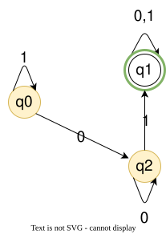
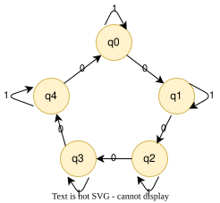

# Deterministic Finite Automata

Section 9.3.1 — The simplest model of computation: finite memory, no tape, just states and transitions.

All references are to the 4th edition of <em>An Introduction to the Analysis of Algorithms</em> (World Scientific, 2025)

---

# Example 1: $L_{01}$

A 3-state DFA for the language of binary strings containing $01$ as a substring.

$L_{01} = \{ w \mid w \text{ is of the form } x01y \in \Sigma^* \}$

The set of strings over $\Sigma = \{0, 1\}$ containing $01$ as a substring.

So: $111 \notin L_{01}$, but $001 \in L_{01}$

**DFA:**
- $\Sigma = \{0,1\}$
- $Q = \{q_0, q_1, q_2\}$
- $F = \{q_1\}$

**Transition table:**
$$
\begin{array}{c||c|c}
       & 0   & 1   \\\hline\hline
q_0    & q_2 & q_0 \\\hline
\ast q_1 & q_1 & q_1 \\\hline
q_2    & q_2 & q_1
\end{array}
$$

**Transition diagram:**

Fig 9.1, Pg 220, fig:exampledfa

---

# Understanding the $L_{01}$ DFA

Each state encodes *what we've seen so far* — the DFA's only memory is which state it's in.

- **$q_0$** — haven't seen a $0$ yet
  - On $1$: stay in $q_0$
  - On $0$: go to $q_2$

- **$q_2$** — have seen a $0$, waiting for a $1$
  - On $0$: stay in $q_2$
  - On $1$: go to $q_1$ (saw $01$)

- **$q_1$** — have seen $01$ — **accept** (absorbing)
  - On $0$ or $1$: stay in $q_1$

**Note:** presenting a DFA is not enough — we must also **prove** it is correct.

<!--
The proof is induction on |w|. It is easier once the extended transition function is defined, which is why it waits a few slides. Problem 9.2 in the book (exr:reg0) asks for it.
-->

---

# Example 2: number of 0s div by 5

A different kind of memory: not a pattern, but a count modulo 5.

$L = \{ w : \text{ the number of 0s in } w \text{ is divisible by } 5 \}$

So: $1010 \notin L$, but $0100100 \in L$. $\varepsilon \in L$.

State $q_i$ means "$i$ zeros so far, modulo 5." A $0$ advances the count; a $1$ stays put.

<!--
Five states on a cycle. q0 is the start and should be accepting (zero 0s is a multiple of 5). Cousin of Problem 9.5 (B_n, C_n): the machine counts modulo n in its states. Same idea as the quiz item that a 0 in position 1,000,004 needs that many states — here the modulus is 5, so five states suffice.
-->

---

# Definition, and how it runs

The 5-tuple is the machine. Feeding it a string is just following $\delta$ until the input is gone.

A **DFA** is a 5-tuple $A = (Q, \Sigma, \delta, q_0, F)$

- **$Q$** — finite set of **states**
- **$\Sigma$** — **alphabet**
- **$\delta: Q \times \Sigma \to Q$** — **transition function**
  - $\delta(q, a) = p \in Q$
- **$q_0 \in Q$** — **start state**
- **$F \subseteq Q$** — **accepting** states

Run $A$ on $w = a_1 a_2 \ldots a_n$:

$$\delta(q_0, a_1) = q_1,\; \ldots,\; \delta(q_{n-1}, a_n) = q_n$$

**Accept** iff $q_n \in F$. Otherwise **reject**.

Equivalently, there is a sequence $r_0, \ldots, r_n$ with
1. $r_0 = q_0$
2. $\delta(r_i, w_{i+1}) = r_{i+1}$
3. $r_n \in F$

---

# ETF: Intuition

Watch the recursion peel off symbols from the right, then collapse back left to right.

The extended transition function processes a string **one symbol at a time**, left to right.

To compute $\hat\delta(q_0, \texttt{1001})$:

$$\hat\delta(q_0, \texttt{1001}) = \delta(\hat\delta(q_0, \texttt{100}), \texttt{1})$$
$$= \delta(\delta(\hat\delta(q_0, \texttt{10}), \texttt{0}), \texttt{1})$$
$$= \delta(\delta(\delta(\hat\delta(q_0, \texttt{1}), \texttt{0}), \texttt{0}), \texttt{1})$$
$$= \delta(\delta(\delta(\delta(\hat\delta(q_0, \varepsilon), \texttt{1}), \texttt{0}), \texttt{0}), \texttt{1})$$
$$= \delta(\delta(\delta(\delta(q_0, \texttt{1}), \texttt{0}), \texttt{0}), \texttt{1})$$

The recursion peels off the last symbol until $\varepsilon$, then evaluates $\delta$ from left to right.

---

# Extended Transition Function

Lift $\delta$ from one symbol to whole strings by induction on length.

Given $\delta$, define $\hat\delta$ inductively.

**Basis:** $\hat\delta(q, \varepsilon) = q$

**Induction:** if $w = xa$ with $x \in \Sigma^*$ and $a \in \Sigma$,
$$\hat\delta(q, w) = \hat\delta(q, xa) = \delta(\hat\delta(q, x), a)$$

So $\hat\delta: Q \times \Sigma^* \to Q$, and
$$w \in L(A) \iff \hat\delta(q_0, w) \in F$$

---

# Language of a DFA

The DFA is a piece of *syntax*; the language $L(A)$ is its *semantics* — the set of strings it accepts.

The **language** of a DFA $A$ is:
$$L(A) = \{ w \mid \hat\delta(q_0, w) \in F \}$$

**Important distinction:**
- $A$ is a **syntactic** object (a machine, a piece of "hardware")
- $L(A)$ is a **semantic** object (a set of strings, a "meaning")

$L$ is a function that assigns a **meaning** or **interpretation** to a syntactic object.

This syntax/semantics distinction is fundamental in computer science.

---

# Regular Languages

A language is *regular* exactly when some DFA recognizes it — and three operations preserve that property.

**Definition:** A language $L$ is **regular** iff there exists a DFA $A$ such that $L = L(A)$

What operations on languages **preserve** regularity?

**Regular operations:**
1. **Union:** $L \cup M = \{ w \mid w \in L \text{ or } w \in M \}$
2. **Concatenation:** $LM = \{ xy \mid x \in L \text{ and } y \in M \}$
3. **Kleene Star:** $L^* = \{ x_1 x_2 \ldots x_n \mid x_i \in L, n \ge 0 \}$

**Caution:** For alphabets, $\Sigma^+ = \Sigma^* - \{\varepsilon\}$. For a general language, $L^+ = L^* - \{\varepsilon\}$ is **not** necessarily true. (Why?)

---

# Closure Under Regular Operations

The product construction: run two DFAs in parallel as one machine over pairs of states.

**Theorem:** Regular languages are closed under regular operations (union, concatenation, and Kleene star) Thm 9.8, Pg 221, thm:1

**Proof (union):** Given regular $A, B$ with DFAs $M_1, M_2$:

Build DFA $M$ with $Q_M = Q_{M_1} \times Q_{M_2}$ (Cartesian product)

$$\delta_M((r_1, r_2), a) = (\delta_{M_1}(r_1, a), \delta_{M_2}(r_2, a))$$

Accept if either component reaches an accepting state.

**Key idea:** The state of $M$ is a **pair** of states — one from each machine. States are finite descriptors; they can be anything, including sets of states from other machines.

**For concatenation and star:** we need **nondeterminism** (next section).
