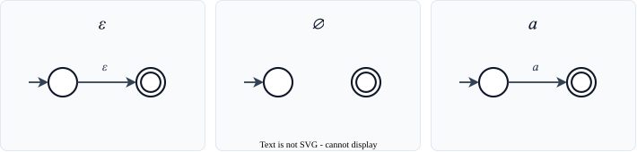
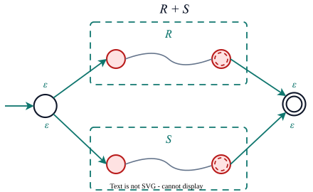
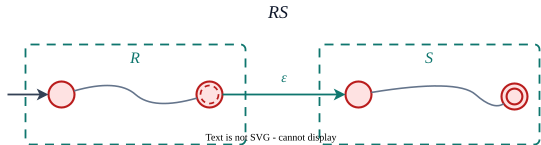
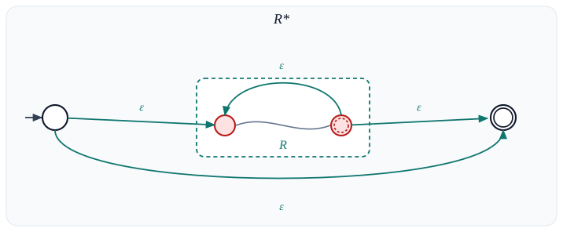
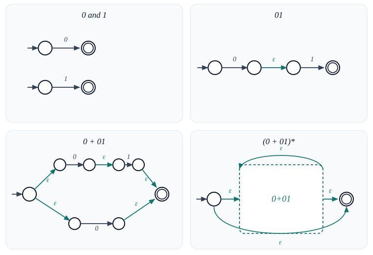
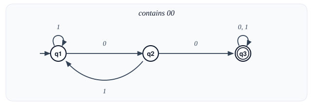
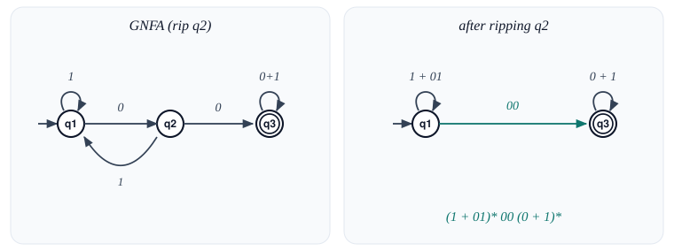

# Regular Expressions

Section 9.3.3 — An algebraic notation for regular languages, and its full equivalence with finite automata.

All references are to the 4th edition of <em>An Introduction to the Analysis of Algorithms</em> (World Scientific, 2025)

<!--
Stephen Cole Kleene introduced regular events in 1956, in Shannon and McCarthy's *Automata Studies*. He was modelling nerve nets, not text search. The Unix tool `grep` is named for the `ed` command `g/re/p` — global, regular expression, print — and Ken Thompson wrote the original grep in a night in 1973 after a user asked for a search that could span lines. Formal REs and the regex in Perl or Python later diverged: backreferences take you outside the regular languages.
-->

---

# Overview

From REs to $\varepsilon$-NFAs, and from DFAs back to REs — closing the loop on the four formalisms.

**Regular Expressions** provide an algebraic notation for describing regular languages

**Key concepts:**
1. **RE definition** — structural induction over $\Sigma$, $\varepsilon$, $\emptyset$
2. **RE semantics** — the language $L(R)$ described by an RE
3. **RE $\Rightarrow$ $\varepsilon$-NFA** — structural induction with invariants
4. **DFA $\Rightarrow$ RE** — two methods
   - Method 1: Dynamic Programming
   - Method 2: Generalized NFA (GNFA)
5. **The fundamental equivalence** — RE $\Leftrightarrow$ FA

Regular Expressions are familiar from text processing (grep, sed, VIM, etc.), though practical implementations go beyond the formal definition

---
layout: section
---

# RE Definition

Three operations and three base cases — all built up by structural induction.

Algebraic notation for sets of strings

---

# Operations on Languages

Union, concatenation, and Kleene star — the three building blocks REs are made of.

**Union:**
$$L \cup M = \{ w \mid w \in L \text{ or } w \in M \}$$

**Concatenation:**
$$LM = \{ xy \mid x \in L \text{ and } y \in M \}$$

**Kleene star:**
$$L^* = \{ x_1 x_2 \ldots x_n \mid x_i \in L,\; n \geq 0 \}$$

$n = 0$ gives $\varepsilon \in L^*$ for any $L$, including $\emptyset$.

**Example.** $L = \{0, 01\}$, $M = \{1\}$

- $L \cup M = \{0,\, 01,\, 1\}$
- $LM = \{01,\, 011\}$
- $ML = \{10,\, 101\}$
- $L^* \ni \varepsilon,\; 0,\; 01,\; 00,\; 001,\; 010,\; 0101,\; \ldots$

Concatenation is not commutative: $LM \neq ML$.

<!--
Even $\emptyset^*$ is $\{\varepsilon\}$. Zero copies of nothing is the empty string, so the star of the empty language is not empty. Kleene named the operation; the $+$ in $E+F$ is older algebraic notation for union, which is why some texts write $E \cup F$ and others write $E|F$ as in grep.
-->

---

# Regular Expressions: Formal Definition

REs are *syntactic objects* — strings of symbols built up by recursive rules.

A **Regular Expression (RE)** is a syntactic object defined by **structural induction**:

**Basis Case:** The following are REs:
- $a \in \Sigma$ (any symbol from the alphabet)
- $\varepsilon$ (the empty string)
- $\emptyset$ (the empty set)

**Induction Step:** If $E, F$ are REs, then so are:
- $E + F$ (union)
- $EF$ (concatenation)
- $(E)^*$ (Kleene star)
- $(E)$ (parenthesization)

REs are a **model of computation**, just like DFAs or NFAs — they describe languages

---

# RE by Example

Read an RE as a language, then test a few strings. $\Sigma = \{0,1\}$.

| RE | Language | In | Out |
|----|----------|----|-----|
| $(0+1)^*$ | all binary strings | $\varepsilon$, $010$ | — |
| $0^*$ | only $0$s | $\varepsilon$, $000$ | $1$, $01$ |
| $(00)^*$ | even number of $0$s | $\varepsilon$, $0000$ | $0$, $000$ |
| $0^*10^*$ | exactly one $1$ | $1$, $0010$ | $\varepsilon$, $11$ |
| $(0+01)^*$ | no $11$, no leading $1$ | $\varepsilon$, $0$, $010$ | $1$, $10$, $11$ |

<!--
$(0+01)^*$ is the running example for Thompson's construction later in the lecture. It is strings built by concatenating blocks $0$ and $01$, so every $1$ is immediately preceded by a $0$. The string $10$ is out because it starts with $1$.
-->

---

# RE Semantics

Each piece of RE syntax denotes a *language* — that's the meaning function $L(\cdot)$.

**Exercise:** What are $L(a)$, $L(\varepsilon)$, $L(\emptyset)$, $L(E+F)$, $L(EF)$, $L(E^*)$? Prb 9.16, Pg 225, exr:regexp-semantics

- $L(a) = \{a\}$
- $L(\varepsilon) = \{\varepsilon\}$
- $L(\emptyset) = \emptyset$
- $L(E + F) = L(E) \cup L(F)$
- $L(EF) = \{xy \mid x \in L(E),\; y \in L(F)\}$
- $L(E^*) = (L(E))^*$

**Example.** Strings of $0$s and $1$s **not** containing $101$: Prb 9.17, Pg 225, exr:reg3

$$(\varepsilon + 0)(1^* + 00^*0)^*(\varepsilon + 0)$$

- In: $\varepsilon$, $0$, $11$, $000$, $1100$
- Out: $101$, $0101$, $1101$

---
layout: section
---

# RE $\Leftrightarrow$ FA

The headline theorem of the chapter — REs and finite automata describe the *same* class of languages.

The fundamental equivalence theorem

---

# The Equivalence Theorem

Two directions to prove — RE-to-NFA, and DFA-to-RE — together they collapse all four formalisms.

**Theorem:** A language is regular if and only if it is given by some regular expression Thm 9.18, Pg 225, thm:2

**Two directions to prove:**

1. **RE $\Rightarrow$ $\varepsilon$-NFA:** Convert a regular expression to an automaton
2. **DFA $\Rightarrow$ RE:** Convert an automaton to a regular expression

Combined with the DFA $\Leftrightarrow$ NFA equivalence from section 9.3.2:

$$\text{DFA} \iff \text{NFA} \iff \varepsilon\text{-NFA} \iff \text{RE}$$

All four formalisms describe **exactly** the same class of languages!

<!--
Kleene proved one direction in 1956: every event realized by a nerve net (a finite automaton) is a regular event. The other direction, RE to automaton, is the construction on the next slides. Once NFAs and DFAs are already known to be equivalent, the four formalisms collapse. That collapse is the whole point of this section of the course: you may design in whichever notation is convenient and compile to whichever machine you need.
-->

---

# RE to $\varepsilon$-NFA: Overview

Build the NFA piece by piece — three invariants make every step glue cleanly to the next.

Convert RE $R$ to an $\varepsilon$-NFA using **structural induction**

**Three invariants** maintained at each step — the NFA $A$ has:
1. Exactly **one** accepting state
2. **No arrow into** the initial state
3. **No arrow out of** the accepting state

**Convention:** If there is no arrow out of state $q$ on symbol $\sigma$, the computation **rejects**. (Formally: there is a "trash state" $T$ with self-loops on all symbols)

<!--
This is Thompson's construction, from his 1968 CACM paper "Regular expression search algorithm." He used it in QED and then in `ed`, the line editor that later gave us `sed` and `grep`. The NFA has at most $2n$ states for an expression of length $n$, linear in the size of the RE, and the three invariants are exactly what let the inductive step glue pieces without creating stray arrows. Thompson and Ritchie built Unix in the same years; their 1974 CACM paper "The UNIX Time-Sharing System" is the public record of that lab. Thompson later co-designed UTF-8 and Go, and shared the 1983 Turing Award with Ritchie.
-->

---

# RE to $\varepsilon$-NFA: Basis Case

Tiny two-state machines for $\varepsilon$, $\emptyset$, and a single symbol — the atoms of the construction.

Each satisfies the three invariants: one accept state, no arrows into start, no arrows out of accept.

---

# RE to $\varepsilon$-NFA: Union ($R + S$)

A new start branches via $\varepsilon$ into both sub-machines, and they merge into a new accept.

1. New **start** state
2. $\varepsilon$ into the starts of $R$ and $S$
3. New **accept** state
4. $\varepsilon$ out of the accepts of $R$ and $S$

Invariants survive: one accept, nothing into start, nothing out of accept.

---

# RE to $\varepsilon$-NFA: Concatenation ($RS$)

Glue $R$'s accept to $S$'s start with a single $\varepsilon$-arrow — that's all concatenation needs.

- Start = $R$'s start
- Accept = $S$'s accept
- One $\varepsilon$ from $R$'s old accept to $S$'s old start
- Those two states become interior

Invariants survive because $R$ had nothing into its start and $S$ had nothing out of its accept.

---

# RE to $\varepsilon$-NFA: Kleene Star ($R^*$)

A loop to repeat $R$, and a bypass to skip it — that is how $\varepsilon$ gets into $R^*$.

1. New start and new accept
2. $\varepsilon$ into $R$, $\varepsilon$ out of $R$
3. $\varepsilon$ from $R$'s accept back to $R$'s start (the loop)
4. $\varepsilon$ from the new start straight to the new accept (the bypass)

Bypass: $\varepsilon \in R^*$. Loop: $R, RR, RRR, \ldots$

---

# RE to $\varepsilon$-NFA: Example

$(0+01)^*$ — strings with no $11$ and no leading $1$. In: $\varepsilon, 0, 01, 010$. Out: $1, 10, 11$.

<!--
Every 1 in this language sits in a block 01, so 10 is out: it would need a 1 with no 0 in front. The four panels are the four inductive cases in order. The star panel wraps the union in a loop and a bypass; the bypass is why ε is in.
-->

---
layout: section
---

# DFA to RE

Two routes back: dynamic programming on path indices, or state-elimination via GNFAs.

Two conversion methods

---

# Method 1: Dynamic Programming

Define $R_{ij}^{(k)}$ — the RE for paths from $q_i$ to $q_j$ using only the first $k$ states as intermediates.

Given DFA $A$ with $n$ states, define:

$R_{ij}^{(k)}$ = RE whose language is the set of strings that take $A$ from state $q_i$ to state $q_j$ with all **intermediate** states having index $\leq k$

**The answer:** $R = R_{1j_1}^{(n)} + R_{1j_2}^{(n)} + \cdots + R_{1j_l}^{(n)}$ where $F = \{q_{j_1}, \ldots, q_{j_l}\}$

(Union over all accepting states, using all $n$ states as intermediates)

---

# Method 1: Basis and Induction

A path either skips state $k$ entirely or visits it — that case split is the recurrence.

**Basis ($k = 0$):** No intermediate states allowed — only direct transitions

$$R_{ij}^{(0)} = x + a_1 + a_2 + \cdots + a_m$$

where $i \xrightarrow{a_l} j$ are direct transitions, and:
- $x = \emptyset$ if $i \neq j$
- $x = \varepsilon$ if $i = j$ (can stay in same state with empty string)

**Induction ($k > 0$):**

$$R_{ij}^{(k)} = \underbrace{R_{ij}^{(k-1)}}_{\text{path skips state } k} + \underbrace{R_{ik}^{(k-1)} \left( R_{kk}^{(k-1)} \right)^* R_{kj}^{(k-1)}}_{\text{path visits state } k \text{ at least once}}$$

The second term says: go from $i$ to $k$, loop at $k$ zero or more times, then go from $k$ to $j$ — all using intermediate states $\leq k-1$

---

# Method 1: Example

DFA for strings containing $00$. Run $001$ (accept) vs $010$ (reject), then fill in $R^{(0)}$.

**Basis ($k = 0$):**
$R_{11}^{(0)} = \varepsilon + 1$,\; $R_{12}^{(0)} = 0$,\; $R_{13}^{(0)} = \emptyset$,\;
$R_{21}^{(0)} = 1$,\; $R_{22}^{(0)} = \varepsilon$,\; $R_{23}^{(0)} = 0$,\;
$R_{31}^{(0)} = R_{32}^{(0)} = \emptyset$,\; $R_{33}^{(0)} = \varepsilon + 0 + 1$

**Exercise:** compute $R^{(1)}, R^{(2)}, R^{(3)}$, and $R = R_{13}^{(3)}$. Prb 9.19, Pg 228, exr:dfa-to-reg

---

# Method 2: Generalized NFA (GNFA)

Allow whole REs as edge labels — a flexible intermediate form for collapsing automata into one expression.

A **Generalized NFA (GNFA)** allows **regular expressions** as labels on transitions

**Formal definition:**
$$\delta: (Q - \{q_{\text{accept}}\}) \times (Q - \{q_0\}) \to \mathcal{R}$$

where start and accept states are **unique**

**Acceptance:** $G$ accepts $w = w_1 w_2 \ldots w_n$ (where $w_i \in \Sigma^*$) if there exists a sequence of states $q_0, q_1, \ldots, q_n = q_{\text{accept}}$ such that for all $i$:
$$w_i \in L(R_i) \quad \text{where } R_i = \delta(q_{i-1}, q_i)$$

---

# GNFA: Conversion Procedure

Rip out states one at a time, replacing detours with a single combined RE on each surviving edge.

**Step 1:** Convert DFA to GNFA
- If no arrow $i \to j$, label it with $\emptyset$
- For each state $i$, label the self-loop with $\varepsilon$

**Step 2:** Eliminate states one by one

If state $q$ has:
- incoming edge $R_1$ from $q_i$
- self-loop $R_2$
- outgoing edge $R_3$ to $q_j$
- and direct edge $R_4$ from $q_i$ to $q_j$

Replace with single edge from $q_i$ to $q_j$:

$$q_i \xrightarrow{R_1 R_2^* R_3 + R_4} q_j$$

**Step 3:** Continue until only $q_{\text{start}} \xrightarrow{R} q_{\text{accept}}$ remains

The label $R$ is the desired regular expression!

<!--
State elimination is the same algebra as Arden's lemma: the language $X$ of a state with a self-loop $A$ and an exit $B$ satisfies $X = AX + B$, whose solution is $A^*B$. Sipser popularized the GNFA packaging; the idea of ripping out states and writing the leftover path as an RE is older. Different elimination orders give different-looking expressions that denote the same language, which is why two correct homework answers can look nothing alike.
-->

---

# GNFA: Example

Rip $q_2$ out of the "$00$ as a substring" DFA. The leftover path is already the language.

$q_1 \xrightarrow{0} q_2 \xrightarrow{0} q_3$ plus the detour $q_2 \xrightarrow{1} q_1$ become
$q_1 \xrightarrow{1+01} q_1$ and $q_1 \xrightarrow{00} q_3$. Reading off:

$$(1+01)^*\,00\,(0+1)^*$$

In: $00$, $100$, $00101$. Out: $\varepsilon$, $1$, $10$, $010$.

<!--
$(1+01)^*$ is "no 00 yet": every 0 is immediately followed by a 1. Then 00 is the first double-zero, and $(0+1)^*$ is free. 010 is out because the only 00 never appears; 100 is 1 then 00.
-->

---

# GNFA: Why It Works

The combined edge $R_1 R_2^* R_3 + R_4$ captures *exactly* the strings the eliminated state could carry.

**State elimination preserves the language:**

The new edge $R_1 R_2^* R_3 + R_4$ captures exactly the strings that could traverse from $q_i$ to $q_j$:
- $R_4$: go directly (not through $q$)
- $R_1 R_2^* R_3$: go to $q$ via $R_1$, loop zero or more times via $R_2$, leave via $R_3$

**Order of elimination doesn't matter** — different orders produce equivalent (though possibly different-looking) REs

**Exercise:** Show that NFAs and GNFAs are equivalent — they recognize the same class of languages

---

# The Complete Picture

DFA, NFA, $\varepsilon$-NFA, RE — four formalisms, one class of languages.

**Theorem:** A language is regular iff it is given by some regular expression. Thm 9.18, Pg 225, thm:2

$$\text{DFA} \iff \text{NFA} \iff \varepsilon\text{-NFA} \iff \text{RE}$$

**Perspectives:**
- **DFA:** algorithmic, deterministic
- **NFA:** design flexibility, compact
- **RE:** algebraic, declarative

| Conversion | Method |
|-----------|--------|
| RE $\to$ $\varepsilon$-NFA | Structural induction (3 invariants) |
| NFA $\to$ DFA | Subset construction |
| DFA $\to$ RE | Dynamic Programming or GNFA |
| DFA $\to$ NFA | Trivial (every DFA is an NFA) |

<!--
The regex engine in a language like Python is not this formalism. Backreferences (`(a+)b\1`) already take you to context-sensitive matching; lookaheads and possessive quantifiers are outside it too. Thompson's NFA simulation still runs in linear time in the input; backtracking engines can go exponential on the same pattern. The theorem on this slide is about the mathematical objects, not about `re.search`.
-->

---

# Exercises

Six problems exercising both directions of the equivalence — RE design, conversions, and a GNFA proof.

1. Define the semantics of RE: What are $L(a)$, $L(\varepsilon)$, $L(\emptyset)$, $L(E+F)$, $L(EF)$, $L(E^*)$?

2. Give a RE for the set of strings of 0s and 1s **not** containing 101 as a substring

3. Convert the RE $(0 + 01)^*$ to an $\varepsilon$-NFA using the structural induction method

4. For the DFA accepting strings with $00$ as a substring, compute $R^{(1)}$, $R^{(2)}$, $R^{(3)}$ and the final RE

5. Convert a 3-state DFA to a RE using the GNFA method

6. Show that NFAs and GNFAs are equivalent
