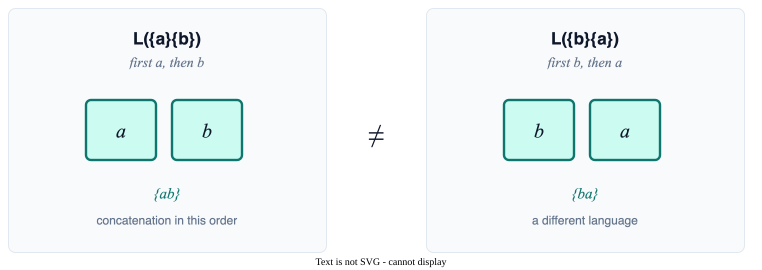
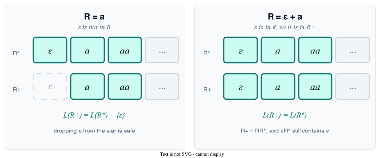
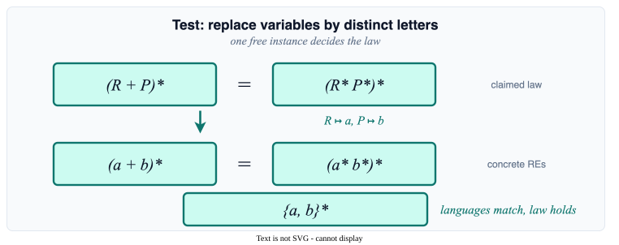
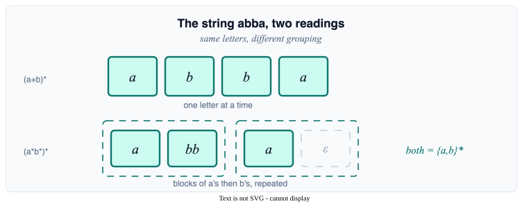
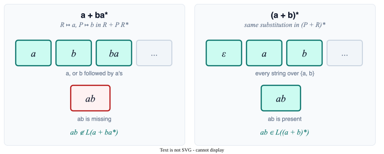

# Algebraic Laws for Regular Expressions

Section 9.3.4 — Identities for simplifying REs, and the surprising single-test method that verifies them.

All references are to the 4th edition of <em>An Introduction to the Analysis of Algorithms</em> (World Scientific, 2025)

---

# Overview

Nine fundamental laws, six star laws, and a remarkable test for verifying them with one example.

**Algebraic Laws** can be used to simplify REs, or to restate them in a different way

**Key concepts:**
1. **Nine fundamental laws** — commutativity, associativity, distributivity, identity, annihilator, idempotence
2. **Six Kleene star laws** — properties of $*$ and $+$
3. **Testing algebraic laws** — a surprising method using a single instance

Note: Unlike most of mathematics, we can verify a **universal** statement about REs with a **single** test case!

---
layout: section
---

# The Nine Fundamental Laws

How $+$ and concatenation behave — almost like a ring, but with one famously missing law.

Algebraic properties of union and concatenation

---

# Laws: Commutativity, Associativity, Identity

The familiar arithmetic rules carry over — except for one important exception coming up.

| Law | Description |
|-----|-------------|
| $R + P = P + R$ | commutativity of $+$ |
| $(R + P) + Q = R + (P + Q)$ | associativity of $+$ |
| $(RP)Q = R(PQ)$ | associativity of concatenation |

| Law | Description |
|-----|-------------|
| $\emptyset + R = R + \emptyset = R$ | $\emptyset$ identity for $+$ |
| $\varepsilon R = R\varepsilon = R$ | $\varepsilon$ identity for concatenation |
| $\emptyset R = R\emptyset = \emptyset$ | $\emptyset$ annihilator for concatenation |

---

# Laws: Distributivity and Idempotence

Concatenation distributes over $+$ on both sides — and union swallows duplicates.

| Law | Description |
|-----|-------------|
| $R(P + Q) = RP + RQ$ | left-distributivity |
| $(P + Q)R = PR + QR$ | right-distributivity |
| $R + R = R$ | idempotent law for union |

---

# Missing Law: Commutativity of Concatenation

$RP = PR$ is the law that is not there. Strings are ordered, so $ab \neq ba$.

<!--
The same reason matrix multiplication fails to commute: the objects have an order, and swapping the factors is a different object. Two-letter words are the smallest witness. RP = PR can hold for particular R and P (take R = P, or R = a* and P = a), but it is not an identity.
-->

---
layout: section
---

# Kleene Star Laws

Useful identities for $R^*$ and $R^+$ — plus a subtle gotcha when $\varepsilon \in L(R)$.

Properties of $*$ and $+$

---

# Six Laws of Kleene Star

Including the *interleaving lemma* $(R + P)^* = (R^*P^*)^*$ — both produce all strings over the alphabet.

| Law | Explanation |
|-----|-------------|
| $(R^*)^* = R^*$ | starring an already-starred RE changes nothing |
| $\emptyset^* = \varepsilon$ | zero or more copies of nothing is the empty string |
| $\varepsilon^* = \varepsilon$ | zero or more copies of $\varepsilon$ is $\varepsilon$ |

| Law | Explanation |
|-----|-------------|
| $R^+ = RR^* = R^*R$ | one or more copies = one copy then zero or more |
| $R^* = R^+ + \varepsilon$ | zero or more = one or more, or the empty string |
| $(R + P)^* = (R^*P^*)^*$ | interleaving lemma |

---

# A Subtle Point About $R^+$

$R^* = R^+ + \varepsilon$ does not mean $L(R^+) = L(R^*) - \{\varepsilon\}$. It depends on whether $\varepsilon$ is already in $R$.

<!--
R+ is defined as RR*, one copy of R followed by a star. If that one copy can be ε, the star is free to contribute ε as well, and ε survives. The identity R* = R+ + ε is still true; union with {ε} does not force ε out of the other summand.
-->

---
layout: section
---

# Testing Algebraic Laws

A single concrete instance can verify a *universal* RE identity — and we'll see why.

A surprising verification method

---

# The Test for RE Algebraic Laws

To test $E = F$, replace the variables by distinct letters and compare the two concrete languages. One free instance decides the identity.

<!--
Language operations are homomorphisms: substituting languages for letters preserves equality. Distinct letters are the free case, so equality there lifts to every substitution. A mismatch on those letters is an ordinary counterexample. Salomaa axiomatized the algebra of regular events in 1966; the classroom test is the free-case specialization of that completeness.
-->

---

# Testing Example

$(R + P)^* = (R^*P^*)^*$ becomes $(a + b)^* = (a^*b^*)^*$. Both are $\{a,b\}^*$, read two ways.

<!--
Any string over {a,b} splits uniquely into maximal runs of a's and b's. Grouping those runs as (a* b*) pairs, with a trailing empty b* if the string ends in a, shows it is in (a* b*)*. The other direction is immediate: a* b* only uses a and b. That is the interleaving lemma as a picture.
-->

---

# When the Test Fails

The same substitution kills a fake law. $R + PR^* \neq (P + R)^*$, because $ab$ is on one side only.

<!--
One mismatched string is enough. Distinct letters keep the two sides from accidentally agreeing: if the identity were true for all languages, it would be true of {a} and {b}. The witness ab is the shortest string that uses both letters in the order the left-hand side forbids.
-->

---

# Exercises

Five problems on verifying laws, finding edge cases, and disproving a tempting fake-law.

1. Verify each of the nine fundamental laws by converting both sides to $\varepsilon$-NFAs and checking language equality

2. Find two REs $R, P$ where $RP = PR$ happens to hold (even though it is not a general law)

3. Give an example where $L(R^+) = L(R^*) - \{\varepsilon\}$ (i.e., where the subtlety does not arise)

4. Use the test for algebraic laws to verify: $R^* = R^+ + \varepsilon$

5. Use the test to show that $R + PR^* \neq (P + R)^*$ (i.e., it is NOT a valid law)
