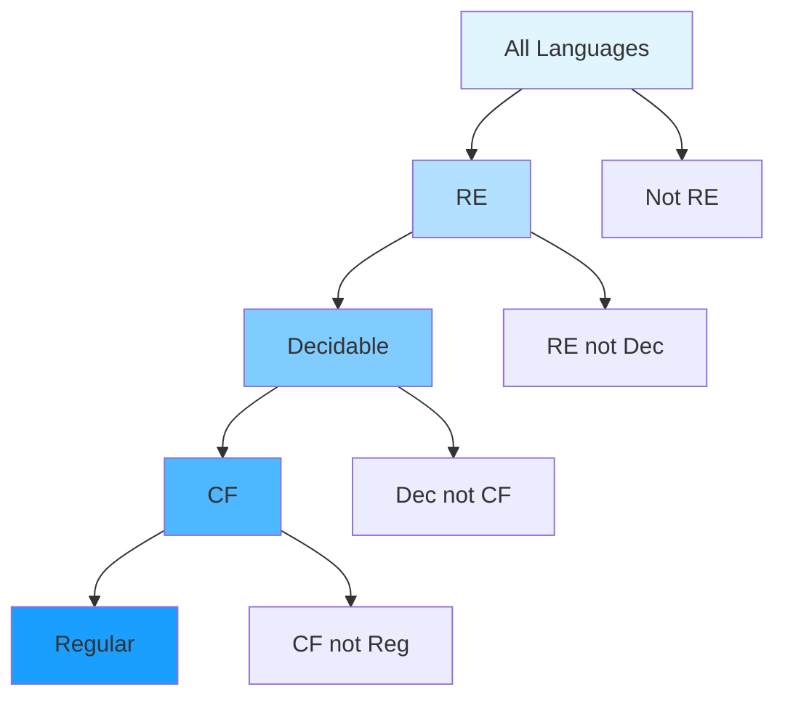

# Decidable Languages

Section 9.5.3 - Decidability

---

# Definition: Decidable Language

<v-clicks>

**Recall:** A language $L$ is **decidable** if there exists a TM that:

1. **Always halts** (on every input)
2. **Accepts** strings in $L$
3. **Rejects** strings not in $L$

**Key distinction:** Must halt on ALL inputs (not just accepting ones)

</v-clicks>

---

# Fundamental Result

## Theorem

<v-clicks>

**Regular languages are decidable**

**Context-free languages are decidable**

This means:
- Every regular language has a deciding TM
- Every context-free language has a deciding TM

</v-clicks>

---

# Examples of Decidable Languages (1/3)

<v-clicks>

$$A_{\text{DFA}} := \{\langle B,w\rangle : \text{B is a DFA that accepts input string w}\}$$

- **Question:** Does DFA $B$ accept string $w$?
- **Decidable:** Simulate the DFA on $w$ (always halts)

$$A_{\text{NFA}} := \{\langle B,w\rangle : \text{B is a NFA that accepts input string w}\}$$

- **Question:** Does NFA $B$ accept string $w$?
- **Decidable:** Convert to DFA and simulate

</v-clicks>

---

# Examples of Decidable Languages (2/3)

<v-clicks>

$$A_{\text{REX}} := \{\langle R,w\rangle : \text{R is a Reg Exp that accepts input string w}\}$$

- **Question:** Does regular expression $R$ match string $w$?
- **Decidable:** Convert to DFA and simulate

$$E_{\text{DFA}} := \{\langle A\rangle : \text{A is a DFA such that } L(A)=\emptyset\}$$

- **Question:** Is the language of DFA $A$ empty?
- **Decidable:** Check if any accepting state is reachable

</v-clicks>

---

# Examples of Decidable Languages (3/3)

<v-clicks>

$$EQ_{\text{DFA}} := \{\langle A,B\rangle : \text{A,B are DFAs such that } L(A)=L(B)\}$$

- **Question:** Do DFAs $A$ and $B$ accept the same language?
- **Decidable:** Use symmetric difference

$$C = (A \cap \overline{B}) \cup (\overline{A} \cap B)$$

If $L(C) = \emptyset$, then $L(A) = L(B)$

$$E_{\text{CFG}} := \{\langle G\rangle : \text{G is a CFG such that } L(G)=\emptyset\}$$

- **Question:** Is the language of CFG $G$ empty?
- **Decidable:** Mark generating variables iteratively

</v-clicks>

---

# Decidability and Complements

## Theorem

<v-clicks>

**If $L$ is decidable, then $\overline{L}$ is decidable**

**Proof idea:**
- Let $M$ decide $L$
- Construct $M'$ that runs like $M$ but:
  - When $M$ accepts, $M'$ rejects
  - When $M$ rejects, $M'$ accepts
- Since $M$ always halts, so does $M'$
- Therefore $\overline{L} = L(M')$ is decidable

</v-clicks>

---

# Relationship: RE and Decidability

## Theorem

<v-clicks>

**If both $L$ and $\overline{L}$ are RE (Recursively Enumerable), then $L$ is decidable**

**Proof idea:**
- Let $M_1$ recognize $L$ and $M_2$ recognize $\overline{L}$
- Construct TM $M$ that:
  - Simulates $M_1$ on one tape
  - Simulates $M_2$ on another tape
- Since $L \cup \overline{L} = \Sigma^*$, input $x$ must be accepted by one or the other
- If $M_1$ accepts, $M$ accepts
- If $M_2$ accepts, $M$ rejects
- $M$ always halts, so $L$ is decidable!

</v-clicks>

---

# Comparison Table

| Property | Regular | Context-Free | RE | Decidable |
|----------|---------|--------------|----|--------------|
| Closed under complement | ✓ | ✗ | ✗ | ✓ |
| Closed under union | ✓ | ✓ | ✓ | ✓ |
| Closed under intersection | ✓ | ✗ | ✗ | ✓ |
| Decidable | ✓ | ✓ | ? | ✓ |
| Halts on all inputs | ✓ | ✓ | ✗ | ✓ |

<v-click>

**Note:** RE languages may not halt on rejecting inputs

</v-click>

---

# The Universal Language

<v-clicks>

$$A_{\text{TM}} = \{\langle M,w\rangle : \text{M is a TM and M accepts w}\}$$

Called the **universal language**

**Question:** Is $A_{\text{TM}}$ decidable?

**Answer:** $A_{\text{TM}}$ is **recognizable** but **not decidable**!

- The **Universal Turing Machine (UTM)** recognizes $A_{\text{TM}}$
- UTM simulates $M$ on $w$ and answers accordingly
- But UTM does **not** decide $A_{\text{TM}}$ (may not halt on rejection)

</v-clicks>

---

# The Universal Turing Machine

<v-clicks>

**Revolutionary idea by Alan Turing**

**UTM:** A machine $U$ that on input $\langle M,w\rangle$:
1. Checks that $\langle M,w\rangle$ is a well-formed string
2. If valid, simulates $M$ on $w$
3. Answers according to what $M(w)$ answers

**Historical context:**
- Engineering principle of 1930s: "one machine to solve one problem"
- Turing proposed: one machine to solve **all** problems
- Modern computers are UTMs: run any algorithm we program

</v-clicks>

---

# Church-Turing Thesis

> **The intuitive notion of algorithm is captured by the formal definition of a TM**

<v-clicks>

- Called a "thesis" because "algorithm" is an intuitive notion
- Proposes TM as the formal definition of computation
- Philosophically profound statement
- Not provable (intuitive notion vs. formal definition)
- Universally accepted in computer science

**Implications:**
- Anything computable can be computed by a TM
- Church-Turing thesis defines the limits of computation

</v-clicks>

---

# Decidability Landscape

**Examples:** Regular, CF: decidable · $A_{\text{TM}}$: RE not decidable · $\overline{A_{\text{TM}}}$: not RE

---

# Why Study Decidability?

<v-clicks>

1. **Theoretical foundation:** Understanding limits of computation
2. **Practical implications:** Some problems have no algorithmic solution
3. **Complexity theory:** Decidable problems may still be intractable
4. **Verification:** Proving properties about programs
5. **Language theory:** Classification of formal languages

</v-clicks>

---

# Summary

<v-clicks>

- **Decidable language:** Has a TM that always halts and decides membership
- **Regular and context-free languages are decidable**
- Examples: $A_{\text{DFA}}$, $E_{\text{DFA}}$, $EQ_{\text{DFA}}$, $E_{\text{CFG}}$
- **Closure:** Decidable languages closed under complement
- **Key theorem:** If $L$ and $\overline{L}$ are both RE, then $L$ is decidable
- **Universal language** $A_{\text{TM}}$ is RE but not decidable
- **UTM** recognizes but does not decide $A_{\text{TM}}$

</v-clicks>

---

# Key Takeaways

<v-clicks>

1. Decidability = always halts + correct answer
2. Many natural language problems are decidable
3. Complement of decidable language is decidable
4. RE + co-RE = decidable
5. Not all RE languages are decidable
6. The halting problem is the canonical undecidable problem
7. Church-Turing thesis defines computation itself

</v-clicks>

---

# Next Steps

- Practice: Prove specific languages are decidable
- Understand: Difference between decidable and RE
- Coming up: Undecidability and the Halting Problem
- Chapter 9 continues with deeper complexity theory
