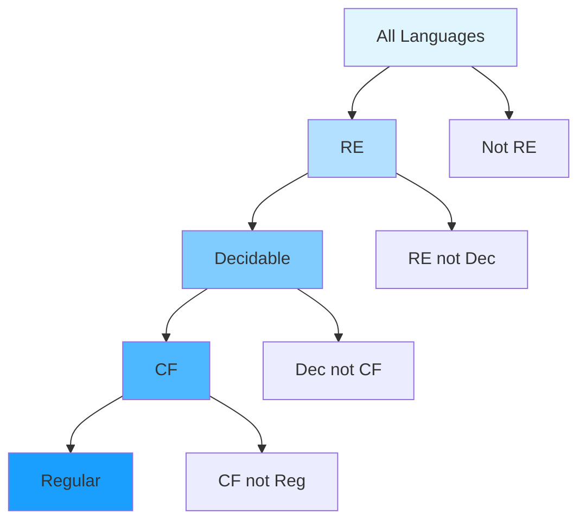

# Decidable Languages

Section 9.5.3 — Languages a Turing machine can settle with a definite *yes* or *no*, every time.

All references are to the 4th edition of <em>An Introduction to the Analysis of Algorithms</em> (World Scientific, 2025)

---

# Definition: Decidable Language

The defining requirement: a TM that *always halts* and gives the right answer — never loops on rejects.

**Recall:** A language $L$ is **decidable** if there exists a TM that:

1. **Always halts** (on every input)
2. **Accepts** strings in $L$
3. **Rejects** strings not in $L$

**Key distinction:** Must halt on ALL inputs (not just accepting ones)

---

# Fundamental Result

Everything we built earlier — DFAs, NFAs, CFGs — fits comfortably *inside* the decidable world.

## Theorem

**Regular languages are decidable**

**Context-free languages are decidable**

This means:
- Every regular language has a deciding TM
- Every context-free language has a deciding TM

<!--
"Regular is decidable" may sound obvious — just simulate the DFA — but the claim that matters is totality: the TM halts on every input. DFAs always halt in |w| steps, so yes, trivially decidable. Context-free is less obvious: naïve recursive-descent can loop on left-recursive rules. The standard proof is the CYK algorithm (Cocke–Younger–Kasami, mid-1960s), which gives an O(n³) parser for any grammar in Chomsky normal form. That's the effective constructive proof. Greibach showed in 1965 that universal CFG membership — "given G and w, does G derive w?" — is P-complete, which is a hint that context-free is very close to the ceiling of "truly efficient."
-->

---

# Examples of Decidable Languages (1/3)

Membership for finite-automaton models: $A_{\text{DFA}}$ and $A_{\text{NFA}}$ — both settled by simulation.

$$A_{\text{DFA}} := \{\langle B,w\rangle : \text{B is a DFA that accepts input string w}\}$$

- **Question:** Does DFA $B$ accept string $w$?
- **Decidable:** Simulate the DFA on $w$ (always halts)

$$A_{\text{NFA}} := \{\langle B,w\rangle : \text{B is a NFA that accepts input string w}\}$$

- **Question:** Does NFA $B$ accept string $w$?
- **Decidable:** Convert to DFA and simulate

---

# Examples of Decidable Languages (2/3)

Regex matching ($A_{\text{REX}}$) and *emptiness* of a DFA's language ($E_{\text{DFA}}$) — both decidable.

$$A_{\text{REX}} := \{\langle R,w\rangle : \text{R is a Reg Exp that accepts input string w}\}$$

- **Question:** Does regular expression $R$ match string $w$?
- **Decidable:** Convert to DFA and simulate

$$E_{\text{DFA}} := \{\langle A\rangle : \text{A is a DFA such that } L(A)=\emptyset\}$$

- **Question:** Is the language of DFA $A$ empty?
- **Decidable:** Check if any accepting state is reachable

---

# Examples of Decidable Languages (3/3)

Equivalence of DFAs via *symmetric difference*, and emptiness of a CFG via iterative marking.

$$EQ_{\text{DFA}} := \{\langle A,B\rangle : \text{A,B are DFAs such that } L(A)=L(B)\}$$

- **Question:** Do DFAs $A$ and $B$ accept the same language?
- **Decidable:** Use symmetric difference

$$C = (A \cap \overline{B}) \cup (\overline{A} \cap B)$$

If $L(C) = \emptyset$, then $L(A) = L(B)$

$$E_{\text{CFG}} := \{\langle G\rangle : \text{G is a CFG such that } L(G)=\emptyset\}$$

- **Question:** Is the language of CFG $G$ empty?
- **Decidable:** Mark generating variables iteratively

---

# Decidability and Complements

A decider for $L$ flips its answer to give a decider for $\overline{L}$ — decidability is *closed under complement*.

## Theorem

**If $L$ is decidable, then $\overline{L}$ is decidable** Thm 9.63, Pg 251, thm:one

**Proof idea:**
- Let $M$ decide $L$
- Construct $M'$ that runs like $M$ but:
  - When $M$ accepts, $M'$ rejects
  - When $M$ rejects, $M'$ accepts
- Since $M$ always halts, so does $M'$
- Therefore $\overline{L} = L(M')$ is decidable

---

# Relationship: RE and Decidability

If you can recognize *both* $L$ and its complement, you can decide $L$ — run them in parallel.

## Theorem

**If both $L$ and $\overline{L}$ are RE (Recursively Enumerable), then $L$ is decidable** Thm 9.64, Pg 252, thm:two

**Proof idea:**
- Let $M_1$ recognize $L$ and $M_2$ recognize $\overline{L}$
- Construct TM $M$ that:
  - Simulates $M_1$ on one tape
  - Simulates $M_2$ on another tape
- Since $L \cup \overline{L} = \Sigma^*$, input $x$ must be accepted by one or the other
- If $M_1$ accepts, $M$ accepts
- If $M_2$ accepts, $M$ rejects
- $M$ always halts, so $L$ is decidable!

---

# Comparison Table

A side-by-side scoreboard of closure properties across the four classes — note where RE *fails*.

| Property | Regular | Context-Free | RE | Decidable |
|----------|---------|--------------|----|--------------|
| Closed under complement | ✓ | ✗ | ✗ | ✓ |
| Closed under union | ✓ | ✓ | ✓ | ✓ |
| Closed under intersection | ✓ | ✗ | ✗ | ✓ |
| Decidable | ✓ | ✓ | ? | ✓ |
| Halts on all inputs | ✓ | ✓ | ✗ | ✓ |

**Note:** RE languages may not halt on rejecting inputs

---

# The Universal Language

$A_{\text{TM}}$ — the language of *all* (TM, input) pairs that accept — is recognizable but, foreshadowing, not decidable.

$$A_{\text{TM}} = \{\langle M,w\rangle : \text{M is a TM and M accepts w}\}$$

Called the **universal language**

**Question:** Is $A_{\text{TM}}$ decidable?

**Answer:** $A_{\text{TM}}$ is **recognizable** but **not decidable**!

- The **Universal Turing Machine (UTM)** recognizes $A_{\text{TM}}$
- UTM simulates $M$ on $w$ and answers accordingly
- But UTM does **not** decide $A_{\text{TM}}$ (may not halt on rejection)

---

# The Universal Turing Machine

One machine $U$ that takes a *description of any other machine* as input and runs it — the modern computer in 1936.

**Revolutionary idea by Alan Turing**

**UTM:** A machine $U$ that on input $\langle M,w\rangle$:
1. Checks that $\langle M,w\rangle$ is a well-formed string
2. If valid, simulates $M$ on $w$
3. Answers according to what $M(w)$ answers

**Historical context:**
- Engineering principle of 1930s: "one machine to solve one problem"
- Turing proposed: one machine to solve **all** problems
- Modern computers are UTMs: run any algorithm we program

<!--
Turing's paper is "On Computable Numbers, with an Application to the Entscheidungsproblem" (1936). He was 23, a graduate student at King's College, Cambridge. The motivation wasn't building computers — none existed yet — it was a decision problem in mathematical logic. The abstraction came from imagining a human "computer" (the word at the time meant a person doing arithmetic by hand): finite mental state, one symbol at a time on a notebook. The leap was showing one such machine could simulate any other — directly anticipating the stored-program computer. Von Neumann visited Cambridge in 1935 and was almost certainly influenced by Turing's construction when designing the EDVAC architecture a decade later.
-->

---

# Church-Turing Thesis

The bold claim — *anything* you'd intuitively call an algorithm can be carried out by a TM.

> **The intuitive notion of algorithm is captured by the formal definition of a TM**

- Called a "thesis" because "algorithm" is an intuitive notion
- Proposes TM as the formal definition of computation
- Philosophically profound statement
- Not provable (intuitive notion vs. formal definition)
- Universally accepted in computer science

**Implications:**
- Anything computable can be computed by a TM
- Church-Turing thesis defines the limits of computation

<!--
Three formalisms of "computable" emerged independently in the 1930s: Church's lambda calculus (1932–35), Gödel–Herbrand recursive functions (1934), and Turing machines (1936). All three were quickly proved equivalent — the same functions are computable in each. That convergence, from wildly different definitions, is the empirical evidence behind the thesis. Kleene coined "Church's thesis" in 1952; "Church–Turing thesis" became standard later as Turing's formulation won on intuitiveness. To this day no one has proposed a plausible notion of mechanical computation that exceeds TMs. Quantum computation preserves the thesis in its basic form (you can simulate a quantum machine classically, just exponentially slower) — but it weakens the Extended Church–Turing thesis, which adds an efficiency clause.
-->

---

# Decidability Landscape

A nested map: Regular $\subset$ CF $\subset$ Decidable $\subset$ RE $\subset$ All Languages — each containment is *strict*.

```mermaid
graph TB
    A[All Languages] --> B[RE]
    A --> C[Not RE]
    B --> D[Decidable]
    B --> E["RE not Dec"]
    D --> F[CF]
    D --> G["Dec not CF"]
    F --> H[Regular]
    F --> I["CF not Reg"]

    style A fill:#e1f5ff
    style B fill:#b3e0ff
    style D fill:#80ccff
    style F fill:#4db8ff
    style H fill:#1a9fff
```

**Examples:** Regular, CF: decidable · $A_{\text{TM}}$: RE not decidable · $\overline{A_{\text{TM}}}$: not RE

---

# Why Study Decidability?

Knowing the *limits of what algorithms can do* shapes verification, compilers, and complexity theory.

1. **Theoretical foundation:** Understanding limits of computation
2. **Practical implications:** Some problems have no algorithmic solution
3. **Complexity theory:** Decidable problems may still be intractable
4. **Verification:** Proving properties about programs
5. **Language theory:** Classification of formal languages

---

# Key Takeaways

The big ideas: halting, complement closure, RE $\cap$ co-RE, and a glimpse of the impossible.

1. Decidability = always halts + correct answer
2. Many natural language problems are decidable
3. Complement of decidable language is decidable
4. RE + co-RE = decidable
5. Not all RE languages are decidable
6. The halting problem is the canonical undecidable problem
7. Church-Turing thesis defines computation itself
