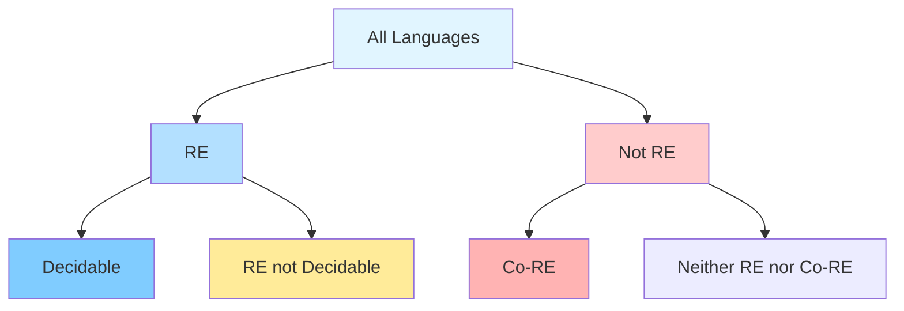

<style>
.slidev-layout.cover {
  background: white !important;
  color: black !important;
}
.slidev-layout.cover h1 {
  color: black !important;
}
</style>

# Undecidability

Section 9.5.4 - The Limits of Computation

---

# A Historical Puzzle

<v-clicks>

In 1900, David Hilbert posed 23 famous mathematical problems

**Hilbert's 10th Problem** (1900): Is there an algorithm to determine if a Diophantine equation has integer solutions?

**What's a Diophantine equation?** Polynomial equation with integer coefficients, seeking integer solutions

**Answer** (Matiyasevich, 1970): **No such algorithm exists!**

This was the first major mathematical problem proven to have **no algorithmic solution**

Today we'll explore what it means for a problem to be **undecidable**

</v-clicks>

---

# Diophantine Equations: Examples

<v-clicks>

A **Diophantine equation** is a polynomial equation where we seek **integer** solutions

**Simple examples:**

$x^2 + y^2 = z^2$ (Pythagorean triples)
- Solution: $x=3, y=4, z=5$ ✓
- Infinitely many solutions!

$x^2 + y^2 = 3$
- No integer solutions (can be proven)

$x^3 + y^3 = z^3$ (Fermat's Last Theorem for $n=3$)
- No positive integer solutions (proved by Andrew Wiles, 1995)

**Hilbert asked:** Can we **algorithmically decide** if ANY such equation has a solution?

**Matiyasevich proved:** **No** - this problem is undecidable!

</v-clicks>

---

# The Central Question

<v-clicks>

**We've seen:**
- Some languages are decidable (Regular, CF)
- Some languages are recognizable but may not halt (RE)

**Natural question:** Is $A_{\text{TM}}$ decidable?

$$A_{\text{TM}} = \{\langle M,w\rangle : \text{M is a TM and M accepts w}\}$$

**Recall:** The Universal TM recognizes $A_{\text{TM}}$

**Key question:** Does there exist a TM that **always halts** and decides $A_{\text{TM}}$?

</v-clicks>

---

# The Answer: A Shocking Result

## Theorem (Turing, 1936)

<v-clicks>

**$A_{\text{TM}}$ is undecidable**

This means:
- There is **no algorithm** that can determine if an arbitrary TM accepts a given input
- Some problems have **no algorithmic solution**
- Computation has **fundamental limits**

This is one of the most important results in computer science!

</v-clicks>

---

# Proof Strategy: Diagonalization

<v-clicks>

**Proof by contradiction** using Cantor's diagonal argument

**Assume:** $A_{\text{TM}}$ is decidable

Let $H$ be a TM that decides $A_{\text{TM}}$:
- $H$ accepts $\langle M,w\rangle$ if $M$ accepts $w$
- $H$ rejects $\langle M,w\rangle$ if $M$ rejects $w$ or loops
- **$H$ always halts**

We will construct a machine that leads to a contradiction...

</v-clicks>

---

# The Diagonal Machine

<v-clicks>

Define a new TM called $D$ ("diagonal"):

$$
D(\langle M\rangle) :=
\begin{cases}
\text{accept} & \text{if } H(\langle M,\langle M\rangle\rangle) = \text{reject} \\
\text{reject} & \text{if } H(\langle M,\langle M\rangle\rangle) = \text{accept}
\end{cases}
$$

**Key idea:** $D$ does the **opposite** of what $H$ says $M$ does on itself

Now ask: **What does $D(\langle D\rangle)$ do?**

</v-clicks>

---

# The Contradiction

<v-clicks>

**Case 1:** Suppose $D(\langle D\rangle)$ accepts

- Then by definition, $H(\langle D,\langle D\rangle\rangle)$ rejects
- This means $D$ rejects $\langle D\rangle$
- **Contradiction!** $D$ both accepts and rejects $\langle D\rangle$

**Case 2:** Suppose $D(\langle D\rangle)$ rejects

- Then by definition, $H(\langle D,\langle D\rangle\rangle)$ accepts
- This means $D$ accepts $\langle D\rangle$
- **Contradiction!** $D$ both rejects and accepts $\langle D\rangle$

**Conclusion:** Our assumption that $H$ exists must be **false**

Therefore, $A_{\text{TM}}$ is **undecidable**!

</v-clicks>

---

# Understanding Diagonalization

Think of a table where:
- Rows = all possible TMs ($M_1, M_2, M_3, \ldots$)
- Columns = all possible inputs ($\langle M_1\rangle, \langle M_2\rangle, \langle M_3\rangle, \ldots$)
- Entry $(i,j)$ = does $M_i$ accept $\langle M_j\rangle$?

| | $\langle M_1\rangle$ | $\langle M_2\rangle$ | $\langle M_3\rangle$ | $\cdots$ |
|---|---|---|---|---|
| $M_1$ | ✓ | ✗ | ✓ | $\cdots$ |
| $M_2$ | ✗ | ✗ | ✓ | $\cdots$ |
| $M_3$ | ✓ | ✓ | ✗ | $\cdots$ |
| $\vdots$ | $\vdots$ | $\vdots$ | $\vdots$ | $\ddots$ |

<v-click>

**$D$ does the opposite of the diagonal:** ✗, ✓, ✓, ...

But $D$ itself is a TM, so it must appear in the table - **contradiction!**

</v-click>

---

# The Halting Problem

<v-clicks>

$$\text{HALT} := \{\langle M,w\rangle : \text{M is a TM that halts on w}\}$$

**Theorem:** HALT is undecidable

**Proof idea:** If we could decide HALT, we could decide $A_{\text{TM}}$

Given decider $H$ for HALT, construct $H'$ that decides $A_{\text{TM}}$:

```text
H'(<M,w>):
  if H(<M,w>) accepts:
    simulate M on w and return M's answer
  else:
    reject (M doesn't halt, so doesn't accept)
```

Since $A_{\text{TM}}$ is undecidable, HALT must be undecidable too!

</v-clicks>

---

# Practical Consequences

<v-clicks>

**Imagine a debugger feature:**
- You run your program on input $x$
- Nothing happens for a long time
- You press `CTRL+D` to interrupt

**Question:** Did you press it too quickly? Would it have halted eventually?

**The halting feature would tell you:**
- "Your program will halt in 5 minutes"
- "Your program will never halt on this input"

**But Theorem says:** This feature **cannot be implemented**!

No debugger can reliably tell you if your program will halt on all inputs

</v-clicks>

---

# What the Theorem Really Says

<v-clicks>

**Theorem claims:** No TM decides $A_{\text{TM}}$ for **all** inputs

**Does NOT say:**
- We can't decide $A_{\text{TM}}$ for **some** inputs
- We can't decide $A_{\text{TM}}$ for **infinitely many** inputs
- We can't decide $A_{\text{TM}}$ for all but **finitely many** inputs

**Key insight:** The theorem is about **universal** decidability

Many practical halting problems can be solved:
- "Does this `for(i=0; i<10; i++)` loop halt?" **Yes!**
- "Does this `while(true) {}` loop halt?" **No!**

But no single algorithm works for **every** input

</v-clicks>

---

# The Busy Beaver Function

<v-clicks>

$$\Sigma(n,m) = \text{max squares written by n-state, m-symbol TM starting on empty tape}$$

For $m=2$ (binary alphabet):

| $n$ | $\Sigma(n)$ | Status |
|-----|-------------|---------|
| 2 | 4 | Known |
| 3 | 6 | Known |
| 4 | 13 | Known |
| 5 | $\geq 4098$ | Lower bound |
| 6 | $\geq 3.5 \times 10^{18267}$ | Lower bound |

**Theorem:** The Busy Beaver function is **uncomputable**!

</v-clicks>

---

# Why Busy Beaver is Uncomputable

<v-clicks>

**Proof idea:** If we could compute $\Sigma(n,m)$, we could decide $A_{\text{TM}}$

Given $\langle M,w\rangle$:
1. Construct $M'$ that writes $w$ on empty tape and simulates $M$ on $w$
2. Compute $i = \Sigma(|Q_{M'}|, |\Gamma_{M'}|)$
3. Simulate $M'$:
   - If $M'$ crosses the $i$-th square, then $M(w)$ doesn't halt
   - If $M'$ stays within first $i$ squares, detect loops

**Bounded space** = finite configurations = can detect loops!

Since we can't decide $A_{\text{TM}}$, we can't compute Busy Beaver

</v-clicks>

---

# Complement of $A_{\text{TM}}$

## Corollary

<v-clicks>

$$\overline{A_{\text{TM}}} = \{\langle M,w\rangle : \text{M does not accept w}\}$$

**$\overline{A_{\text{TM}}}$ is not RE** (not even recognizable!)

**Proof:**
- We know $A_{\text{TM}}$ is RE (recognized by Universal TM)
- We proved $A_{\text{TM}}$ is not decidable
- **Recall theorem:** If both $L$ and $\overline{L}$ are RE, then $L$ is decidable
- Therefore, $\overline{A_{\text{TM}}}$ cannot be RE

**Profound:** There exist languages that are **not even recognizable**!

</v-clicks>

---

# The Landscape of Languages

<div style="transform: scale(0.7); transform-origin: top center; margin-top: -20px;">



</div>

<v-clicks>

**Examples:**
- **Decidable:** Regular, CF, $A_{\text{DFA}}$, $E_{\text{DFA}}$
- **RE not Decidable:** $A_{\text{TM}}$, HALT
- **Not RE:** $\overline{A_{\text{TM}}}$

</v-clicks>

---

# Enumerators

<v-clicks>

An **enumerator** is a TM with:
- A work tape (empty on input)
- An output tape where it writes strings separated by `#`
- Never moves left on output tape

**Idea:** It "prints out" all strings in a language

A language is **enumerable** if there exists an enumerator $E$ with $L = L(E)$

</v-clicks>

---

# Recognizable = Enumerable

## Theorem

<v-clicks>

**A language is recognizable iff it is enumerable**

**Proof ($\Leftarrow$):** If $L$ is enumerable
- Given enumerator $E$ for $L$
- Construct recognizer $M$: on input $w$, simulate $E$ and accept if $w$ appears in output

**Proof ($\Rightarrow$):** If $L$ is recognizable
- Given recognizer $M$ for $L$
- Construct enumerator $E$ using **dovetailing**:

</v-clicks>

---

# Dovetailing Technique

<v-clicks>

**Problem:** Can't just run $M$ on $w_1$, then $w_2$, etc. (might loop on $w_1$!)

**Solution:** Simulate $M$ on **all inputs in parallel**

**Enumerator $E$:** In phase $i$:
- Simulate $M$ on first $i$ strings (in lexicographic order)
- Each simulation runs for $i$ steps
- If $M$ accepts string $s$, output $s$

**Key idea:** Every accepting string will eventually be discovered!

This is called **dovetailing** - interleaving multiple simulations

</v-clicks>

---

# Dovetailing Visualization

Phase 1: `M(w₁)` for 1 step

Phase 2: `M(w₁)` for 1 step, `M(w₂)` for 1 step

Phase 3: `M(w₁)` for 1 step, `M(w₂)` for 1 step, `M(w₃)` for 1 step

Phase 4: `M(w₁)` for 1 step, `M(w₂)` for 1 step, `M(w₃)` for 1 step, `M(w₄)` for 1 step

...

<v-click>

**Guarantee:** If $M$ accepts $w_j$ in $t$ steps, we'll discover it by phase $\max(j,t)$

No single simulation blocks progress on others!

</v-click>

---

# Comparison Table

| Language | Decidable | RE | Co-RE | Enumerable |
|----------|-----------|----|----|------------|
| Regular | ✓ | ✓ | ✓ | ✓ |
| Context-Free | ✓ | ✓ | ✓ | ✓ |
| $A_{\text{DFA}}$ | ✓ | ✓ | ✓ | ✓ |
| $A_{\text{TM}}$ | ✗ | ✓ | ✗ | ✓ |
| HALT | ✗ | ✓ | ✗ | ✓ |
| $\overline{A_{\text{TM}}}$ | ✗ | ✗ | ✓ | ✗ |

<v-click>

**Key insight:** Decidable = RE ∩ Co-RE

</v-click>

---

# Alan Turing's Legacy

<v-clicks>

**1936:** Turing proves the halting problem is undecidable
- 23 years old at the time!
- Paper: "On Computable Numbers, with an Application to the Entscheidungsproblem"

**Impact:**
- Founded modern computer science
- Showed fundamental limits of computation
- Introduced the Universal Turing Machine (concept of stored-program computer)

**1950:** Proposed the Turing Test for artificial intelligence

**Historical note:** This work was done **before** electronic computers existed!

Turing imagined the limits of computation before we had computers to compute with

</v-clicks>

---

# The Entscheidungsproblem

<v-clicks>

**Hilbert's Entscheidungsproblem** (German: "decision problem", 1928):

> Is there an algorithm to determine if a first-order logic formula is valid?

**Turing's answer** (1936): **No!**

**Church's answer** (also 1936): **No!** (using λ-calculus)

Both proved independently that no such algorithm exists

This resolved one of Hilbert's famous problems with a **negative** answer

Sometimes the answer to "Can we solve this?" is provably "**No**"

</v-clicks>

---

# Undecidability in Practice

<v-clicks>

**Program verification:**
- Can we automatically verify if a program meets its specification?
- **Rice's Theorem:** Most nontrivial properties are undecidable

**Compiler optimization:**
- Can we determine if two programs are equivalent?
- **Undecidable** in general

**Security:**
- Does this program contain a virus?
- **Undecidable** in general (though heuristics help)

**Practical approach:** Develop heuristics, solve special cases, use approximations

</v-clicks>

---

# Why This Matters

<v-clicks>

**Theoretical importance:**
1. Defines fundamental limits of what's computable
2. Some problems have **no algorithmic solution**
3. Computation is not omnipotent

**Practical importance:**
1. Tells us when to **stop looking** for perfect solutions
2. Guides us toward **approximate** or **heuristic** approaches
3. Helps understand why some tools can't be perfect (debuggers, compilers, verifiers)

**Philosophical importance:**
1. There are true statements we can never prove algorithmically
2. Connects to Gödel's Incompleteness Theorems
3. Limits of formal reasoning

</v-clicks>

---

# Summary

<v-clicks>

- **$A_{\text{TM}}$ is undecidable** - proven via diagonal argument
- **HALT is undecidable** - cannot decide if arbitrary TM halts
- **Busy Beaver is uncomputable** - grows faster than any computable function
- **$\overline{A_{\text{TM}}}$ is not RE** - not even recognizable
- **Enumerators** provide alternative characterization of RE languages
- **Recognizable = Enumerable** via dovetailing technique
- **Practical impact:** Tells us limits of automated debugging, verification, optimization

**Key insight:** Some problems have **no algorithmic solution**

This is not a limitation of our cleverness - it's a **mathematical fact**!

</v-clicks>

---

# Key Theorems Recap

<v-clicks>

1. **Undecidability of $A_{\text{TM}}$:** No TM decides $A_{\text{TM}}$

2. **$\overline{A_{\text{TM}}}$ not RE:** Complement of RE need not be RE

3. **Recognizable ⟺ Enumerable:** Two characterizations of RE languages

4. **HALT undecidable:** Halting problem has no solution

5. **Next up:** Reductions - using undecidability to prove other problems undecidable

</v-clicks>

---

# Looking Ahead: Reductions

<v-clicks>

**Key technique:** To show language $L$ is undecidable:
1. Assume $L$ is decidable
2. Show how to use a decider for $L$ to decide $A_{\text{TM}}$
3. This contradicts undecidability of $A_{\text{TM}}$
4. Therefore $L$ must be undecidable

**Coming up:**
- More undecidable languages: $E_{\text{TM}}$, REGULAR$_{\text{TM}}$
- Rice's Theorem: **All** nontrivial properties are undecidable
- Post's Correspondence Problem

</v-clicks>

---

# Exercises to Consider

<v-clicks>

1. Is there a TM $M$ that decides $A_{\text{TM}}$ for all but finitely many inputs?

2. Construct an enumerator for the language of all palindromes

3. Why can't we use the same diagonal argument to show CFLs are undecidable?

4. Show that if $L$ is decidable, then $\overline{L}$ is decidable

5. Prove: If $L$ is enumerable in lexicographic order, then $L$ is decidable

</v-clicks>

---

# Next Steps

- Review the diagonal argument carefully
- Understand the difference between RE and decidable
- Practice enumerator constructions
- Prepare for reductions technique
- Next section: Using undecidability to prove more problems undecidable

**Remember:** Undecidability is not a bug - it's a fundamental feature of computation!
