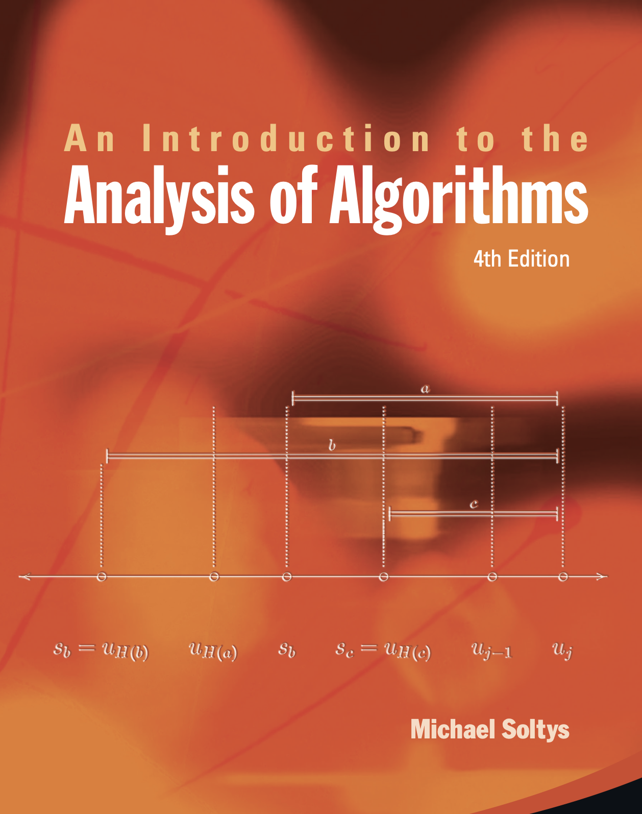
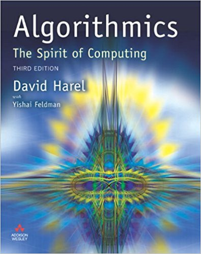

# COMP/MATH 354

Analysis of Algorithms

---

# Instructor

**Michael Soltys**

<v-clicks>

- Email: michael.soltys@csuci.edu
- Office: Shasta Hall 2611
- Office Hours: Thursdays 11:30–2:30 or by appointment
- Lecture: Wednesdays 6:00–7:00

</v-clicks>

---

# Prerequisites

<v-clicks>

- **MATH 300** (Discrete Math)
- Some computer programming experience
- We will implement algorithms in **Python 3**

</v-clicks>

---

# Textbook

3rd Edition

4th Edition

<v-click>

**Code Repository:** https://github.com/michaelsoltys/IAA-Code

</v-click>

---

# Course Outline

<v-clicks>

1. **Correctness** — Pre/post-conditions, loop invariants, division, Euclid
2. **Ranking Algorithms** — PageRank, Stable Marriage, Pairwise Comparisons
3. **Greedy Algorithms** — Spanning trees, job scheduling, promising solutions
4. **Divide and Conquer** — Mergesort, binary multiplication, Savitch's algorithm
5. **Dynamic Programming** — LMS, shortest paths, knapsack, activity selection

</v-clicks>

<v-click>

**Throughout:** Performance analysis (Big-O), implementation in Python 3

</v-click>

---

# Resources

<v-clicks>

- **Canvas:** https://cilearn.csuci.edu/courses/34008
  - Complete modules with all course material

- **GitHub:** https://github.com/michaelsoltys/IAA
  - Slides, Solutions, Summaries
  - Implementations of Algorithms

- **GitHub Classroom:** https://classroom.github.com/
  - Assignment URL provided in Canvas
  - Work directly in Codespaces

- **YouTube:** https://www.youtube.com/playlist?list=PLZV4fOisnXZ4OmDurTxZAq9WA4Vv7NIHR
  - Prerecorded lectures

</v-clicks>

---

# Grading

<v-clicks>

- **Quizzes:** 8 quizzes × 5% = 40%
- **Assignments:** 4 assignments × 5% = 20%
- **Midterms:** 2 midterms × 10% = 20%
- **Final Exam:** 20% (cumulative)

</v-clicks>

---

# Great Introductions to Algorithms

---

# A Classic

---

# References

---

# BBC Documentary

A BBC Documentary by Marcus Du Sautoy

<v-click>

**Watch:** https://www.youtube.com/watch?v=pxRlo1z2TIQ

</v-click>

---

# Student Learning Outcomes (SLOs)

Upon successful completion you will be able to:

<v-clicks>

1. **Design** algorithms using greedy, divide-and-conquer, and dynamic programming
2. **Analyze** performance using worst-case complexity and Big-O notation
3. **Prove** correctness of algorithms

</v-clicks>

---

# Assessment (ABET SLO 1)

Measured for the COMP/MATH 354 assessment (ABET accreditation requirement)

<v-click>

> Analyze a complex computing problem and apply principles of computing and other relevant disciplines to identify solutions.

</v-click>

---

# Assessment Rubric

| Performance Indicator | Unsatisfactory | Developing | Satisfactory | Exemplary |
|----------------------|----------------|------------|--------------|-----------|
| **1. Algorithmic Design** | No understanding of problem, no solution | Problem understood, but solution wrong | Problem understood and a solution given | Problem understood and best solution given |
| **2. Performance Analysis** | No understanding of what is requested | Understanding of worst-case but no Big-O estimate | Worst-case analysis and Big-O estimate given | Worst-case analysis with tight Big-O estimate |
| **3. Proof of Correctness** | No understanding of how to approach proof | General direction but no details | Outline of proof with aspects of framework | Complete proof with pre/post-conditions and invariants |

---

# Assessment Questions

All three rubric rows will be measured by corresponding questions on the final exam:

<v-clicks>

- **Design Question:** Choose a design technique and present solution in pseudo-code

- **Performance Question:** Evaluate time/space complexity in Big-O notation with trade-offs

- **Correctness Question:** Provide algorithmic solution with proof of correctness

</v-clicks>
