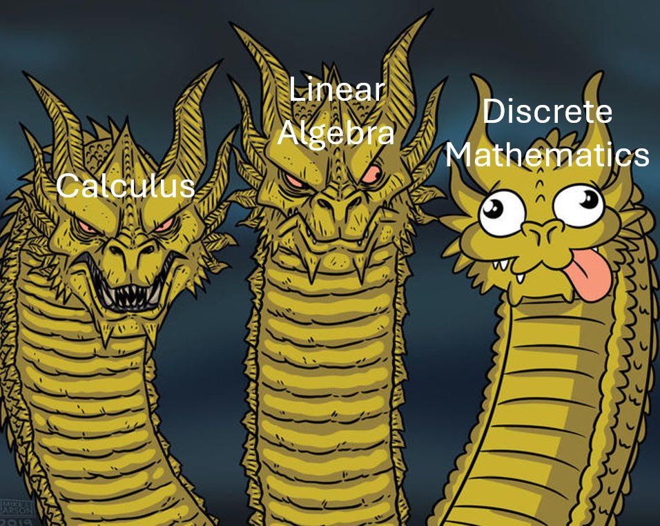
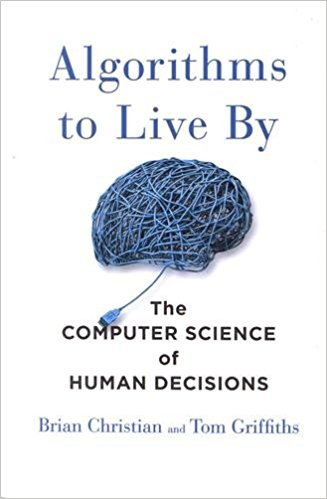
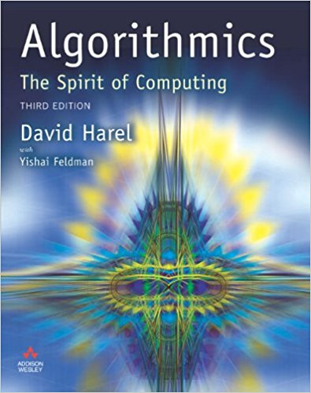
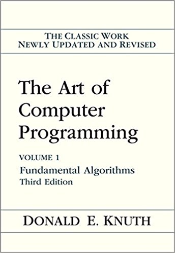
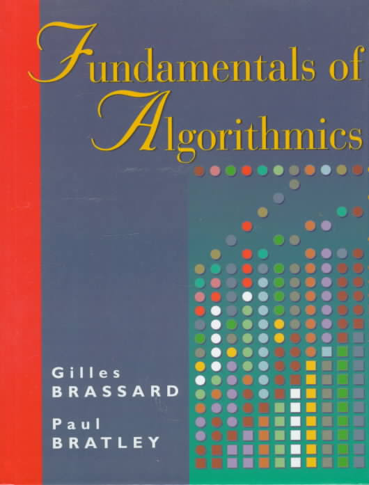
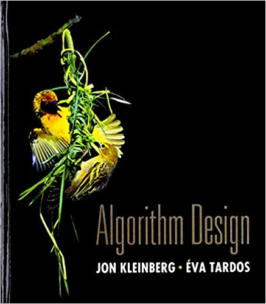
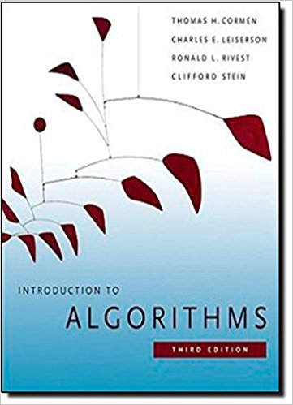
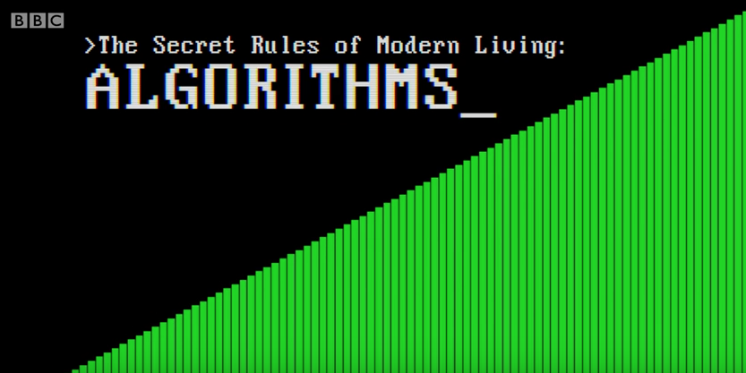

# COMP/MATH 354

COMP 354 — Welcome to Analysis of Algorithms: design, analyze, and prove correct.

All references are to the 4th edition of <em>An Introduction to the Analysis of Algorithms</em> (World Scientific, 2025)

---

# Instructor

How to reach me, where to find me, and when class meets.

**Michael Soltys**

- Email: michael.soltys@csuci.edu
- Office: Shasta Hall 2611
- Office Hours: Thursdays 11:30–2:30 or by appointment
- Lecture: Wednesdays 6:00–7:00

---

# Algorithms

A few facts to make the case that algorithms are old, useful, and quietly running the world.

- **The word "algorithm"** comes from the 9th-century Persian mathematician al-Khwarizmi, whose name was Latinized to "Algoritmi"

- **Euclid's GCD algorithm** (c. 300 BCE) is one of the oldest algorithms still in use today — over 2,300 years old! (Section 1.1.3)

- **Google processes 8.5 billion searches per day**, each one relying on algorithms that return results in under 0.5 seconds (PageRank, Section 1.2.1)

- **The Traveling Salesman Problem** with just 20 cities has over 60 quadrillion possible routes — algorithms help us avoid checking them all (NP, Section 4.4)

- **Sorting algorithms** are estimated to use 25% of all computing cycles worldwide (Divide and Conquer, Section 3.1)

- **Dynamic Programming** powers spell checkers, DNA sequence alignment, and GPS navigation — by remembering solutions to subproblems (Chapter 4)

---

# Prerequisites

Discrete math and a bit of programming — that's all you need to follow this course.

- **MATH 300** (Discrete Math)
- Some computer programming experience
- We will implement algorithms in **Python 3**

  
  
"Discrete mathematics I will always love you"

  
— @Anthony_Bonato

---

# Textbook

Either the 3rd or 4th edition works — both track the course closely.

3rd Edition

4th Edition

**Code Repository:** https://github.com/michaelsoltys/IAA

---

# Course Outline

Five units, each a major algorithmic paradigm — built up over the semester.

1. **Correctness** — Pre/post-conditions, loop invariants, division, Euclid
2. **Ranking Algorithms** — PageRank, Stable Marriage, Pairwise Comparisons
3. **Greedy Algorithms** — Spanning trees, job scheduling, promising solutions
4. **Divide and Conquer** — Mergesort, binary multiplication, Savitch's algorithm
5. **Dynamic Programming** — LMS, shortest paths, knapsack, activity selection

**Throughout:** Performance analysis (Big-O), implementation in Python 3

---

# Resources

Canvas, GitHub, GitHub Classroom, YouTube — everything you need is one click away.

- **Canvas:** https://cilearn.csuci.edu/courses/34008
  - Complete modules with all course material

- **GitHub:** https://github.com/michaelsoltys/IAA
  - Slides, Solutions, Summaries
  - Implementations of Algorithms

- **GitHub Classroom:** https://classroom.github.com/
  - Assignment URL provided in Canvas
  - Work directly in Codespaces

- **YouTube:** https://www.youtube.com/playlist?list=PLZV4fOisnXZ4OmDurTxZAq9WA4Vv7NIHR
  - Prerecorded lectures

---

# Grading

How the 100% breaks down: quizzes, assignments, two midterms, and a cumulative final.

- **Quizzes:** 8 quizzes × 5% = 40%
- **Assignments:** 4 assignments × 5% = 20%
- **Midterms:** 2 midterms × 10% = 20%
- **Final Exam:** 20% (cumulative)

---

# Great Introductions to Algorithms

Two friendly popular books worth reading alongside the course.

---

# A Classic

Knuth's *The Art of Computer Programming* — the canonical reference, still being written.

---

# References

Brassard, Kleinberg-Tardos, and CLRS — three textbooks worth knowing about.

---

# BBC Documentary

Marcus Du Sautoy's accessible tour of algorithms — good background viewing.

A BBC Documentary by Marcus Du Sautoy

**Watch:** https://www.youtube.com/watch?v=pxRlo1z2TIQ

---

# Student Learning Outcomes (SLOs)

By semester's end you should design, analyze, and prove correct.

Upon successful completion you will be able to:

1. **Design** algorithms using greedy, divide-and-conquer, and dynamic programming
2. **Analyze** performance using worst-case complexity and Big-O notation
3. **Prove** correctness of algorithms

---

# Assessment (ABET SLO 1)

The accreditation outcome we're measuring — analyze a complex problem, find a solution.

Measured for the COMP/MATH 354 assessment (ABET accreditation requirement)

> Analyze a complex computing problem and apply principles of computing and other relevant disciplines to identify solutions.

---

# Assessment Rubric

Three skills graded on a four-level scale: design, analysis, and proof.

| Performance Indicator | Unsatisfactory | Developing | Satisfactory | Exemplary |
|----------------------|----------------|------------|--------------|-----------|
| **1. Algorithmic Design** | No understanding of problem, no solution | Problem understood, but solution wrong | Problem understood and a solution given | Problem understood and best solution given |
| **2. Performance Analysis** | No understanding of what is requested | Understanding of worst-case but no Big-O estimate | Worst-case analysis and Big-O estimate given | Worst-case analysis with tight Big-O estimate |
| **3. Proof of Correctness** | No understanding of how to approach proof | General direction but no details | Outline of proof with aspects of framework | Complete proof with pre/post-conditions and invariants |

---

# Assessment Questions

The final exam will have one question for each rubric row — design, performance, correctness.

All three rubric rows will be measured by corresponding questions on the final exam:

- **Design Question:** Choose a design technique and present solution in pseudo-code

- **Performance Question:** Evaluate time/space complexity in Big-O notation with trade-offs

- **Correctness Question:** Provide algorithmic solution with proof of correctness
