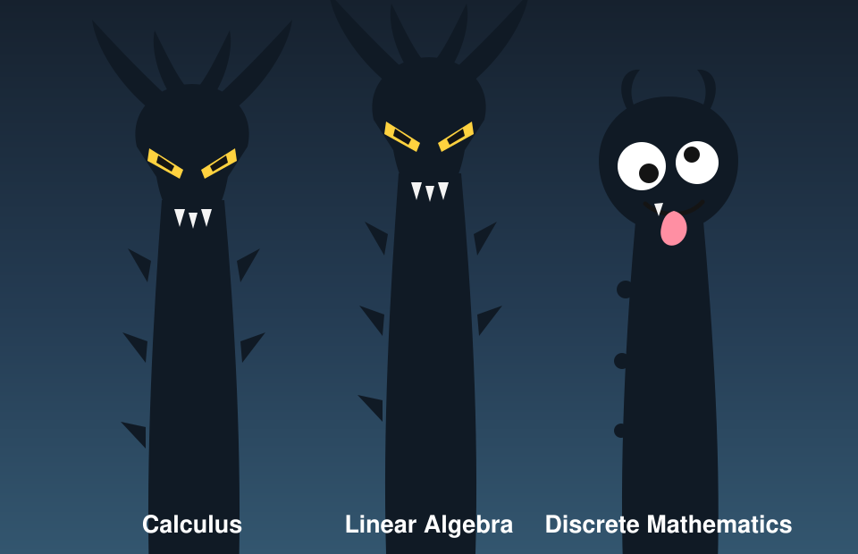
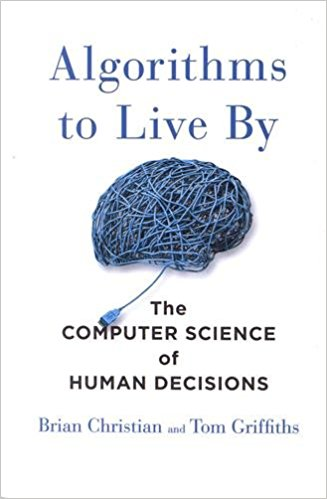
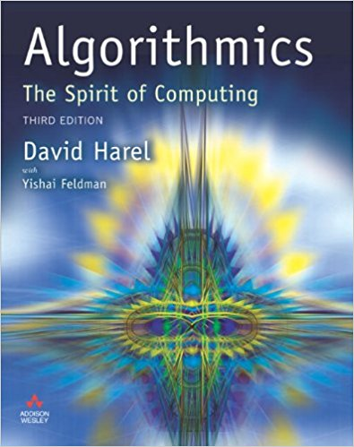
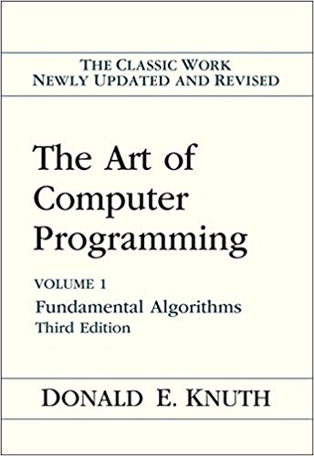
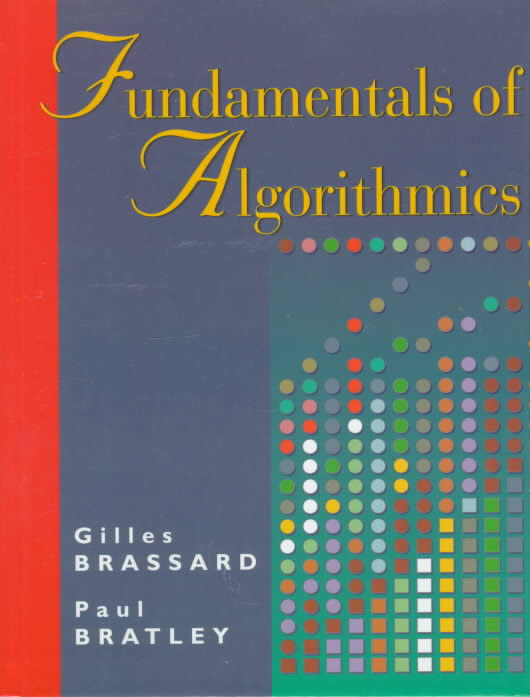
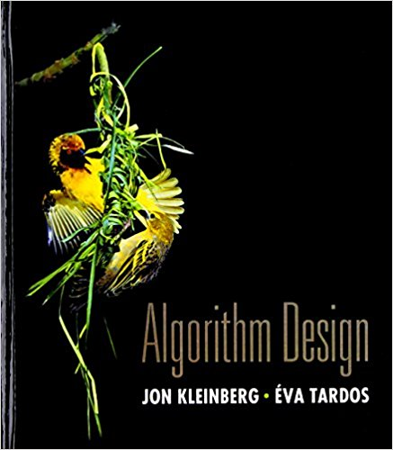
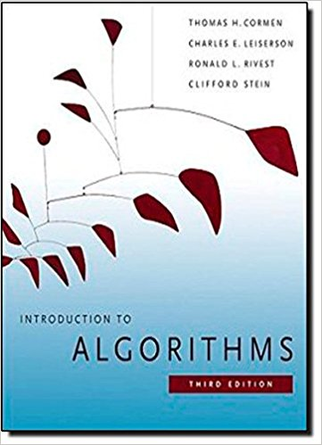

# COMP/MATH 354

COMP 354 — Welcome to Analysis of Algorithms: design, analyze, and prove correct.

All references are to the 4th edition of <em>An Introduction to the Analysis of Algorithms</em> (World Scientific, 2025)

---

# Instructor

How to reach me, where to find me, and when class meets.

**Michael Soltys**

- Email: michael.soltys@csuci.edu
- Office: Shasta Hall 2611
- Office Hours: Thursdays 11:30–2:30 or by appointment
- Lecture: Wednesdays 6:00–7:00

---

# Algorithms

A few facts to make the case that algorithms are old, useful, and quietly running the world.

- **The word "algorithm"** comes from the 9th-century Persian mathematician al-Khwarizmi, whose name was Latinized to "Algoritmi"

- **Euclid's GCD algorithm** (c. 300 BCE) is one of the oldest algorithms still in use today — over 2,300 years old! (Section 1.1.3)

- **Google processes 8.5 billion searches per day**, each one relying on algorithms that return results in under 0.5 seconds (PageRank, Section 1.2.1)

- **The Traveling Salesman Problem** with just 20 cities has over 60 quadrillion possible routes — algorithms help us avoid checking them all (NP, Section 4.4)

- **Sorting algorithms** are estimated to use 25% of all computing cycles worldwide (Divide and Conquer, Section 3.1)

- **Dynamic Programming** powers spell checkers, DNA sequence alignment, and GPS navigation — by remembering solutions to subproblems (Chapter 4)

---

# Prerequisites

Discrete math and a bit of programming — that's all you need to follow this course.

- **MATH 300** (Discrete Math)
- Some computer programming experience
- We will implement algorithms in **Python 3**

  
  
"Discrete mathematics I will always love you"

  
— @Anthony_Bonato

---

# Textbook

The 4th edition (2025) is the latest; strongly recommended, not required.

4th Edition (World Scientific, 2025)

- The book is **strongly recommended**, especially if you plan to work in algorithms, but it is **not required**

- All course material will be given via the slides

**Code Repository:** https://github.com/michaelsoltys/IAA

---

# Course Outline

Five units, each a major algorithmic paradigm — built up over the semester.

1. **Correctness** — Pre/post-conditions, loop invariants, division, Euclid
2. **Ranking Algorithms** — PageRank, Stable Marriage, Pairwise Comparisons
3. **Greedy Algorithms** — Spanning trees, job scheduling, promising solutions
4. **Divide and Conquer** — Mergesort, binary multiplication, Savitch's algorithm
5. **Dynamic Programming** — LMS, shortest paths, knapsack, activity selection

**Throughout:** Performance analysis (Big-O), implementation in Python 3

---

# Resources

Canvas, GitHub, Classroom 50, YouTube — everything you need is one click away.

- **Canvas:** https://cilearn.csuci.edu/courses/35558
  - Complete modules with all course material

- **GitHub:** https://github.com/michaelsoltys/IAA
  - Slides, Solutions, Summaries
  - Implementations of Algorithms

- **Classroom 50:** https://classroom50.org
  - Assignment accept links provided in Canvas
  - Work directly in Codespaces

- **YouTube:** https://s.msoltys.com/iaa-yt
  - Prerecorded lectures

---

# Grading

How the 100% breaks down: quizzes, assignments, two midterms, and a cumulative final.

- **Quizzes:** 40%, 8 quizzes, **best 6 count** (≈6.67% each)
- **Assignments:** 20%, 4 assignments, **best 3 count** (≈6.67% each)
- **Midterms:** 20%, two midterms at 10% each (required, never dropped)
- **Final Exam:** 20%, cumulative (required, never dropped)

 

**No late work and no extensions.** The drops are your flexibility: a missed quiz or assignment simply becomes a dropped score. Use them for illness, travel, or a bad week; no explanation needed.

---

# Great Introductions to Algorithms

Two friendly popular books worth reading alongside the course.

Home of the 37% rule: spend the first 37% of any search just looking, then commit to the next option that beats everything seen so far.

David Harel also invented statecharts, the visual formalism that made it into UML and runs in embedded systems everywhere.

<!--
Algorithms to Live By pairs a writer (Brian Christian) with a cognitive scientist (Tom Griffiths); its argument is that optimal stopping, caching, and scheduling are decision tools for ordinary life: when to stop apartment hunting, how to organize a closet like an LRU cache, why exponential backoff is good advice for social life. Harel's book grew out of lectures aimed at the general public and has been translated into many languages; his own research fame is statecharts, which came from consulting on avionics for the Lavi fighter jet.
-->

---

# A Classic

Knuth's *The Art of Computer Programming* — the canonical reference, still being written.

- Begun in **1962**, planned as seven volumes, and still being written
- Knuth paused for a decade to invent **TeX**, just to typeset it properly
- Finding an error earns you a check for **$2.56**: one hexadecimal dollar

<!--
Bill Gates on this book: "If you think you're a really good programmer... You should definitely send me a resume if you can read the whole thing." The $2.56 reward checks are almost never cashed; recipients frame them. Knuth has not used email since 1990, on the grounds that his job is to be at the bottom of things, not on top of things.
-->

---

# References

Brassard, Kleinberg-Tardos, and CLRS — three textbooks worth knowing about.

Gilles Brassard is the B in BB84: he co-invented quantum cryptography.

Kleinberg's HITS algorithm ranked the web by hubs and authorities just as PageRank appeared (Section 1.2.1).

Known simply as CLRS, with over a million copies sold; the R is Rivest, the R in RSA.

<!--
Brassard co-invented quantum key distribution with Charles Bennett in 1984 (hence BB84), decades before quantum computers existed to threaten RSA. Kleinberg is a MacArthur Fellow, and HITS makes a nice classroom contrast with PageRank: authority flows from link structure in both, but HITS is query-dependent. CLRS is the standard interview-prep reference; Rivest's RSA connects this shelf directly to the cryptography that secures the web.
-->

---

# BBC Documentary

Marcus Du Sautoy's accessible tour of algorithms — good background viewing.

  
&gt;The Secret Rules of Modern Living:

  
ALGORITHMS_

  
BBC, 2015 — presented by Marcus du Sautoy

- Du Sautoy holds Oxford's chair for the Public Understanding of Science, endowed by Charles Simonyi, the Microsoft engineer behind Word and Excel; his predecessor was Richard Dawkins
- The film shows the **Gale-Shapley matching algorithm** pairing kidney donors with patients in the UK's national exchange, the same algorithm we meet in Section 1.2.2 as Stable Marriage
- It also races **bubble sort against merge sort** on a pile of library books, our Section 3.1 in television form

**Watch:** https://www.youtube.com/watch?v=pxRlo1z2TIQ

<!--
Du Sautoy is a group theorist; his popular books include The Music of the Primes. The kidney exchange segment is the strongest classroom hook: Gale and Shapley published stable matching in 1962 as a curiosity about marriage proposals, and half a century later it moved real organs between strangers. Shapley shared the 2012 Nobel in Economics for it, with Alvin Roth, who engineered the kidney exchanges. Worth saying out loud: two of the algorithms in this one-hour film are graded topics in this course.
-->

---

# Student Learning Outcomes (SLOs)

By semester's end you should design, analyze, and prove correct.

Upon successful completion you will be able to:

1. **Design** algorithms using greedy, divide-and-conquer, and dynamic programming
2. **Analyze** performance using worst-case complexity and Big-O notation
3. **Prove** correctness of algorithms

---

# Assessment (ABET SLO 1)

The accreditation outcome we're measuring — analyze a complex problem, find a solution.

Measured for the COMP/MATH 354 assessment (ABET accreditation requirement)

> Analyze a complex computing problem and apply principles of computing and other relevant disciplines to identify solutions.

---

# Assessment Rubric

Three skills graded on a four-level scale: design, analysis, and proof.

| Performance Indicator | Unsatisfactory | Developing | Satisfactory | Exemplary |
|----------------------|----------------|------------|--------------|-----------|
| **1. Algorithmic Design** | No understanding of problem, no solution | Problem understood, but solution wrong | Problem understood and a solution given | Problem understood and best solution given |
| **2. Performance Analysis** | No understanding of what is requested | Understanding of worst-case but no Big-O estimate | Worst-case analysis and Big-O estimate given | Worst-case analysis with tight Big-O estimate |
| **3. Proof of Correctness** | No understanding of how to approach proof | General direction but no details | Outline of proof with aspects of framework | Complete proof with pre/post-conditions and invariants |

---

# Assessment Questions

The final exam will have one question for each rubric row — design, performance, correctness.

All three rubric rows will be measured by corresponding questions on the final exam:

- **Design Question:** Choose a design technique and present solution in pseudo-code

- **Performance Question:** Evaluate time/space complexity in Big-O notation with trade-offs

- **Correctness Question:** Provide algorithmic solution with proof of correctness
