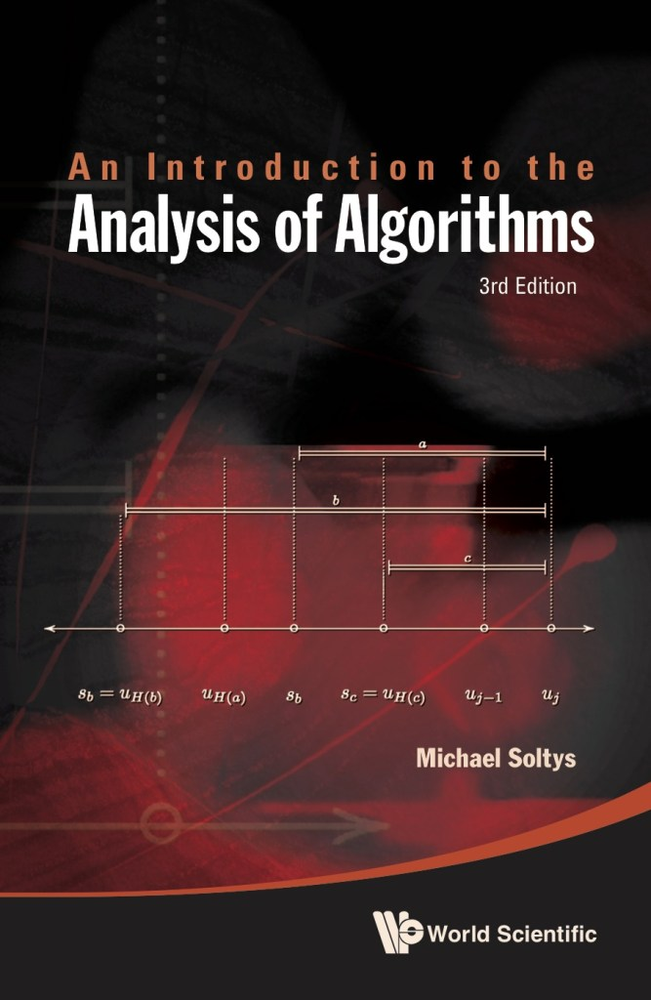
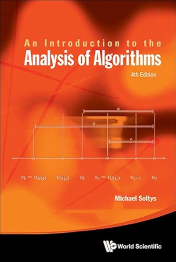

# COMP 454

COMP 454 — What can be computed, and what *can't* — a tour from finite automata to Turing machines.

All references are to the 4th edition of <em>An Introduction to the Analysis of Algorithms</em> (World Scientific, 2025)

---

# Instructor

Where to find me, when to find me, and how to reach me.

**Michael Soltys**

- Email: michael.soltys@csuci.edu
- Office: Shasta Hall 2611
- Office Hours: Thursdays 11:30–2:30 or by appointment
- Lecture: Wednesdays 7:00–8:00

---

# Prerequisites

You'll need discrete math reflexes and enough Python to implement a parser.

- **MATH 300** (Discrete Math)
- **Python** programming language
- We will implement automata and parsers in Python

---

# Textbook

We'll work primarily out of Chapter 9 of *An Introduction to the Analysis of Algorithms*.

3rd Edition

4th Edition

**We use Chapter 9** (PDF provided by instructor)

**Code Repository:** https://github.com/michaelsoltys/IAA

---

# What is This Course About?

The deep correspondence between *what* you can describe and *how* a machine recognizes it.

The relation between **languages** (sets of strings) and **machines** that process them

- What can be computed?
- What are the limits of computation?
- How do we describe sets of strings formally?

---

# Course Overview

We climb the Chomsky hierarchy: regular, context-free, and finally the full Turing-computable languages.

Three major topics:

1. **Regular Languages** — Finite Automata and Regular Expressions
2. **Context-Free Languages** — Grammars and Pushdown Automata
3. **Computability** — Turing Machines and the Church-Turing Thesis

---

# Course Outline

A topic-by-topic roadmap of the semester — the order matters; each layer subsumes the previous.

**1. Regular Languages**
- DFAs and NFAs (equivalence)
- Regular Expressions
- Pumping Lemma
- Applications to text search

**2. Context-Free Languages**
- Context-Free Grammars (CFGs)
- Pushdown Automata (PDAs)
- Pumping Lemma for CFLs

**3. Turing Machines**
- Church-Turing Thesis
- Decidability and undecidability

---

# Resources

Where the slides, code, recordings, and assignments live — bookmark all of these.

- **Canvas:** https://cilearn.csuci.edu/courses/33936
  - Complete modules with all course material

- **GitHub:** https://github.com/michaelsoltys/IAA
  - Slides, Solutions, Summaries
  - Implementations of Algorithms

- **GitHub Classroom:** https://classroom.github.com/
  - Assignment URL provided in Canvas
  - Work directly in Codespaces

- **YouTube:** https://www.youtube.com/playlist?list=PLZV4fOisnXZ4OmDurTxZAq9WA4Vv7NIHR
  - Prerecorded lectures

---

# Grading

How your grade is built — frequent low-stakes work, plus two midterms and a cumulative final.

- **Quizzes:** 8 quizzes × 5% = 40%
- **Assignments:** 4 assignments × 5% = 20%
- **Midterms:** 2 midterms × 10% = 20%
- **Final Exam:** 20% (cumulative)

---

# Student Learning Outcomes (SLOs)

What you'll walk out of the course knowing — and being able to *do*.

Upon successful completion you will be able to:

1. **Describe** sets of strings with different computational models
2. **Understand** the computational power of different models
3. **Understand** the limits of computability
