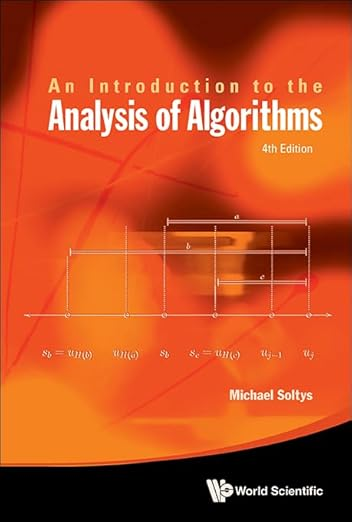

<style>
.slidev-layout.cover {
  background: white !important;
  color: black !important;
}
.slidev-layout.cover h1 {
  color: black !important;
}
</style>

# COMP 454

COMP 454 — What can be computed, and what *can't* — a tour from finite automata to Turing machines.

<div style="position: absolute; bottom: 20px; right: 30px; font-size: 0.55em; color: navy;">All references are to the 4th edition of <em>An Introduction to the Analysis of Algorithms</em> (World Scientific, 2025)</div>

---

# Instructor

<div style="color: #9ca3af; font-style: italic; font-size: 0.9em; margin-bottom: 0.8em;">

Where to find me, when to find me, and how to reach me.

</div>

**Michael Soltys**


- Email: michael.soltys@csuci.edu
- Office: Shasta Hall 2611
- Office Hours: Thursdays 11:30–2:30 or by appointment
- Lecture: Wednesdays 7:00–8:00

---

# Why Automata: Preponderance

<div style="color: #9ca3af; font-style: italic; font-size: 0.9em; margin-bottom: 0.8em;">

This is the most quietly practical theory in computer science; you are already running it.

</div>


- **Every regular expression you have ever written is a finite automaton.** Google's RE2 engine compiles patterns to automata to guarantee linear-time matching, and deliberately refuses backreferences because automata cannot do them (Regular Languages)

- **A regex written without this theory took down 10% of the internet.** On 2 July 2019 a Cloudflare firewall rule containing `.*(?:.*=.*)` caused catastrophic backtracking and 27 minutes of global outage. A DFA has nothing to backtrack with; that is the entire point (Regular Languages)

- **Every compiler is this course in order.** Lexing is a DFA, the grammar is a CFG, and the parser is a pushdown automaton (Regular and Context-Free Languages)

- **Some problems have no algorithm at all.** No tool will ever flag every infinite loop. That is not a gap in our engineering, it is a theorem (Computability)

- **Protocols, controllers, and UI flows are state machines.** Drawing the automaton is how you find the transition nobody handled


<!--
The Cloudflare outage is the strongest hook on this slide and worth telling properly. The rule was pushed globally with no staged rollout, so every edge server worldwide began burning CPU at once; Cloudflare was handling on the order of ten million requests a second, which is ten million chances a second to hit the pathological input. The postmortem by their CTO is public and readable, and the fix in the long run was to move to a non-backtracking engine. Students should take away that the pumping lemma and the subset construction are not classroom furniture: the reason RE2 can promise linear time is precisely that a DFA makes one transition per input character, no matter what.
-->

---

# Why Automata: Job Interview

<div style="color: #9ca3af; font-style: italic; font-size: 0.9em; margin-bottom: 0.8em;">

Two of the most-asked questions at Google and Amazon are this course wearing a disguise.

</div>

<div class="flex gap-6">
<div class="flex-1">

**Asked constantly at Amazon and Google:**

> Given a string of brackets, decide whether it is balanced.

```text
"([]{})"   valid
"([)]"     invalid
```

Push on open, pop on close: you have just built a **pushdown automaton**. Balanced brackets is the standard example of a language that is context-free but not regular.

**The follow-up they actually ask:** "Could you do this in constant memory?" The answer is no, and the **pumping lemma** is the proof.

</div>
<div class="flex-1">

**Also standard:**

> Implement regular-expression matching supporting `.` and `*`.

This is the NFA-to-DFA subset construction under another name. Candidates who have seen it write it in twenty minutes; candidates who have not, usually do not finish.

<br>

**You will build both in this course:**

- A lexer, with RE2C (Assignment 2)
- A JSON parser, with Bison (Assignment 3)

</div>
</div>

<!--
The constant-memory follow-up is the one that separates candidates, and it is a genuinely nice moment: the honest answer is not "no" but "no, and here is why no algorithm can". Being able to prove a lower bound rather than just failing to find an algorithm is the skill this course sells. Worth mentioning that the bracket problem generalizes directly to XML and JSON validation, which is why the parser assignment is not a toy.
-->

---

# Why Automata: Standard Curriculum

<div style="color: #9ca3af; font-style: italic; font-size: 0.9em; margin-bottom: 0.8em;">

The standard theory-of-computation course, taught from the same outline at every research university.

</div>

**The curriculum standard**

The ACM/IEEE-CS/AAAI **Computer Science Curricula 2023** places computability and complexity inside the **Algorithmic Foundations (AL)** knowledge area, with learning outcomes covering the classes P and NP and the significance of NP-completeness. COMP 454 is where our program delivers that.

**The same course elsewhere**

- **UC Berkeley CS 172**, *Computability and Complexity*: finite automata, Turing machines, undecidability, Cook's theorem
- **MIT 6.1400 / 18.400**, *Automata, Computability, and Complexity Theory*, and Michael Sipser's own **18.404**

Both are taught from Sipser's *Introduction to the Theory of Computation*, the book that fixed the shape of this subject. Our Chapter 9 covers the same ground.

<!--
Sipser still teaches 18.404 himself, and the OpenCourseWare video of his first lecture is a good thing to point students at; it opens with finite automata and regular expressions, exactly where we start. The point to make here is that the Chomsky hierarchy is not a CSUCI framing device: Berkeley, MIT and everyone else climb it in the same order, because each level genuinely subsumes the one below. Chomsky himself developed it in the 1950s for natural language, and it turned out to describe programming languages instead, which is one of the more useful accidents in the history of the field.
-->

---

# Why Automata: LLMs

<div style="color: #9ca3af; font-style: italic; font-size: 0.9em; margin-bottom: 0.8em;">

Writing code became cheap. Some questions still have no answer, and never will.

</div>

<div class="flex gap-6">
<div class="flex-1">

Ask any model whether a program halts on every input and it will answer you, fluently and with confidence.

In general it cannot be right. Not because the model is weak, but because **no procedure whatsoever can decide this**, and that is a theorem rather than a limitation of the current generation.

Ask one for an infinite-loop detector and you will get one. It will work on the examples you tried.

<span style="font-size: 0.6em; color: navy;">Thm 9.70, Pg 256, thm:rice</span>

</div>
<div class="flex-1">

**Rice's theorem** settles it: every non-trivial semantic property of programs is undecidable. No complete loop detector exists, at any scale, ever.

This is why static analyzers report false positives, why type systems reject programs that would in fact have run, and why compilers are conservative. Those are not bugs; they are the only options available.

<div class="border-l-4 pl-3 mt-4 text-sm" style="border-color:#4B0082;">

The skill that survives is knowing which questions are **decidable**, which are only **semi-decidable**, and which are neither. That judgment is this course.

</div>

</div>
</div>

<!--
This is the sharpest thing this course has to say about the current moment, and it is worth being precise about the claim. It is not that models are unreliable or that they will improve; it is that the barrier is mathematical, so improvement is irrelevant to it. Turing proved the halting problem undecidable in 1936, nine years before there was a computer to run anything on, and Rice generalized it in 1951 to essentially every interesting question you could ask about what a program does. Students meet this again in Section 9.5. The practical payoff is a good instinct to leave them with: when a tool promises to find all bugs of some kind, the right first question is whether the property it claims to detect is decidable at all, because if it is not, the tool is necessarily either unsound or incomplete and the vendor has chosen which.
-->

---

# Prerequisites

<div style="color: #9ca3af; font-style: italic; font-size: 0.9em; margin-bottom: 0.8em;">

You'll need discrete math reflexes and enough Python to implement a parser.

</div>


<div class="flex gap-8">
<div class="flex-1">


- **MATH 300** (Discrete Math)
- **Python** programming language
- We will implement automata and parsers in Python


<div class="text-sm mt-6">

**What discrete math buys you here**

A **language** is a set of strings. The objects of this course are therefore sets, and the operations that build them, union, concatenation and Kleene star, are operations on sets.

A **finite automaton** is a labelled directed graph. Everything you already know about paths and reachability carries over unchanged.

</div>

</div>
<div class="flex-1">

<div class="text-sm">

**Induction is the method, not a topic.** Nearly every proof in this course is an induction on the length of the input string, or a structural induction over a regular expression or a grammar derivation.

**Quantifiers are load-bearing.** The pumping lemma reads: *there exists* $p$, such that *for all* $s$, *there exists* a split, such that *for all* $i$. Read that alternation correctly and the lemma is mechanical; read it wrongly and it is unusable (Section 9.3.8.1).

**Counting settles the arguments.** The subset construction turns $n$ NFA states into as many as $2^n$ DFA states, and that number is what tells you when determinising is affordable (Section 9.3).

</div>

</div>
</div>

<!--
Worth saying plainly that the prerequisite here is not the same as the prerequisite for a programming course. Students who struggle in this course almost never struggle with the Python; they struggle with quantifier alternation, and the pumping lemma is where that surfaces. It is the first time many of them meet a statement with four alternating quantifiers that they have to use rather than merely read, and treating it as an adversarial game helps: the lemma hands you p, you choose s, it splits the string, you choose i. Whoever moves last wins, and the lemma is written so that you move last.

An aside that is true and striking, though not part of our chapter, so keep it verbal: there are only countably many Turing machines, since each is a finite description over a finite alphabet, but uncountably many languages. So almost every language has no machine that recognizes it, and the undecidable examples we construct in Section 9.5 are not exotic edge cases; they are the overwhelming majority, and the recognizable languages are the vanishing exception.
-->

---

# Textbook

<div style="color: #9ca3af; font-style: italic; font-size: 0.9em; margin-bottom: 0.8em;">

The 4th edition (2025) is the latest; strongly recommended, not required.

</div>

<div class="flex gap-8 mt-4">
<div class="text-center">

<p>4th Edition (World Scientific, 2025)</p>
</div>
<div class="flex-1 mt-6">

- The book is **strongly recommended**, especially if you plan to work in algorithms, but it is **not required**

- All course material will be given via the slides

- This course works from **Chapter 9**

**Code Repository:** https://github.com/michaelsoltys/IAA

</div>
</div>

---

# What is This Course About?

<div style="color: #9ca3af; font-style: italic; font-size: 0.9em; margin-bottom: 0.8em;">

The deep correspondence between *what* you can describe and *how* a machine recognizes it.

</div>

The relation between **languages** (sets of strings) and **machines** that process them


- What can be computed?
- What are the limits of computation?
- How do we describe sets of strings formally?

---

# Course Overview

<div style="color: #9ca3af; font-style: italic; font-size: 0.9em; margin-bottom: 0.8em;">

We climb the Chomsky hierarchy: regular, context-free, and finally the full Turing-computable languages.

</div>

Three major topics:


1. **Regular Languages** — Finite Automata and Regular Expressions
2. **Context-Free Languages** — Grammars and Pushdown Automata
3. **Computability** — Turing Machines and the Church-Turing Thesis

---

# Course Outline

<div style="color: #9ca3af; font-style: italic; font-size: 0.9em; margin-bottom: 0.8em;">

A topic-by-topic roadmap of the semester — the order matters; each layer subsumes the previous.

</div>

<div class="grid grid-cols-2 gap-8">
<div>


**1. Regular Languages**
- DFAs and NFAs (equivalence)
- Regular Expressions
- Pumping Lemma
- Applications to text search

**2. Context-Free Languages**
- Context-Free Grammars (CFGs)
- Pushdown Automata (PDAs)
- Pumping Lemma for CFLs


</div>
<div>


**3. Turing Machines**
- Church-Turing Thesis
- Decidability and undecidability


</div>
</div>

---

# Resources

<div style="color: #9ca3af; font-style: italic; font-size: 0.9em; margin-bottom: 0.8em;">

Where the slides, code, recordings, and assignments live — bookmark all of these.

</div>


<div class="flex gap-8">
<div class="flex-1">

- **Canvas:** https://cilearn.csuci.edu/courses/36157
  - Complete modules with all course material

- **GitHub:** https://github.com/michaelsoltys/IAA
  - Slides, Solutions, Summaries
  - Implementations of Algorithms

</div>
<div class="flex-1">

- **Classroom 50:** https://classroom50.org
  - Assignment accept links provided in Canvas
  - Work directly in Codespaces

- **YouTube:** https://s.msoltys.com/iaa-yt
  - Prerecorded lectures

</div>
</div>

---

# Grading

<div style="color: #9ca3af; font-style: italic; font-size: 0.9em; margin-bottom: 0.8em;">

How your grade is built — frequent low-stakes work, plus two midterms and a cumulative final.

</div>


- **Quizzes:** 40%, 8 quizzes, **best 6 count** (≈6.67% each)
- **Assignments:** 20%, 4 assignments, **best 3 count** (≈6.67% each)
- **Midterms:** 20%, two midterms at 10% each (required, never dropped)
- **Final Exam:** 20%, cumulative (required, never dropped)

<br>

**No late work and no extensions.** The drops are your flexibility: a missed quiz or assignment simply becomes a dropped score. Use them for illness, travel, or a bad week; no explanation needed.

---

# Student Learning Outcomes (SLOs)

<div style="color: #9ca3af; font-style: italic; font-size: 0.9em; margin-bottom: 0.8em;">

What you'll walk out of the course knowing — and being able to *do*.

</div>

Upon successful completion you will be able to:


1. **Describe** sets of strings with different computational models
2. **Understand** the computational power of different models
3. **Understand** the limits of computability
